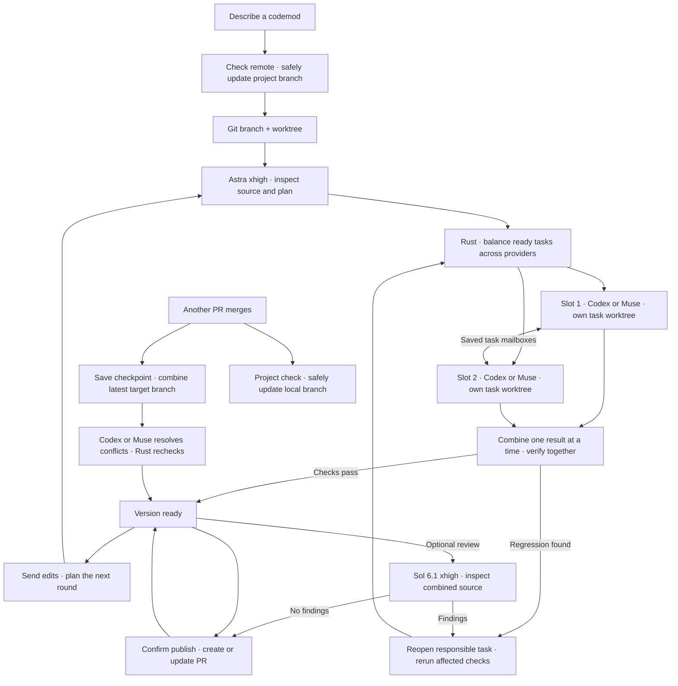

# sprowt harness

A local CLI for building software with coding agents.

## Why I’m building this

I want to understand how coding harnesses work, so I’m building one layer at a time. The goal is to have Codex and Muse work in parallel, share context and bring their work together in a local sandbox. Better code, less waiting.

The harness works independently of sprowt.finance. It is open source and still taking shape.

## What works today

- [Codemods and messages](docs/codemods.md): separate goals, conversations and drafts. Edit, reorder or remove queued instructions; steer active turns.
- [Planning and routing](docs/planning.md): describe the outcome. Astra xhigh defines tasks and contracts. Rust balances Codex and Muse; Jev chooses Sol 6.1 effort.
- [Worktrees and PRs](docs/git-workflow.md): build on separate branches, update from merged work and publish a PR. Keep editing, or close with a saved checkpoint.
- [Plan execution](docs/execution.md): up to two Codex or Muse executors work in parallel, with separate task folders, independent checks, one recovery attempt and repair handoffs.
- [Independent review](docs/review.md): a fresh Sol 6.1 xhigh reviewer inspects the combined result, returns defects to their owners and reviews verified fixes.
- [Worker communication](docs/coordination.md): saved task mailboxes, live replies and questions you answer in the composer.
- [Local Linux sandbox](docs/sandbox.md): one Apple Container VM per executing mod. Workers choose runtimes and dependencies, request OS packages and ask you to approve blocked download domains.
- [Workers and isolation](docs/workers.md): Codex planning and review, with separate Codex or Muse executors. Parallel work, saved conversations and delivery recovery.
- [Harness tools](docs/tools.md): one dispatcher for Git, GitHub, cleanup and VM package setup, with caller checks and recorded activity.
- [Local state](docs/local-state.md): reopen a project and pick up where you left off.
- [Terminal and companion](docs/terminal.md): one action dock with the next useful step, an All actions menu, compact results and a Sprowt pet that reacts to work.

### Current limits

The planner uses a read-only host sandbox. Execution and independent review use a Linux VM; PR publication needs your confirmation. Downloads use a host-controlled domain allowlist; extra access needs your approval for that codemod. iOS and macOS builds need a later macOS VM backend. Existing snapshot mods can be adopted into Git.

Verified on macOS with Codex CLI **0.159.2**. Run one harness instance per project.

Startup detects Codex and Muse from your installed CLIs and account logins. Muse **1.4.3-R5018.1** joins the worker pool automatically; it runs inside the VM behind a host credential broker. Account authentication is verified; subscription metering remains unconfirmed. The [full Codex VM probe](docs/workers.md#standalone-diagnostics) is still separate from production.

## Architecture today

Rust owns the interface, scheduling, workers, task mailboxes and saved state. Startup checks the available agents. Astra defines the work; Rust assigns ready tasks to the least loaded suitable provider. A shared tool dispatcher validates operations and routes them to host or VM adapters. Codex plans and reviews; Codex and Muse execute. Jev evaluates task difficulty and risk through a host-only API adapter.



Planning uses Astra xhigh. Jev recommends a reasoning level for each Sol 6.1 task; uncertainty or missing Jev uses xhigh. Codex uses your subscription and installs project dependencies in the VM. Rust reruns checks independently. The dispatcher keeps publication on the Mac and package setup in the worker’s VM. A separate Git repository inside the VM manages task branches without host credentials. Each mod runs up to two independent tasks at once. One VM controller serializes Git integration, checks and system package setup; each worker has its own runtime folder. Dependent tasks wait for verified prerequisites. Muse uses Spark 1.3 high. Jev routes Codex effort.

Each codemod has two active slots: two Codex, two Muse or one of each. Both providers can implement, test and integrate. Rust picks the least loaded suitable provider across active codemods and alternates ties. Existing plans keep their assignments; retries and repairs keep their owner. The codemod row shows active workers. **Ctrl+O** shows each task's assignment reason.

Muse resumes its native task conversation after a stop or harness restart while the VM disk remains. Saved delivery IDs are checked against native receipts before any retry. Completed work goes straight to verification; unknown delivery stays paused. Starting another task creates a separate conversation.

Late handoff acknowledgements keep the worker's valid task report. New blockers take precedence, and user steering requires a fresh report. Rust reruns the selected checks against current files before accepting completion.

Publishing keeps the VM and worktree for further edits. Closing saves source and task branches before removing the VM. Reopening restores the worktree; its next execution creates a fresh VM. Closed worktrees are pruned after 30 days, keeping the branch and history.

You describe what you want built. The planner identifies useful parallel work and links peers around shared interfaces or handoffs. Workers receive the relevant ownership and topics, then exchange needed asks, replies and updates through saved mailboxes. Rust delivers into active turns or the next task start. Questions for you appear beside the answer composer; answered tasks resume. **Ctrl+O** shows plan details; **Ctrl+T** opens worker history. Finished versions show tasks and check counts. A shared action model drives the dock, menu and shortcuts from current state. The dock suggests the next step; **Ctrl+G** lists available actions. Small changes can stay with one worker.

Blocked downloads show **Network access needed** beside the task. **Ctrl+N** shows the exact domains and reason: **a** allows them for this codemod; **d** denies. Approval reconnects the affected worker and retries its saved task. Other workers continue; the global allowlist stays unchanged.

Merge PRs one at a time on GitHub. The harness syncs your project branch on startup and every 30 seconds while open, even with no codemods. Codemod checks fetch into separate references, so they can run alongside project sync. Local edits and staging stay; unsafe updates pause. **Ctrl+U** checks immediately.

Other codemods finish their current work, save a checkpoint and update in their existing VM. A worker resolves text conflicts and rechecks the combined code. Open PRs become drafts during the update; Publish updates the same PR and marks it ready again. Product decisions pause for your input; binary conflicts need manual resolution.

When integration finds a regression in a completed task, it sends failure evidence back to that owner. The harness preserves work, reopens affected tasks and reruns final checks. Each plan allows two automatic repair attempts; unresolved failures stop with the next action. File ownership and network approvals stay in place.

New test caches, package metadata and runtime databases stay out of source checkpoints. Committed database fixtures remain source; committed `.egg-info` metadata keeps its baseline contents, so parallel dependency installs do not create merge conflicts. Runtime data stays in the VM, separate from the PR.

## Get started

You need [Rust](https://rustup.rs), [Codex CLI](https://github.com/openai/codex) **0.159.2**, Apple silicon and macOS 26+. This connection needs a file-backed ChatGPT login on the Mac:

```sh
codex -c 'cli_auth_credentials_store="file"' login
```

Installed Muse joins automatically after `muse login`. Without Muse, the harness uses Codex alone. An installed CLI with an unsupported version or missing account login gives a startup error with the next action. See [Workers](docs/workers.md#login).

Install and start [Apple Container](https://github.com/apple/container):

```sh
brew install container
container system start --enable-kernel-install
```

Install from this repository:

```sh
cargo install --path . --locked --force
```

Then open a terminal in the project you want to work on and run:

```sh
sprowt-harness
```

Start in an empty folder, an existing project or a Git repository. If Git has no commits, review and confirm the starting files. Before a new worktree, the harness fetches the current branch’s upstream and safely fast-forwards your project. Local edits and staging stay; conflicts stop creation. The codemod uses the updated committed source.

Publishing needs [GitHub CLI](https://cli.github.com/). Sign in with `gh auth login` and `gh auth setup-git`.

1. Describe a codemod and press **Enter**. Confirm Git setup if offered. Planning and execution start automatically.
2. Workers prepare a first version. The dock shows progress and the next useful action. **Ctrl+G** opens All actions; existing shortcuts still work.
3. Send a message to request edits. Messages sent during work wait for the next round; the queue also supports steering.
4. Choose **Ask agent to review**, **View diff** or **Publish PR** in the dock or All actions. Review is optional; confirm the GitHub destination if needed, then the PR. Keep editing afterward to update the same PR.
5. In **Ctrl+P**, **c** closes with a checkpoint, **Tab** shows closed mods, **r** reopens and **d** deletes local data.

Reopening restores state; unfinished work waits for **Ctrl+R**. Finished versions can automatically update from the target branch. **Ctrl+U** checks immediately. Use `--no-motion` to disable animations, or `--closed-worktree-days 0` to keep closed worktrees indefinitely. Review fix rounds are capped at two per plan.

### Jev routing

Copy `.env.example` to `.env.local` and paste your TypeSafe API key. From the harness repository, run:

```sh
sprowt-harness setup
```

Setup saves the key in private local configuration, so the installed harness can route tasks from any project. `.env.local` stays out of Git. Jev uses its own API billing and receives relevant project context; its key stays on the host. Without setup, workers use Sol 6.1 xhigh. See [Planning and routing](docs/planning.md).

## Controls

| Key | Action |
| --- | --- |
| Enter | Answer a highlighted question, send edits or queue an instruction |
| Ctrl+J | Newline |
| Ctrl+G | All available actions; Esc returns |
| Ctrl+P | Switch, create, close, reopen or delete a codemod |
| Ctrl+Q | Open the queue |
| Ctrl+R | Run, stop, retry or reopen a closed codemod |
| Ctrl+S | Publish verified changes as a PR |
| Ctrl+E | Ask an agent to review the finished version |
| Ctrl+U | Sync the project branch and check the codemod's target |
| Ctrl+O | Show or hide plan details |
| Ctrl+T | Open worker history; Esc returns |
| Ctrl+N | Review a pending network request |
| Ctrl+D | View diff |
| Fn + ↑ / ↓ on Mac | Scroll the conversation |
| Esc | Back, or quit from the conversation |
| Ctrl+C | Quit |

Dialog actions and steering are covered in [Codemods and messages](docs/codemods.md).

## Local data

Mods, plans, task progress, check results, reviews, conversations, queues and drafts save automatically in SQLite. Worktrees and source exports live beside the database. On macOS:

```text
~/Library/Application Support/sprowt-harness/state.db
```

Reopen from the same project root to restore them. Credentials stay with Codex. See [Local state](docs/local-state.md) for storage and [Workers](docs/workers.md) for credential isolation.

Git ignores local environment files, credentials, logs and databases. Use placeholders in `.env.example` or `.env.sample`.

## What’s next

Login refresh, shared context, memory, external MCPs and skills follow in small batches.

## Development

```sh
cargo run
cargo fmt --check
cargo clippy --all-targets -- -D warnings
cargo test
```
