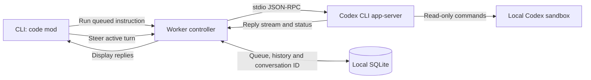

# Sprowt Harness

A local harness for coordinating coding agents. Built in small, explainable steps.

## Run

Install Rust using [rustup](https://rustup.rs), then run from this directory:

```sh
cargo run
cargo run -- --help
cargo run -- --version
cargo run -- --no-motion
```

The `--` passes arguments to our program instead of Cargo. Interactive mode needs a terminal.

## Current behavior

Launch from your project root. On first use, name your first code mod, then write instructions.
Each mod has its own queue, conversation history and unfinished draft. The **`<code mod/>`** row above the
conversation identifies the active mod. A `◇` glyph appears beside each mod name. Ctrl+P opens its compact picker;
use the arrow keys to choose an existing mod or **new code mod**, then press Enter.
The checkmark marks the active mod. Long titles shorten with an ellipsis, and keyboard
hints appear inside the picker. User messages begin with a bright `>` marker.

In the picker, press **d** to delete the selected mod, then **Enter** to confirm or **Esc** to cancel.
Deletion stops its worker and removes the mod's saved history, queue, steering requests and draft.
Deleting an inactive mod keeps the current one selected. If no mods remain, the new-mod screen opens.
Codex's own conversation records remain in its local storage.

Enter adds an instruction to the queue. Its count and up to three previews appear above
the composer; Ctrl+Q opens the queue manager. Use arrows to select an instruction,
Enter to edit, `k`/`j` to move it up/down, or `d` to remove it. While editing,
Enter saves and Esc cancels. Your unfinished composer draft stays intact.
Removing the last instruction closes the manager. Ctrl+Q does nothing when the queue is empty.
In the manager, Space marks or unmarks instructions with a checkmark. Press `s` to
request steering for the marked instructions, or the focused instruction if none are marked.
They move out of the normal queue in queue order. A steering preview shows them as
**waiting for workers** until you connect one. Once running, steering reaches the active Codex turn.
If no turn is active, it waits for the next one; it does not start a new task.
Selections stay attached to messages through edits and reordering; closing the manager clears the marks.
Previews fold multiline messages into one line; the editor shows their full text.
The mod picker and queue manager share a compact dialog layout, with titles, full-row
selection and keyboard hints below a divider.

## Codex worker

Install [Codex CLI](https://learn.chatgpt.com/docs/cli), then sign in with `codex login` using your ChatGPT subscription.
This batch was verified with Codex **0.159.2** on macOS.

Press **Ctrl+R** to connect and run this mod's queued instructions, one at a time. Press it again
to interrupt the active turn and pause the queue. Replies stream into the conversation with a `◆` marker;
user messages keep `>`. The header shows the actual worker state. Switching mods leaves running workers active.
Reopening a project restores history and drafts; Ctrl+R reconnects the same Codex conversation.
Nothing runs automatically on launch.

Instructions leave the queue only after Codex accepts them. A pending instruction cannot be edited,
removed or steered during delivery. Acceptance, history and queue removal save together.
After a connection failure, recovery checks Codex's recorded client message reference before replaying anything.
If acceptance cannot be confirmed, the instruction stays saved and automatic retry pauses.

Each worker has its own ID and belongs to a mod. We currently attach **one worker per mod**;
the storage allows more later. Run one harness instance per project for now.



Tool commands can read the project and minimal runtime files. They cannot write files or use the network.
The trusted Codex process uses your host login; tool processes receive a restricted environment and cannot
read the Codex credential directory or macOS Keychain. Startup checks project access and denial of an
outside canary file and Keychain access. Host MCP servers, apps, plugins, hooks and delegation are disabled
for this worker. These settings apply only to the child process.

This uses Codex's local OS sandbox, **not a separate VM**. VM isolation and code editing are later batches.
The app-server permission profile API is experimental; a failed isolation check prevents starting work.

History, queues, steering requests, drafts and the last selected mod save automatically to a local SQLite database.
On macOS it lives at `~/Library/Application Support/sprowt-harness/state.db`.
On Linux and Windows it uses the standard local application data directory.
Projects are identified by their canonical launch directory; use the same root when reopening.
The harness stores conversation references, not copied login credentials.

| Key | Action |
| --- | --- |
| Enter | Queue a nonblank instruction; edit the selected instruction in the queue manager; save an edit |
| Ctrl+J | Insert a newline |
| Ctrl+P | Open or close the code mod picker |
| Ctrl+Q | Open or close the queue manager |
| Ctrl+R | Connect/run the active mod’s Codex worker, or stop and pause it |
| Up / Down | Focus an instruction while the queue manager is open |
| Space | Mark or unmark an instruction in the queue manager |
| s | Request steering for marked instructions, or the focused instruction |
| k / j | Move the selected instruction up / down |
| d | Delete the selected mod in the picker (with confirmation), or remove an instruction in the queue |
| Up / Down, then Enter | Choose a mod or create one while the picker is open |
| Arrow keys, Home, End | Move within the input |
| Backspace, Delete | Edit the input |
| Page Up / Page Down (Mac: Fn + ↑ / ↓) | Scroll to earlier or later messages in the conversation |
| Esc | Close a manager, cancel an edit or mod creation, or quit from the conversation |
| Ctrl+C | Quit and restore the terminal |

Pasted text stays in the input until you press Enter. The header fades in once; Sprowt nods, blinks and hops, with curious, cheerful and sleepy expressions. Saving a message or creating a mod triggers a happy hop and wink. `--no-motion` keeps everything still.

## Code map

- `src/main.rs`: launch flags, terminal setup and cleanup.
- `src/app.rs`: app state, event loop and input handling.
- `src/ui.rs`: layout, styling and welcome animation.
- `src/sprout.rs`: companion sprite and facial animation.
- `src/store.rs`: SQLite storage for projects, mods, history, queues and workers.
- `src/worker.rs`: queue delivery, steering, streamed replies and recovery.
- `src/codex.rs`: background app-server connection and read-only permission checks.

Clap parses launch flags. Ratatui draws the screen and exposes Crossterm for terminal events.
Ratatui TextArea manages editing; Tachyonfx animates the header.

## Check

```sh
cargo fmt --check
cargo clippy -- -D warnings
cargo test
```
