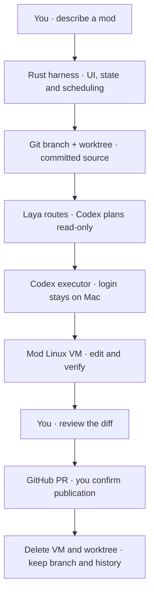

# sprowt harness

A local CLI for building software with coding agents.

## Why I’m building this

I want to understand how coding harnesses work, so I’m building one layer at a time. The goal is to have Codex and Muse work in parallel, share context and bring their work together in a local sandbox. Better code, less waiting.

The harness works independently of sprowt.finance. I plan to open source it as it develops.

## What works today

- [Code mods and messages](docs/code-mods.md): separate goals, conversations and drafts. Edit, reorder or remove queued instructions; steer active turns.
- [Planning and Laya](docs/planning.md): turn a mod’s description into a saved task plan with file scopes, dependencies and checks.
- [Worktrees and PRs](docs/git-workflow.md): each new Git mod gets its own branch. Review verified changes, publish a PR, then remove its VM and worktree.
- [Plan execution](docs/execution.md): one executor follows task dependencies and checks the combined result.
- [Local Linux sandbox](docs/sandbox.md): one Apple Container VM per executing mod. Codex chooses runtimes and dependencies; the harness installs requested OS packages.
- [Workers and isolation](docs/workers.md): separate Codex planner and executor conversations. Different mods can run in parallel.
- [Harness tools](docs/tools.md): one dispatcher for Git, GitHub, cleanup and VM package setup, with caller checks and recorded activity.
- [Local state](docs/local-state.md): reopen a project and pick up where you left off.
- [Terminal and companion](docs/terminal.md): model and effort labels, dot spinners for active workers and tasks, readable plans and the animated Sprowt pet.

### Current limits

The planner uses a read-only host sandbox. Execution uses a Linux VM; PR publication needs your confirmation. Downloads use a host-controlled domain allowlist. iOS and macOS builds need a later macOS VM backend. Existing mods and non-Git folders keep local apply.

Verified on macOS with Codex CLI **0.159.2**. Run one harness instance per project.

## Architecture today

Rust owns the interface, scheduling, workers and saved state. A shared tool dispatcher validates harness-owned operations and routes them to host or VM adapters. A small Python helper runs Laya locally; Codex plans and edits.



Laya recommends the planner configuration. Codex uses your subscription and installs project dependencies in the VM. Rust reruns checks independently. The dispatcher keeps Git and GitHub on the Mac and package setup in the worker’s own VM. Tasks run sequentially within a mod; different mods can run in parallel. Muse follows later.

## Get started

You need [Rust](https://rustup.rs), [Codex CLI](https://github.com/openai/codex) **0.159.2**, Apple silicon and macOS 26+. This connection needs a file-backed ChatGPT login on the Mac:

```sh
codex -c 'cli_auth_credentials_store="file"' login
```

Install and start [Apple Container](https://github.com/apple/container):

```sh
brew install container
container system start --enable-kernel-install
```

Install from this repository:

```sh
cargo install --path . --locked --force
```

Then open a terminal in the project you want to work on and run:

```sh
sprowt-harness
```

For Git projects, make an initial commit and sign in with `gh auth login` and `gh auth setup-git`. New mods start from committed `HEAD`; your local edits stay in the original checkout.

1. Describe your code mod and press **Enter**. Its worktree is created, then planning starts.
2. Review the numbered tasks. **Ctrl+O** shows files, checks and model details. Write follow-up instructions and press **Enter** to queue them.
3. Press **Ctrl+R** to execute in the mod’s VM. The first run builds the sandbox image. Press it again to pause.
4. When changes are ready, **Ctrl+D** opens the diff. Press **p**, then **Enter** to create a PR. Its VM and worktree are removed after publication. Existing mods and non-Git folders use **a** to apply locally.

**Ctrl+R** also stops or retries unfinished planning. Reopening restores state without starting workers. Unfinished host executions move to Linux on their next run. Use `--no-motion` to turn off animations.

### Local model routing

Install [uv](https://docs.astral.sh/uv/getting-started/installation/), then run:

```sh
sprowt-harness setup
```

This downloads [Laya](https://huggingface.co/convaiinnovations/laya) locally to recommend a planner model and reasoning level. Routing is experimental; uncertain results or missing Laya use Sol high. See [Planning and Laya](docs/planning.md) for model choices and limitations.

## Controls

| Key | Action |
| --- | --- |
| Enter | Queue an instruction |
| Ctrl+J | Newline |
| Ctrl+P | Open code mods; switch or create one |
| Ctrl+Q | Open the queue |
| Ctrl+R | Run, stop or retry; recover pending publication or cleanup |
| Ctrl+O | Show or hide plan details |
| Ctrl+D | Review working-folder changes |
| Fn + ↑ / ↓ on Mac | Scroll the conversation |
| Esc | Back, or quit from the conversation |
| Ctrl+C | Quit |

Dialog actions and steering are covered in [Code mods and messages](docs/code-mods.md).

## Local data

Mods, plans, task progress, check results, conversations, queues and drafts save automatically in SQLite. Worktrees and source exports live beside the database. On macOS:

```text
~/Library/Application Support/sprowt-harness/state.db
```

Reopen from the same project root to restore them. Credentials stay with Codex. See [Local state](docs/local-state.md) for storage and [Workers](docs/workers.md) for credential isolation.

## What’s next

Task worktrees inside each VM, then multiple Codex/Muse executors per mod. Shared context, memory, MCPs and skills follow in small batches.

## Development

```sh
cargo run
cargo fmt --check
cargo clippy --all-targets -- -D warnings
cargo test
```
