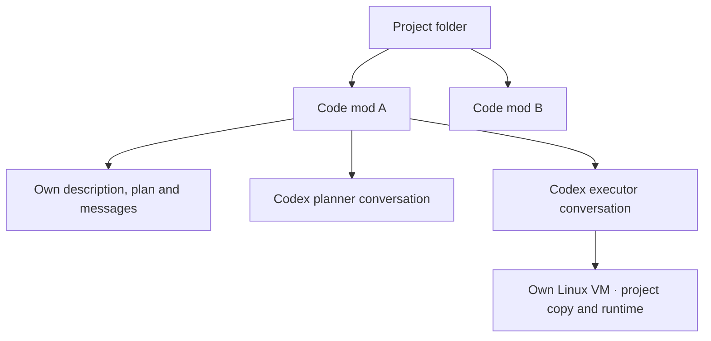
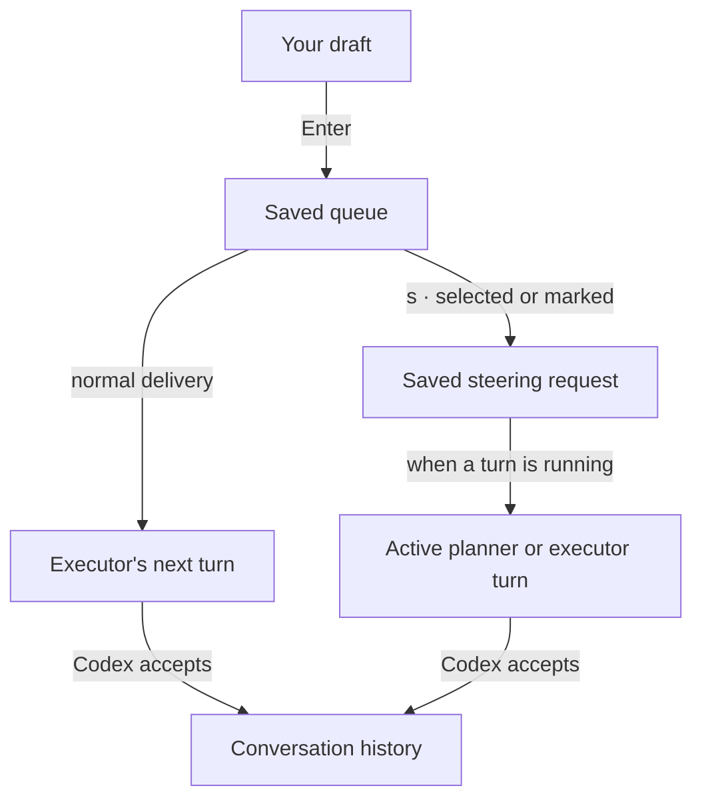

# Code mods and messages

A code mod is one goal in one project. It owns its description, conversation, plan, queue, draft and execution workspace.

The current harness supports one planner and one executor per mod. Workers in different mods can run at the same time. Planners read the project. Each executor works on a project copy in its own Linux VM. Multiple executors per mod come later. See [Plan execution](execution.md).

## Create, switch, delete

- **Create:** open **Ctrl+P**, select **New code mod**, describe the change and press Enter. Planning starts immediately. The first line becomes the title; the full description is saved.
- **Switch:** open **Ctrl+P**, select a mod and press Enter. Its conversation and draft return. Other mods’ workers keep running.
- **Delete:** select a mod, press `d`, then Enter to confirm. Its workers stop and its VM, harness data and working folder are removed, including unapplied changes. Project files remain.

The first launch in an empty project opens creation directly. Ctrl+J adds a newline. Esc cancels creation, or quits when no mod exists.

## Draft, queue, conversation

A draft is what you are typing. Enter saves it to the queue. An enabled executor takes queued instructions in order, one turn at a time. Accepted instructions and replies appear in the conversation.

Open **Ctrl+Q** to manage pending instructions:

| Key | Action |
| --- | --- |
| ↑ / ↓ | Select |
| Enter | Edit; Enter saves, Esc cancels |
| `k` / `j` | Move up / down |
| `d` | Remove |
| Space | Mark or unmark |
| `s` | Steer with marked instructions, or the selected one |
| Esc | Return to the composer |

Editing preserves your composer draft. Removing the last item closes the queue dialog. An instruction awaiting delivery confirmation cannot be edited, removed or steered.

## Steer an active turn

Steering moves instructions out of the normal queue, preserving queue order. They stay saved until a worker accepts them into an active turn. Without an active turn, they wait; executing a plan task or a normal queued instruction starts one.

Ordinary queued instructions wait for the executor while planning runs. For connection and recovery behavior, see [Workers](workers.md).
