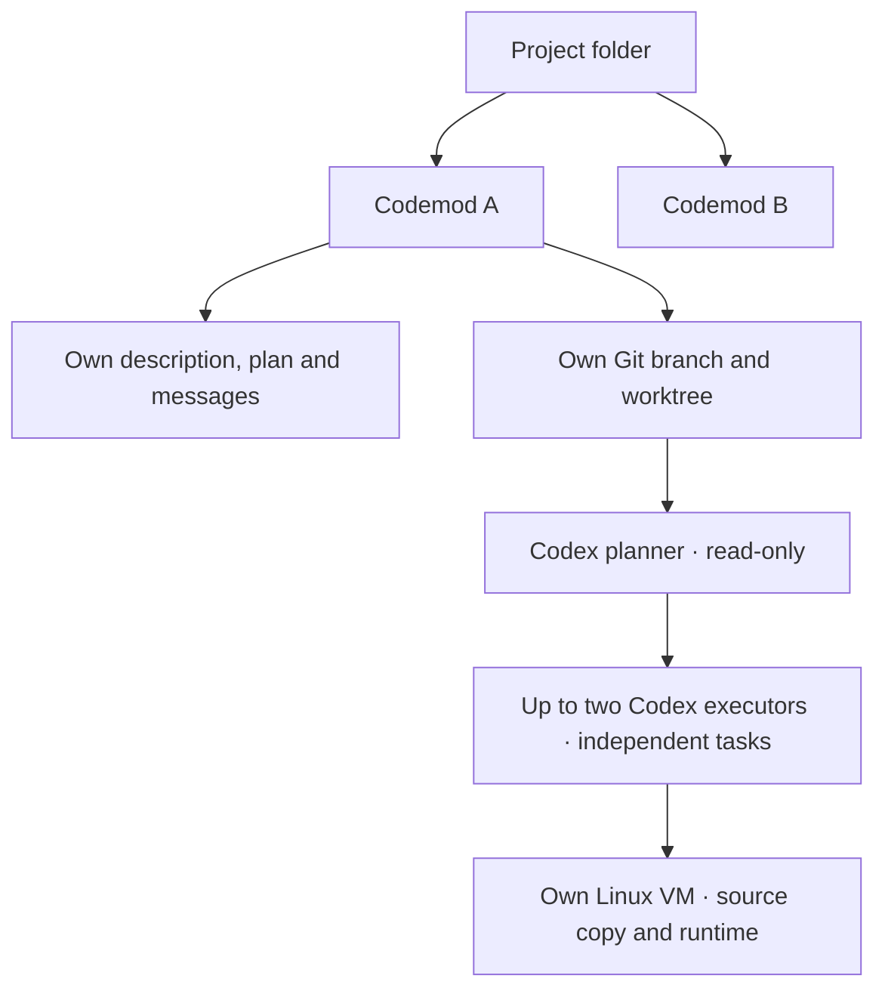
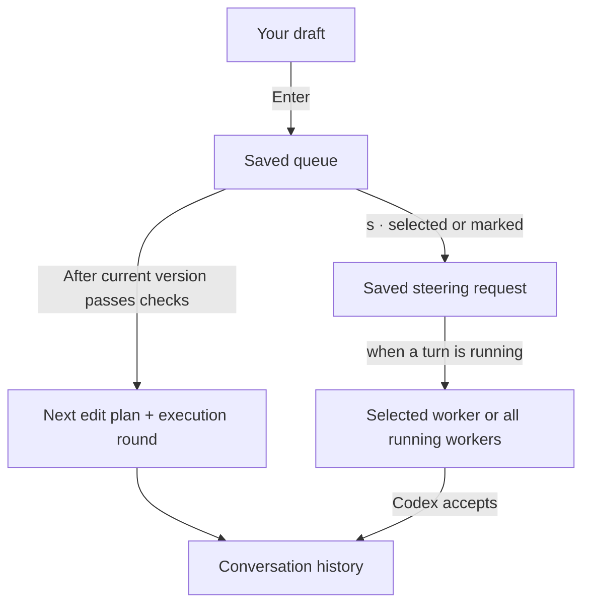

# Codemods and messages

A codemod is one goal in one project. It owns its description, conversation, plan, queue, draft and execution workspace. New codemods also own a branch and worktree, with Git setup offered when needed.

The current harness supports one planner and up to two executors per mod. Workers in different mods can run at the same time. Planners read the worktree initially and exported source for edit rounds; executors work on its source copy in Linux. See [Plan execution](execution.md).

Publishing creates or updates a PR and keeps the VM for further edits. Closing saves a checkpoint and removes the VM; deletion discards local work. A review worker comes later.

## Create, switch, close

- **Create:** open **Ctrl+P**, select **New codemod**, describe the change and press Enter. Confirm Git setup when offered. The project branch is checked and safely updated before creating a worktree; planning and execution start automatically. The first line becomes the title; the full description is saved.
- **Switch:** open **Ctrl+P**, select a mod and press Enter. Its conversation and draft return. Other mods’ workers keep running.
- **Edit:** send a message through the composer. After the current version is verified, a fresh plan and execution round start against its source. Published mods use the same composer and PR.
- **Publish:** **Ctrl+S** starts publication after verification; Enter confirms the PR. **Ctrl+D** lets you review the diff first.
- **Update:** **Ctrl+U** syncs the project branch and checks for merged work. Finished versions update and recheck automatically; running workers finish first. An existing PR becomes draft until you publish the verified update.
- **Close:** select an active mod, press `c`, then Enter. Save a local checkpoint, keep the worktree and history, and remove the VM. GitHub is not required. Older snapshot mods first offer Git adoption.
- **Reopen:** press **Tab** for closed mods, then `r` on the selected mod. Its saved source returns; the next execution creates a fresh VM. Enter opens history without reopening.
- **Delete:** press `d`, then Enter to permanently remove local history and discard unpublished work. Existing PRs remain on GitHub.

See [Worktrees and PRs](git-workflow.md) for login, branch targets and recovery. Publishing saves work to GitHub; closing ends the local session. After a PR is merged or closed, start a new mod from the updated project.

The first launch in an empty project opens creation directly. Ctrl+J adds a newline. Esc cancels creation, or quits when no mod exists.

## Draft, queue, conversation

A draft is what you are typing. Enter saves it to the queue, or answers the highlighted worker question when the composer says **answer #ID**. During work, ordinary instructions wait. Once a version is verified, the next instruction starts a new edit plan. Sending edits after a failed run replans against the work saved so far. That request and worker replies appear in the conversation. Drafts remain separate. See [Worker communication](coordination.md) for asks, replies and automatic resumption.

Open **Ctrl+Q** to manage pending instructions:

| Key | Action |
| --- | --- |
| ↑ / ↓ | Select |
| Enter | Edit; Enter saves, Esc cancels |
| `k` / `j` | Move up / down |
| `d` | Remove |
| Space | Mark or unmark |
| `t` | Choose a running worker or all workers for steering |
| `s` | Steer the target with marked instructions, or the selected one |
| Esc | Return to the composer |

Editing preserves your composer draft. Removing the last item closes the queue dialog. An instruction awaiting delivery confirmation cannot be edited, removed or steered.

## Steer an active turn

Steering moves instructions out of the normal queue, preserving queue order. In the queue, **t** cycles the target between all running workers and individual worker IDs; **s** sends. Broadcasts stay saved until every selected worker accepts. Each confirmed delivery appears in the conversation. If Codex rejects steering—for example, its turn has already finished—the instructions return to the normal queue once, for the next edit round. Unconfirmed delivery remains saved until it can be reconciled. Without an active turn, they wait until a plan task starts one.

You can send messages while planning or execution runs. Steering reaches the selected active turns; normal edits wait for the next version. For connection and recovery behavior, see [Workers](workers.md).
