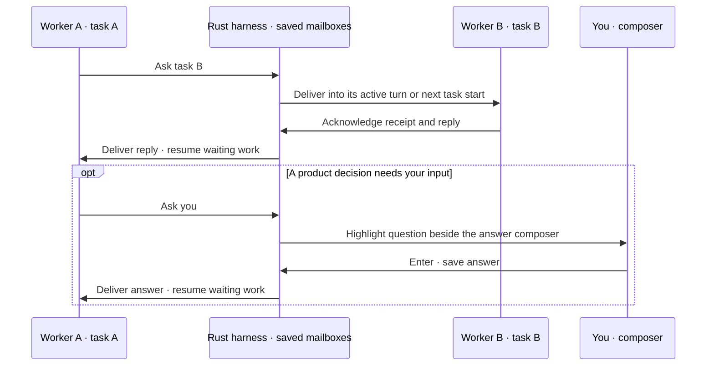

# Worker communication

Workers in one codemod share saved task mailboxes. They can ask questions, reply and send updates while keeping separate file ownership. Rust routes messages to the worker currently assigned to the recipient task.

You do not need to request messages or prescribe a task split. The planner links tasks around shared interfaces, assumptions and handoffs. Each worker gets relevant peers, their scope and coordination topics. A link added by either task appears to both; it is separate from a scheduling dependency.

Workers follow the agreed contract and send material changes, blockers or completed handoffs to relevant peers. They ask only when information is genuinely missing. Independent work needs no conversation for its own sake.

## What you see

**Ctrl+O** shows peer topics in the plan. **Ctrl+T** opens [task inspection](terminal.md#inspect-a-task), including saved narration and routine messages. Questions for you stay visible, with the sender and message ID. The composer changes to **answer #ID**; Enter answers that question instead of queueing an edit. If several workers ask, answer them in order. Your draft stays intact when a question arrives.

An executor can finish independent work before pausing for a reply. Unanswered asks prevent task completion. After its questions are answered, Rust resumes a waiting task in its existing folder. Other independent tasks keep running. Reopened projects wait for **Ctrl+R** to reconnect workers.

## Worker tools

| Tool | Purpose |
| --- | --- |
| `send_worker_message` | Send an `ask`, `reply` or `update` to a plan task ID; asks can target `user` |
| `read_worker_messages` | Read inbox, sent messages, live assignments and relevant peers with scopes and topics |
| `ack_worker_messages` | Confirm receipt of specific inbox message IDs |

Replies reference the original ask. Stable keys make repeated sends idempotent. Rust binds codemod and worker identity; model arguments cannot impersonate another worker. Messages carry context and cannot change file scope, permissions or the user's goal.

Messages are saved before delivery. **Delivered** means the target provider accepted the injection; **acknowledged** means the recipient called the receipt tool; **answered** means a reply was saved. None means the source passed verification. Both providers check native conversation receipts on reconnect. Confirmed injections are not repeated; uncertain delivery pauses for explicit retry. Rejected injections stay in the inbox for a later read.

Acknowledging a late handoff does not replace a valid task report with an empty result. Workers retain all declared check commands in their final report, or report a blocker. Rust selects the task result and independently verifies it. See [Tasks and checks](execution.md#tasks-and-checks).

## Boundaries

Messages stay within one codemod. Task IDs follow current ownership, including tasks not yet assigned. Asks to unavailable tasks or asks that create a wait cycle are rejected. Workers read at useful checkpoints and continue independent work; they do not poll for replies.

Bodies are limited to 4,000 bytes, with up to 32 unacknowledged messages per task. SQLite retains messages as local plain text. New edit and integration rounds keep the history but use new task identities, so old asks cannot reopen. Closing retains mailboxes; deleting the codemod removes them.

Code regressions found after an owner finishes use [automatic repair handoffs](execution.md#automatic-repairs). Rust reopens that task; a mailbox message alone does not restart completed work.
