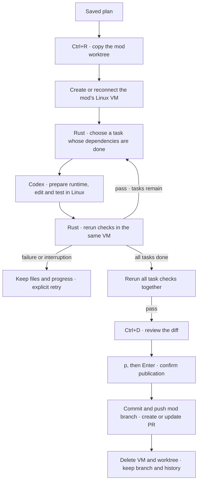

# Plan execution

A plan becomes code when you press **Ctrl+R**. One Codex executor runs tasks in dependency order in the mod’s Linux VM.

## Working folder

New Git mods start from committed `HEAD` in a separate host worktree. The planner reads that worktree; the first execution copies its source into the VM. Your original checkout’s uncommitted and untracked files stay there.

Existing mods and non-Git projects retain snapshots of current files, including uncommitted and untracked code. Ignored files are left out in Git projects. Every mod has a private folder outside the project with starting files, source exports and diff metadata. New source files stay visible even if a generated `.gitignore` would hide them.

Common credential files, including `.env` and `.npmrc`, are excluded. `.env.example` and `.env.sample` are included. Installed dependencies and build caches are excluded too. Other secrets in source files are still source files; keep them out of the project.

The source snapshot is copied into `/workspace` inside the mod’s VM. The host’s `work/` folder holds exported source for diff review; it is not mounted into the guest. Host Git metadata stays on the Mac. Runtime installs and dependencies persist until PR publication, local apply or mod deletion removes the VM. See [Local Linux sandbox](sandbox.md).

The executor cannot access the original project, harness state, host Codex credentials or Keychain. The planner remains read-only. See [Workers](workers.md) for the boundary.

## Tasks and checks

Rust dispatches one task at a time. Dependencies must be complete first. Queued follow-ups run between tasks; steering reaches the current turn.

The executor prepares the runtime and project dependencies. Missing OS packages go through the harness’s [VM setup tool](sandbox.md#system-packages); successful setup returns to the same task. Failed setup blocks completion with its cause.

Codex returns a short task summary and runnable commands for each declared completion check. Rust reruns them in the same sandbox, with a 30-second limit per command. Missing checks, nonzero exits, timeouts or checks that change source files block completion. After all tasks finish, every saved check runs again against the combined result.

The plan shows task status. A dot spinner marks the running task and stays active through its checks; completed and waiting tasks stay still. **Ctrl+O** expands scopes, check commands, failures and final check results. Passing commands is evidence, not a guarantee that the plan or tests are good; review the code too. Declared file scopes guide Codex, while the sandbox enforces the folder boundary.

## Pause and recover

**Ctrl+R** pauses execution. During verification, the current guest command is terminated and subsequent checks stop. Interrupted tasks keep their working files and runtime. Press Ctrl+R again to explicitly retry the unfinished task; completed tasks stay done.

Reopening restores progress without starting workers. On reconnect, confirmed completed turns are verified without asking Codex to repeat the edits. Unconfirmed delivery pauses for explicit retry. Failed final checks can be rerun without regenerating completed tasks. Older executor conversations restart once to gain the system-package tool, keeping their VM, saved transcript and task progress.

## Review and publish

**Ctrl+D** opens the diff when execution is idle. After tasks and final checks pass, press **p**, then **Enter** to publish a PR. Esc cancels. Source must match the verified result; outside edits to the worktree block publication.

The harness commits reviewed changes and creates or updates the mod’s PR. It saves the URL before removing the VM and worktree. History remains visible. **Ctrl+R** retries interrupted publication or cleanup; afterward it opens **Continue working** to plan changes on the same open PR. See [Worktrees and PRs](git-workflow.md) for closing and recovery.

## Local apply · existing mods and non-Git projects

1. **Ctrl+D** opens the diff when execution is idle. You can inspect partial work, but apply is available only after all tasks and final checks pass.
2. Use **↑ / ↓** or **Fn + ↑ / ↓** to scroll. **Esc** returns to the conversation.
3. Press **a**, then **Enter** to confirm applying. Esc cancels.

The working files must match the snapshot that passed verification and the diff you reviewed. Every affected project file must still match its starting contents and permissions. A conflict stops the apply before any file is changed; reconcile it manually or start a fresh mod.

Applying adds, edits and deletes files without committing in your target project. Files are replaced individually; a handled error rolls back earlier replacements. A crash midway can leave a partial apply; the starting copies remain in the mod folder's `before/` directory.

After applying, the harness stops the executor and deletes the mod’s VM, including its runtime and dependencies. The plan, messages, checks, draft, queue and source exports stay on the Mac. Shared images remain for reuse. A failed or cancelled apply keeps the VM.

If VM cleanup fails, changes stay applied. **Ctrl+R** retries cleanup; the pending state survives reopening. Older applied mods with retained VMs offer the same cleanup action. Cleanup finishes before Ctrl+R can start read-only follow-up questions against the project.

Start a new mod for further code changes. Removing a legacy or non-Git mod deletes its history and unapplied work.

## Current limits

One executor per mod. Linux only; no host mounts or published app ports. Symlinks, submodules and special files are unsupported. Projects without Git work too; Git is required locally for snapshots and diffs.

Uses Codex CLI **0.159.2** through the [app-server API](https://developers.openai.com/codex/app-server).
