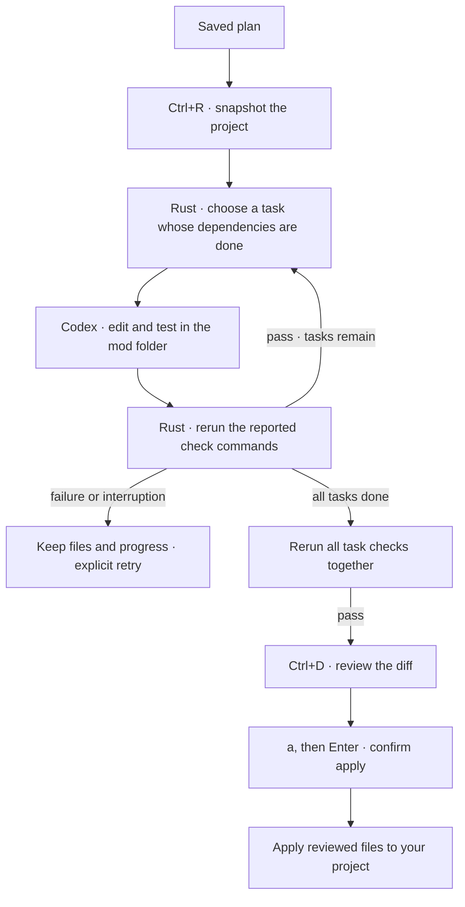

# Plan execution

A plan becomes code when you press **Ctrl+R**. One Codex executor runs tasks in dependency order in a separate working folder.

## Working folder

The first run snapshots your current files, including uncommitted and untracked code. In Git projects, ignored files are left out. Every mod gets its own folder outside the project, with separate copies of files and private Git metadata for the diff. New source files stay visible in review even if a generated `.gitignore` rule would hide them.

Common credential files, including `.env` and `.npmrc`, are excluded. `.env.example` and `.env.sample` are included. Installed dependencies and build caches are excluded too. Other secrets in source files are still source files; keep them out of the project.

The executor can write only within its working folder. It cannot read or write the original project, harness state, Codex credentials or Keychain. The planner remains read-only. See [Workers](workers.md) for the boundary.

## Tasks and checks

Rust dispatches one task at a time. Dependencies must be complete first. Queued follow-ups run between tasks; steering reaches the current turn.

Codex returns a short task summary and runnable commands for each declared completion check. Rust reruns them in the same sandbox, with a 30-second limit per command. Missing checks, nonzero exits, timeouts or checks that change source files block completion. After all tasks finish, every saved check runs again against the combined result.

The plan shows task status. **Ctrl+O** expands scopes, check commands, failures and final check results. Passing commands is evidence, not a guarantee that the plan or tests are good; review the code too. Declared file scopes guide Codex, while the sandbox enforces the folder boundary.

## Pause and recover

**Ctrl+R** pauses execution. During verification, the current command finishes within its timeout and subsequent checks stop. Interrupted tasks keep their working files. Press Ctrl+R again to explicitly retry the unfinished task; completed tasks stay done.

Reopening restores progress without starting workers. On reconnect, confirmed completed turns are verified without asking Codex to repeat the edits. Unconfirmed delivery pauses for explicit retry. Failed final checks can be rerun without regenerating completed tasks.

## Review and apply

1. **Ctrl+D** opens the diff when execution is idle. You can inspect partial work, but apply is available only after all tasks and final checks pass.
2. Use **↑ / ↓** or **Fn + ↑ / ↓** to scroll. **Esc** returns to the conversation.
3. Press **a**, then **Enter** to confirm applying. Esc cancels.

The working files must match the snapshot that passed verification and the diff you reviewed. Every affected project file must still match its starting contents and permissions. A conflict stops the apply before any file is changed; reconcile it manually or start a fresh mod.

Applying adds, edits and deletes files without committing in your target project. Files are replaced individually; a handled error rolls back earlier replacements. A crash midway can leave a partial apply; the starting copies remain in the mod folder's `before/` directory.

After applying, queued follow-up questions use read-only tools against the project. Start a new mod for further code changes. Deleting a mod removes its working folder too, including unapplied work.

## Current limits

One executor per mod. No tool networking, package installation or VM yet. Symlinks, submodules and special files are unsupported. Projects without Git work too; Git is required locally for snapshots and diffs.

Uses Codex CLI **0.159.2** through the [app-server API](https://developers.openai.com/codex/app-server).
