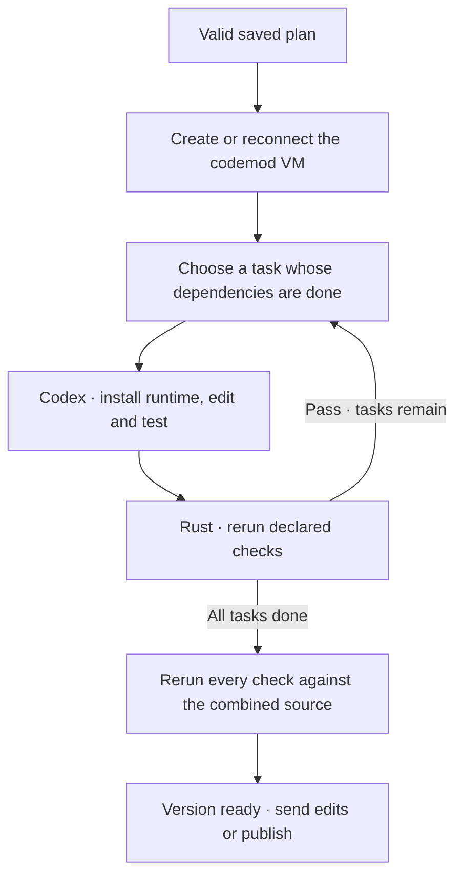

# Plan execution

Creating a codemod starts planning and execution automatically. One Codex executor follows dependencies in the mod’s Linux VM.

A failed check or interruption pauses execution with its cause. **Ctrl+R** retries unfinished work; completed tasks stay done.

## Working folder

New codemods start from committed `HEAD` in their own host worktree. The first execution copies source into `/workspace` in Linux. Git metadata, host credentials and your original checkout stay on the Mac.

The host’s `work/` folder holds source exports for planning, review and checkpoint saves. It is not mounted into the VM. Credentials, dependencies and caches are excluded from snapshots; `.env.example` and `.env.sample` are included. Source files remain visible even if a generated `.gitignore` would hide them.

Runtimes and dependencies stay in the VM across edit rounds and publication. Closing removes that VM; reopening creates a fresh one when execution starts. See [Local Linux sandbox](sandbox.md) and [Workers](workers.md).

## Tasks and checks

Rust dispatches one task at a time. Codex prepares project runtimes and dependencies; missing OS packages go through the [VM setup tool](sandbox.md#system-packages).

Each task returns a short summary and runnable commands for every declared check. Rust reruns them with a 30-second limit per command. Missing checks, nonzero exits, timeouts or checks that change source files block completion. After all tasks finish, every saved check runs again against the combined result.

The current task has a spinner through implementation and checks. **Ctrl+O** expands scopes, commands and failures. File scopes guide Codex; the sandbox enforces the folder boundary. Passing checks are evidence; review the code too.

## Request edits

Send a message through the composer. During implementation, ordinary messages wait in the queue until the current version passes verification. The next message starts a new plan against the latest source, including checks for the change and regressions. The execution workspace and conversation stay; the current plan and task results are replaced.

After a failed run, sending a message starts a revised plan against the saved source, including unfinished work.

Use the queue’s **s** action to steer an active turn immediately. Steering and ordinary edit rounds are separate. See [Codemods and messages](codemods.md).

## Pause, review and publish

**Ctrl+R** pauses the worker or verification command. Files and runtime remain. Reconnecting verifies confirmed turns without repeating their edits; uncertain delivery waits for explicit retry. Failed final checks can rerun without regenerating completed tasks.

**Ctrl+D** reviews source while workers are idle. **Ctrl+S**, or **p** inside the diff, starts publication after verification. Confirm Git adoption or a GitHub destination if needed, then the PR. Publication commits and pushes to the codemod branch and retains the VM for more edits.

Closing saves a local checkpoint and removes the VM. Deleting discards local work. See [Worktrees and PRs](git-workflow.md) for retention and recovery.

## Current limits

One executor per codemod. Linux only; no host mounts or published app ports. Symlinks, submodules and special files are unsupported. Uses Codex CLI **0.159.2** through the [app-server API](https://developers.openai.com/codex/app-server).
