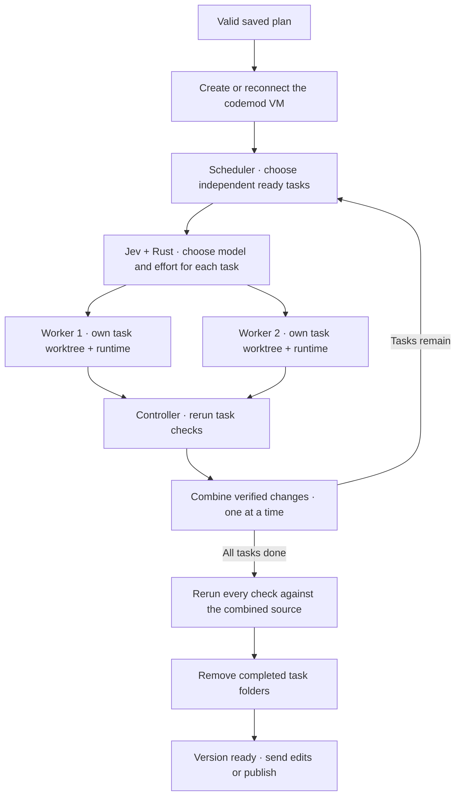
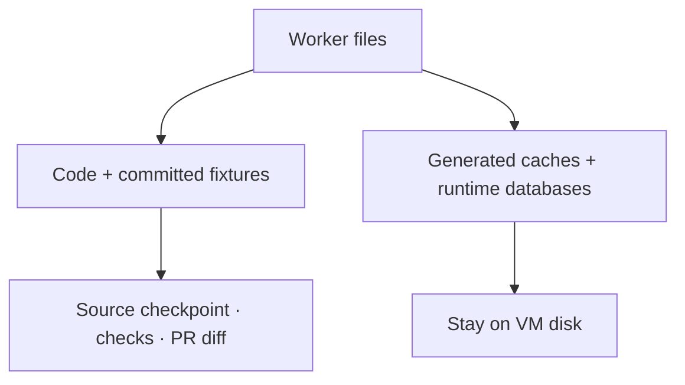

# Plan execution

Creating a codemod starts planning and execution automatically. Up to two Codex executors follow dependencies in the mod’s Linux VM.

A failed check pauses that task and its dependents. The other worker can finish independent work. **Ctrl+R** retries unfinished work; completed tasks stay done.

## Working folder

New codemods start from committed `HEAD` in their own host worktree. The first execution copies source into `/workspace` in Linux. A separate, local Git repository in the VM owns the integration branch and task worktrees. The project’s original Git metadata, remote configuration and credentials stay on the Mac.

The host’s `work/` folder holds source exports for planning, review and checkpoint saves. It is not mounted into the VM. Credentials, dependencies and caches are excluded from snapshots; `.env.example` and `.env.sample` are included. Source files remain visible even if a generated `.gitignore` would hide them.

Each worker’s runtimes and download caches stay in the VM across edit rounds and publication. Task-local dependencies are removed with their completed task folders. Closing removes that VM; reopening creates a fresh one when execution starts. See [Local Linux sandbox](sandbox.md) and [Workers](workers.md).

### Source and generated files

New test caches (`.pytest_cache`, `.mypy_cache`, `.ruff_cache`), `.egg-info` metadata and local database files stay out of checkpoints and PR diffs. This includes DuckDB, SQLite and `.db` files with their WAL, shared-memory and journal sidecars. Files already tracked in the starting project or an updated target remain source, so committed fixtures are preserved.

Private save copies preserve the checked files instead of filtering them against an older baseline. Saving checks their contents and permissions; changed source or outside worktree edits pause the save.

Guest Git checkpoints contain the filtered source snapshot. Runtime files remain on the VM's disk. Reconnecting repairs older checkpoint indexes and saved drafts before retrying; the worker can verify scope without deleting runtime data. Newly created database files are treated as runtime data.

## Tasks and checks

Rust dispatches at most two ready tasks into `/tasks/<task-run-id>`. Each worktree has its own branch and index, sharing Git objects. New tasks start from the latest combined source. A retry keeps the same worker and task folder. The worker can write that folder, its own runtime home and temporary files; other task folders, combined source and Git metadata remain read-only.

One controller owns VM startup and shutdown, task checkpoints, Git integration and system package setup. Controller operations run one at a time; model turns and task commands overlap. Worker conversations and cancellation signals are separate.

Codex prepares project runtimes and dependencies; missing OS packages go through the [VM setup tool](sandbox.md#system-packages).

Each task returns a short summary and runnable commands for every declared check. Rust reruns them with a 30-second limit per command. Missing checks, nonzero exits, timeouts or checks that change source files block completion. Passing tasks are merged into the integration branch one at a time, as they finish. A conflict pauses execution and keeps both versions. The saved draft includes non-conflicting changes and conflict markers. **Ctrl+R** asks the worker to resolve them, or send an edit request to replan.

After all tasks finish, the harness updates each task folder to the combined source and reruns its checks there. Commands keep their original paths and installed dependencies. Successful final verification removes the task folders. Failed checks retain them for retry.

Each active task has a spinner and worker ID through implementation and checks. **Ctrl+O** expands scopes, commands and failures. File scopes guide Codex; the sandbox enforces the folder boundary. Passing checks are evidence; review the code too.

## Updates from merged work

When the PR target changes, a finished codemod saves a checkpoint and runs an integration plan in the same VM. Codex resolves text conflicts; Rust independently reruns the original and combined checks. Current workers finish first. Publication waits for verification. See [Worktrees and PRs](git-workflow.md#when-another-codemod-merges).

## Request edits

Send a message through the composer. During implementation, ordinary messages wait in the queue until the current version passes verification. The next message starts a new plan against the latest source, including checks for the change and regressions. The execution workspace and conversation stay; the current plan and task results are replaced.

After a failed run, sending a message starts a revised plan against the saved source, including unfinished work.

Use the queue’s **s** action to steer an active turn immediately. Steering and ordinary edit rounds are separate. See [Codemods and messages](codemods.md).

## Pause, review and publish

**Ctrl+R** pauses both workers and any verification or setup command. Files and runtime remain. Reconnecting verifies confirmed turns without repeating their edits; uncertain delivery waits for explicit retry. Failed final checks can rerun without regenerating completed tasks.

**Ctrl+D** reviews source while workers are idle. **Ctrl+S**, or **p** inside the diff, starts publication after verification. Confirm Git adoption or a GitHub destination if needed, then the PR. Publication commits and pushes to the codemod branch and retains the VM for more edits.

Closing stops both workers, saves each unfinished draft, then saves a local checkpoint and a Git bundle of the VM’s task branches before removing the VM. Reopening restores unfinished task source and branch relationships. Draft exports include edits from both tasks; overlapping text edits get conflict markers. Binary conflicts retain the VM until resolved. Installed runtimes and dependencies must be prepared again in the fresh VM; saved check commands may need an edit request to rebuild their environment. Deleting discards local work. See [Worktrees and PRs](git-workflow.md) for retention and recovery.

## Current limits

Maximum two Codex executors per codemod. No Muse or direct peer messaging yet. Linux only; no host mounts or published app ports. Symlinks, submodules and special files are unsupported. Uses Codex CLI **0.159.2** through the [app-server API](https://developers.openai.com/codex/app-server).
