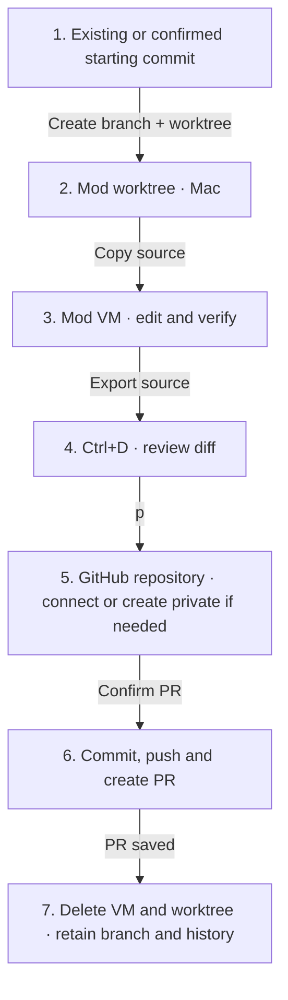
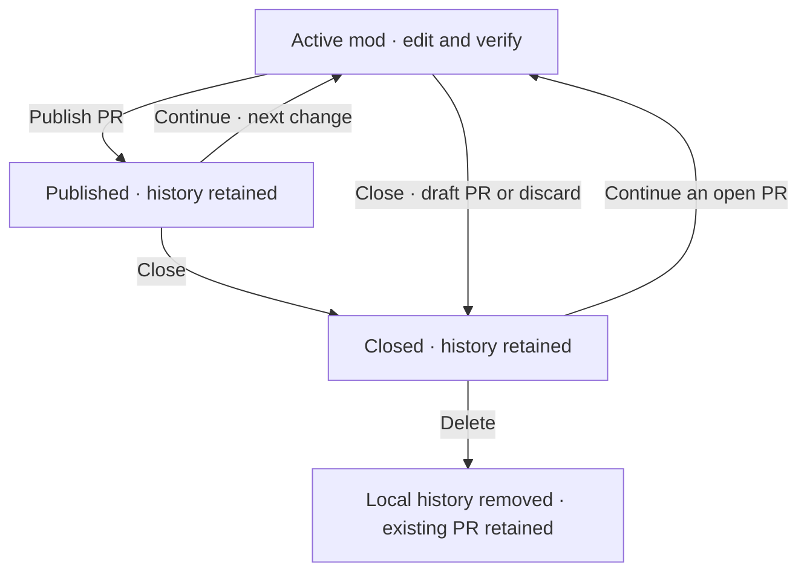

# Worktrees and pull requests

A new codemod owns a Git branch and worktree. The harness handles empty folders, existing files and repositories that have no commits.

## Start in any folder

| Folder | Starting point |
| --- | --- |
| Empty, without Git | Confirm an empty initial commit. |
| Existing files, without Git | Review the file list and confirm the initial commit. |
| Git, without commits | Review and commit the starting files. |
| Git, with commits | Use committed `HEAD`; local edits remain in your checkout. |

Setup respects `.gitignore` and excludes common credential files, dependencies and caches. Use ↑/↓ to review the list; Enter confirms and Esc returns to the description. Changed files block setup. Your source files stay in place; the initial commit preserves their bytes and executable permissions. New repositories use `main`; an existing unborn branch keeps its name.



The planner reads the mod worktree. The executor gets a source copy in `/workspace`; the Mac’s `.git` pointer and credentials never enter the VM. One executor works there today. Task worktrees and parallel executors come later.

Worktree creation, publication and resource cleanup use the [tool dispatcher](tools.md). These operations are callable only by the harness; workers cannot invoke them.

## Publish

Sign in with [GitHub CLI](https://cli.github.com/) and configure Git authentication:

```sh
brew install gh
gh auth login
gh auth setup-git
```

After all tasks and combined checks pass, open **Ctrl+D** and press **p**. Without an origin remote, choose **connect existing** or **create private** using Tab. Enter `owner/repository`, then confirm the destination. An empty repository gets the starting commit before the PR. A populated repository must share history and contain the target branch; unrelated projects are rejected.

Confirm **Publish PR** with Enter. Reviewed changes are committed and pushed to the mod branch. The harness creates a PR, or updates its existing one. It does not merge the PR or edit your original checkout.

The PR targets the branch you were on when the mod was created. That branch must exist on GitHub. A detached starting commit uses the repository’s default branch. Generated branches use `sprowt/mod-<id>-<stamp>`.

## Continue working

On a published mod, press **Ctrl+R**, describe the next change and press Enter. The harness checks that the PR is open and its commit matches the saved branch. It restores the worktree from the last published commit and prepares a fresh plan. Run that plan to create a fresh VM; publication pushes further commits to the same PR. Verified publication marks a draft PR ready for review.

Merged or closed PRs require a new mod from the updated project. A branch changed outside the harness blocks continuation and retains saved work.

## Close or delete

Open **Ctrl+P**:

| Action | Result |
| --- | --- |
| `c` · Close | Keep history in the closed list; delete the VM and worktree. |
| `d` · Delete | Permanently remove local history and discard unpublished work. Existing PRs remain. |

Closing unfinished Git work offers **save changes as draft PR** or **discard unpublished changes**. Saving updates an existing PR when present and marks it as draft. Empty mods need no PR. Closing published work keeps its PR unchanged. Commits already pushed to an existing PR remain.

**Tab** switches between active and closed mods. Enter opens history; **r** continues a published mod's open PR. Closing and deleting never merge a PR.



A failed push, PR update, restoration or cleanup retains the mod and recovery files. **Ctrl+R** retries; reopening starts no work automatically. Saved checkpoints prevent duplicate commits and PRs after uncertain responses. A PR with different commits blocks continuation or publication.

Publication removes the VM and worktree after saving the PR URL. Messages and results remain until deletion. Continuing replaces the current plan and checks, retaining the conversation. Published branches remain locally and on GitHub; discarded source exports are removed.

## Existing snapshot codemods

Open **Ctrl+D**, then press **p**. Confirm using the saved starting files as the Git baseline. The harness adopts the finished source into a branch, retaining the plan, checks and conversation. Work already applied locally can be published too; it does not need another implementation run. Local files stay untouched. An existing repository must match the saved baseline.

GitHub setup then follows the same flow. **a** remains available for local apply before adoption. Closing a snapshot mod without adopting it discards its unapplied files.

Interrupted repository setup retains its request. **Ctrl+R** retries; **Ctrl+D**, then **p** lets you change the choice. If a repository was created but the response was lost, choose **connect existing** for the same destination. Existing remotes and unrelated remote history are never replaced.

## Current limits

Symlinks and submodules are unsupported. GitHub Enterprise and other Git hosts are not connected yet.
