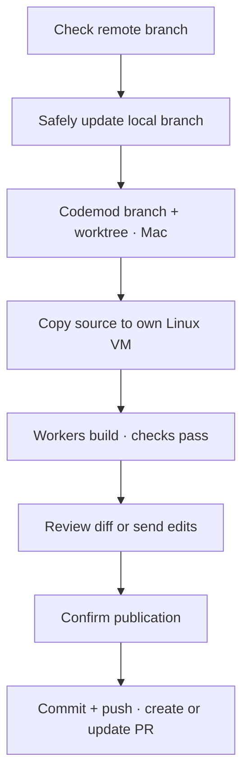
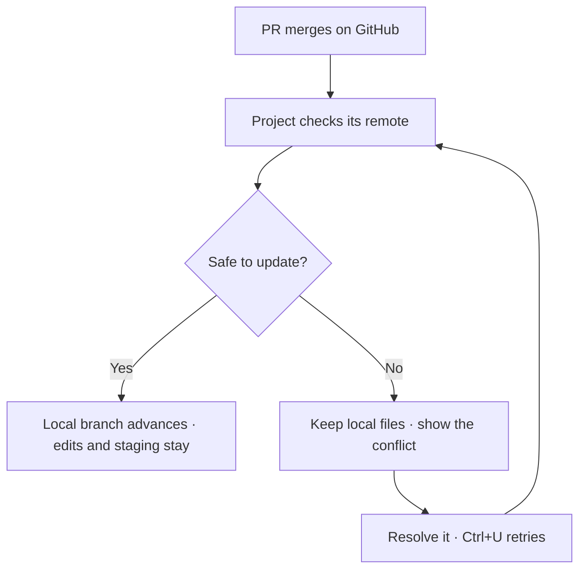
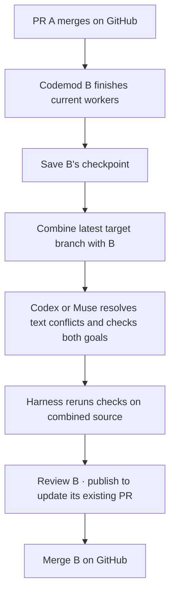
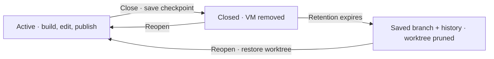

# Worktrees and pull requests

Each codemod owns a branch, a host worktree and a local Linux VM. Workers prepare a version; you request edits or publish it.

## Start in any folder

| Folder | Starting point |
| --- | --- |
| Empty, without Git | Confirm an empty initial commit |
| Existing files, without Git | Review the files and confirm the initial commit |
| Git, without commits | Review and commit the starting files |
| Git, with commits | Check the remote, safely fast-forward, then use committed `HEAD` |

Setup respects `.gitignore` and excludes common credentials, dependencies and caches. Enter confirms; Esc returns to the description. Changed files block setup. Source bytes and executable permissions are preserved. New repositories use `main`; an existing unborn branch keeps its name.



Original project Git metadata and credentials stay on the Mac. A separate Git repository inside the VM manages task worktrees under `/tasks/<id>` and combined source at `/workspace`. The harness owns guest Git operations; the [tool dispatcher](tools.md) handles host worktrees and GitHub publication. See [Plan execution](execution.md).

## Keep the project current

The project syncs on startup and every **30 seconds** while the harness is open, including with zero codemods. Publishing, closing or deleting a codemod does not stop this check. Merge its PR later on GitHub and local `main` catches up when you are on `main`. With the harness closed, it catches up next time you open it. **Ctrl+U** checks immediately from the conversation, codemod picker or new-mod screen.



Fetch the checked-out branch’s configured upstream, or the same branch on `origin`. Updates only fast-forward; they never switch branches, rebase, create a merge commit or push the project branch. Already current or locally ahead branches keep their committed source. Creating a codemod also checks before making its worktree.

Local edits and staging are preserved. Files previously left untracked after publication become tracked against the merged commit; differing local bytes remain unstaged edits. The codemod gets committed source, so local edits are not included in its PR.

Overlapping tracked edits, divergent history, unavailable remotes and active Git operations pause sync with an error. Resolve the cause and press **Ctrl+U**, or wait for the next check. Failed codemod setup uses **Ctrl+R**. No planner starts with stale source. Detached commits, local-only branches and projects without a remote keep their local starting point; a missing configured upstream is an error.

If planning failed before execution, **Ctrl+R** refreshes an untouched worktree from the updated project and starts a fresh planner conversation. History, queued instructions and the draft stay. Executing codemods use the update flow below.

## When another codemod merges

Build codemods in parallel; merge their PRs one at a time on GitHub. The harness checks each target branch every **30 seconds** while open. **Ctrl+U** checks immediately.

Each codemod fetches into its own `refs/sprowt/upstream/<branch>` reference. Target checks leave remote-tracking references and `FETCH_HEAD` unchanged, so they can run alongside project sync and other codemod checks.



An open PR becomes a draft as soon as a newer target is detected. Its workers finish before source changes. Finished versions update automatically once their review is clear. An unfinished review, open findings or repairs hold the automatic update; paused or failed work waits for retry or edits. **Ctrl+U** explicitly updates a finished version and invalidates its previous review. This updates B's branch and VM source separately from the project's fast-forward above.

The integration plan carries the codemod's checks and adds combined regression checks. A resolution worker receives the original goals, upstream commit messages and conflicting versions. Technical text conflicts are resolved in B's existing VM. Conflicting product intent pauses with a question; answer through the composer. Clean merges get the same verification.

Passing checks save a merge commit with both parents. Drafts, queues and history stay; the diff now compares B with the updated target. Worker runtimes remain, while completed task folders are replaced. **Publish** updates the same PR and marks it ready after confirmation. Publication checks the target again, so changes arriving during verification trigger another update.

Interrupted updates retain a checkpoint and resume safely. If saving fails after checks pass, **Ctrl+R** retries the save without repeating workers, provided the checked source is unchanged. Changed source needs verification again. Binary conflicts, rewritten target history, protected file changes or outside worktree edits pause for manual reconciliation. Both Git commits and saved work remain.

This is branch synchronization, not a GitHub merge queue. The harness does not merge PRs or enforce their merge order; use GitHub branch protection or its merge queue to require current checks at merge time.

## Publish and edit

Sign in with [GitHub CLI](https://cli.github.com/):

```sh
brew install gh
gh auth login
gh auth setup-git
```

After tasks and combined checks pass, **Ctrl+S** starts publication. You can also open **Ctrl+D** and press **p**. Source must match the verified version. Confirm the PR with Enter; Esc cancels.

Without an origin, choose **connect existing** or **create private** using Tab, enter `owner/repository`, then confirm. An empty repository gets the starting commit first. A populated repository must share history and contain the target branch.

The PR targets your starting branch, or the GitHub default branch when starting detached. Codemod branches use `sprowt/mod-<id>-<stamp>`.

Publishing retains the VM, worktree and conversation. Send edits through the composer. A new plan covers the requested change and regression checks; execution reuses the VM. Publish again to update the same PR. The diff covers the codemod's changes against its latest checked target.

Merged or closed PRs require a new codemod. Project sync brings merged changes into the local starting branch independently. Outside changes to the PR branch or worktree block publication and preserve local work.

## Close, reopen or delete

Open **Ctrl+P**:

| Action | What stays | What is removed |
| --- | --- | --- |
| `c` · Close | Checkpoint commit, worktree, history, draft and queue | VM and its runtime |
| `r` · Reopen a closed mod | Saved source and history | Nothing; a fresh VM starts on execution |
| `d` · Delete | Existing PR on GitHub | Local codemod data, worktree and VM |

Closing stops workers, exports their latest source, commits a local checkpoint and removes the VM. It works without GitHub, including unfinished work. The **Closed** flag lives in harness state; no Git tag is needed. **Tab** switches active and closed lists; Enter reads closed history.



Closed worktrees are pruned after **30 days**, checked when the harness opens that project. Use `--closed-worktree-days N`; **0** disables pruning. Only unchanged checkpoint worktrees are removed. The branch, history and source exports remain, so reopening can restore them. Outside edits skip pruning.

Failed publication, checkpoint saves or VM deletion retain work and recovery metadata. **Ctrl+R** retries. Closing and deleting leave existing PRs unchanged; publication creates or updates them.

## Saved snapshots and recovery

Older snapshot codemods offer Git adoption before publication or closing. Confirm the saved starting files as the baseline; the harness preserves their source, checks and conversation. Previously completed local work can be published without another implementation run. An existing repository must match that baseline.

Interrupted repository setup retains its request. **Ctrl+R** retries; **Ctrl+D**, then **p** lets you change the destination. Existing remotes and unrelated history are never replaced.

## Current limits

Up to two Codex or Muse executors per codemod, plus an optional [independent reviewer](review.md) once a version is ready. Symlinks, submodules, GitHub Enterprise and other Git hosts are unsupported.
