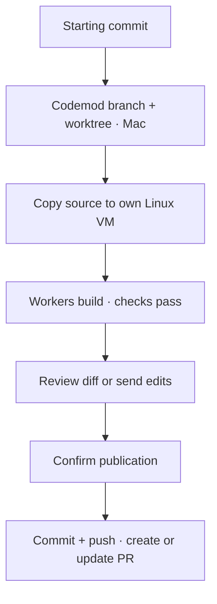
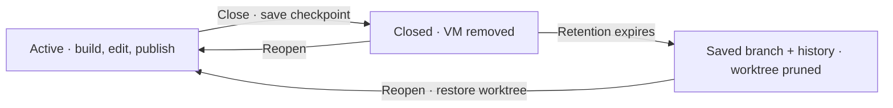

# Worktrees and pull requests

Each codemod owns a branch, a host worktree and a local Linux VM. Workers prepare a version; you request edits or publish it.

## Start in any folder

| Folder | Starting point |
| --- | --- |
| Empty, without Git | Confirm an empty initial commit |
| Existing files, without Git | Review the files and confirm the initial commit |
| Git, without commits | Review and commit the starting files |
| Git, with commits | Use committed `HEAD`; local edits stay in your checkout |

Setup respects `.gitignore` and excludes common credentials, dependencies and caches. Enter confirms; Esc returns to the description. Changed files block setup. Source bytes and executable permissions are preserved. New repositories use `main`; an existing unborn branch keeps its name.



Git metadata and credentials stay on the Mac. Workers edit `/workspace` inside the VM. Git and GitHub operations belong to the [harness tool dispatcher](tools.md).

## Publish and edit

Sign in with [GitHub CLI](https://cli.github.com/):

```sh
brew install gh
gh auth login
gh auth setup-git
```

After tasks and combined checks pass, **Ctrl+S** starts publication. You can also open **Ctrl+D** and press **p**. Source must match the verified version. Confirm the PR with Enter; Esc cancels.

Without an origin, choose **connect existing** or **create private** using Tab, enter `owner/repository`, then confirm. An empty repository gets the starting commit first. A populated repository must share history and contain the target branch.

The PR targets your starting branch, or the GitHub default branch when starting detached. Codemod branches use `sprowt/mod-<id>-<stamp>`.

Publishing retains the VM, worktree and conversation. Send edits through the composer. A new plan covers the requested change and regression checks; execution reuses the VM. Publish again to update the same PR. The diff covers the codemod's changes from its original baseline.

Merged or closed PRs require a new codemod from the updated project. Outside changes to the PR branch or worktree block publication and preserve local work.

## Close, reopen or delete

Open **Ctrl+P**:

| Action | What stays | What is removed |
| --- | --- | --- |
| `c` · Close | Checkpoint commit, worktree, history, draft and queue | VM and its runtime |
| `r` · Reopen a closed mod | Saved source and history | Nothing; a fresh VM starts on execution |
| `d` · Delete | Existing PR on GitHub | Local codemod data, worktree and VM |

Closing stops workers, exports their latest source, commits a local checkpoint and removes the VM. It works without GitHub, including unfinished work. The **Closed** flag lives in harness state; no Git tag is needed. **Tab** switches active and closed lists; Enter reads closed history.



Closed worktrees are pruned after **30 days**, checked when the harness opens that project. Use `--closed-worktree-days N`; **0** disables pruning. Only unchanged checkpoint worktrees are removed. The branch, history and source exports remain, so reopening can restore them. Outside edits skip pruning.

Failed publication, checkpoint saves or VM deletion retain work and recovery metadata. **Ctrl+R** retries. Closing and deleting leave existing PRs unchanged; publication creates or updates them.

## Saved snapshots and recovery

Older snapshot codemods offer Git adoption before publication or closing. Confirm the saved starting files as the baseline; the harness preserves their source, checks and conversation. Previously completed local work can be published without another implementation run. An existing repository must match that baseline.

Interrupted repository setup retains its request. **Ctrl+R** retries; **Ctrl+D**, then **p** lets you change the destination. Existing remotes and unrelated history are never replaced.

## Current limits

One executor per codemod. Parallel executors and review workers come later. Symlinks, submodules, GitHub Enterprise and other Git hosts are unsupported.
