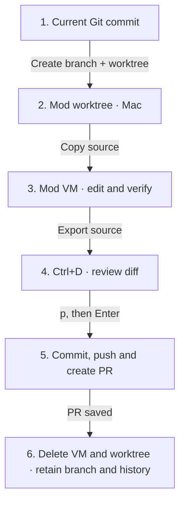

# Worktrees and pull requests

Each new mod in a Git project gets a branch and worktree from the current committed `HEAD`. Local edits and untracked files stay in your original checkout. Commit the source you want the mod to use before creating it.



The planner reads the mod worktree. The executor gets a source copy in `/workspace`; the Mac’s `.git` pointer and credentials never enter the VM. One executor works there today. Task worktrees and parallel executors are the next batch.

## Publish

You need a `github.com` origin remote, permission to push, and a signed-in [GitHub CLI](https://cli.github.com/):

```sh
brew install gh
gh auth login
gh auth setup-git
```

After all tasks and combined checks pass, open **Ctrl+D**. Press **p**, then **Enter** to publish. The harness exports only reviewed source changes into the mod worktree, commits them, pushes the branch and creates a PR. It does not merge the PR or edit your original checkout.

The PR targets the branch you were on when the mod was created. That branch must exist on GitHub. A detached starting commit uses the repository’s default branch. Generated branches use `sprowt/mod-<id>-<stamp>`.

## Remove a mod

- With source changes: stop workers, export the latest VM files and create a **draft PR** before cleanup.
- Without source changes: remove the VM, worktree and unused generated branch.
- Already published: retain the PR and branch; remove local mod data.

A failed push, PR creation or cleanup keeps the mod and its recovery files. **Ctrl+R** retries; reopening does not start work automatically. Publication checkpoints prevent duplicate commits and look up an existing PR after an uncertain response. A PR with different commits blocks cleanup.

Publication removes the VM and host worktree only after the PR URL is saved. Messages, checks and source exports remain until you remove the mod. Published branches remain available locally and on GitHub.

## Compatibility

Existing mods and projects without Git keep their snapshot and local-apply workflow. New Git mods require an initial commit. Symlinks and submodules are unsupported. GitHub Enterprise and other Git hosts are not connected yet.
