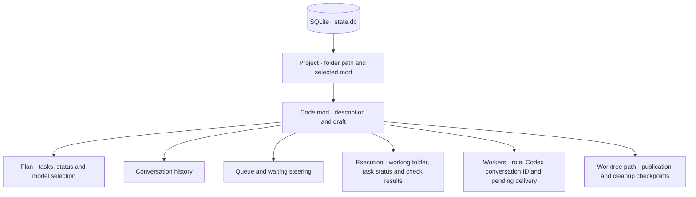

# Local state

One SQLite database stores harness state for all projects. Git projects use their canonical repository root; other folders use their canonical path. Each mod’s data stays scoped to that project.



## On macOS

```text
~/Library/Application Support/sprowt-harness/
├── state.db          harness state
├── state.db-wal      SQLite write-ahead log, when present
├── state.db-shm      SQLite shared memory, when present
├── network.json      guest download allowlist
├── laya-runtime/     Python runtime installed by setup
├── laya-models/      downloaded model cache
└── workspaces/       private working folders per mod
    └── <mod>-<stamp>/
        ├── checkout/ Git worktree for new Git mods; removed after publication
        ├── git-mod.json branch, base commit, PR URL and recovery phase
        ├── snapshot-ready completed Git mod source transfer
        ├── before/   starting files
        ├── work/     source exported from the VM
        ├── base.git/ private diff metadata
        ├── vm.json   VM identity and image digest; removed after VM deletion
        ├── host-codex/ private host agent state; never shared with the guest
        ├── sandbox.log setup diagnostics
        ├── packages.jsonl OS package requests and results
        ├── tools.jsonl harness tool activity; metadata only
        ├── setup/    trusted guest package setup files
        └── review.patch
```

State is saved automatically as you create mods, type drafts, manage queues and receive worker messages. Replies save model and effort; plans save routing. Execution saves attempts, checks and the verified source fingerprint. SQLite stores each Git mod’s folder; `git-mod.json` records its branch, base, exported fingerprint, commit, PR URL and publication or removal intent.

The [tool dispatcher](tools.md) records call IDs, callers, duration and outcomes in `tools.jsonl`. Inputs and outputs are omitted. Tool logs stay on the Mac and are removed with the mod; recovery uses saved execution state and Git checkpoints.

Apple Container manages each VM’s disk separately. Code and dependencies persist until publication, local apply or mod deletion removes the VM. The host workspace holds starting files and source exports. Quitting stops active VMs and keeps unfinished disks. Setup briefly creates transfer archives inside the private workspace.

The database file uses owner-only permissions; its directory is private to your macOS user. Conversation text, descriptions and queued instructions are stored as plain text.

## Reopen, close and delete

Run from the same project to restore mods, drafts and conversations. Git subfolders resolve to the repository root. Workers start when requested. A moved repository has a different identity; relocating saved worktrees is unsupported.

PR publication deletes the VM and worktree while retaining the branch, history and exports. The saved URL recovers after reopening; **Ctrl+R** retries pending cleanup. Git operations run in the background and stop on exit, retaining their checkpoints. Legacy local apply deletes only the VM and also keeps history.

Closing marks the mod as closed in SQLite after resource cleanup. Its conversation and results remain in the closed list. Unpublished Git work can become a draft PR or be explicitly discarded. Deletion removes local records and source exports; existing PRs remain. Legacy and non-Git closing discards unapplied files while keeping history.

Continuing an open PR restores its branch, resets the current plan and worker conversations, and retains the transcript. The follow-up stays in the saved draft until restoration succeeds. Reopening the harness starts no workers. Codex may retain earlier conversations; credentials stay on the host.

Run one harness instance per project. Shared memory across projects, repository indexing and memory updates after merges are future layers.
