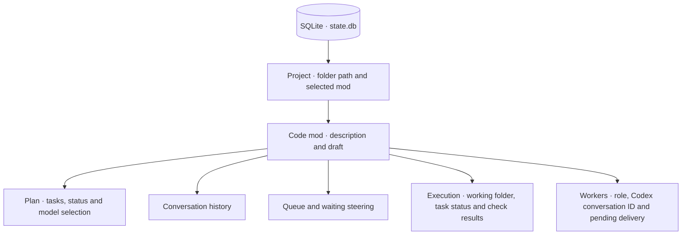

# Local state

One SQLite database stores harness state for all projects. Projects are identified by their canonical folder path; each mod’s data stays scoped to that project.



## On macOS

```text
~/Library/Application Support/sprowt-harness/
├── state.db          harness state
├── state.db-wal      SQLite write-ahead log, when present
├── state.db-shm      SQLite shared memory, when present
├── laya-runtime/     Python runtime installed by setup
├── laya-models/      downloaded model cache
└── workspaces/       private working folders per mod
    └── <mod>-<stamp>/
        ├── before/   starting files
        ├── work/     executor edits
        ├── base.git/ private diff metadata
        └── review.patch
```

State is saved automatically as you create mods, type drafts, manage queues and receive worker messages. Plans also save their chosen model, reasoning level and routing reason. Execution saves task attempts, delivery and turn IDs, verification results and the fingerprint of verified source files. Working files stay on disk across restarts.

The database file uses owner-only permissions; its directory is private to your macOS user. Conversation text, descriptions and queued instructions are stored as plain text.

## Reopen and delete

Run the harness from the same project root to restore mods, the selected mod, drafts, queues and conversations. Workers start when requested. A renamed or moved folder has a different project identity.

Deleting a mod removes its plan, conversation, queue, draft, steering, execution records and working folder, including unapplied work. Codex keeps its own conversation records outside this database. Credentials stay with Codex.

Run one harness instance per project. Shared memory across projects, repository indexing and memory updates after merges are future layers.
