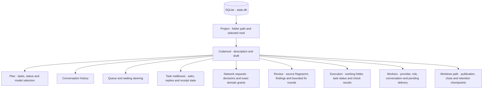

# Local state

One SQLite database stores harness state for all projects. Git projects use their canonical repository root; other folders use their canonical path. Each mod’s data stays scoped to that project.



## On macOS

```text
~/Library/Application Support/sprowt-harness/
├── state.db          harness state
├── state.db-wal      SQLite write-ahead log, when present
├── state.db-shm      SQLite shared memory, when present
├── network.json      guest download allowlist
├── router.env        host-only Jev API key; owner-only permissions
├── projects/         project sync state, independent of codemods
│   └── <project>/
│       ├── sync-project.json pending fast-forward; removed when complete
│       ├── sync-before-index original staging checkpoint during sync
│       ├── sync-index temporary staging used for the fast-forward
│       └── tools.jsonl project sync activity; metadata only
└── workspaces/       private working folders per mod
    └── <mod>-<stamp>/
        ├── checkout/ Git worktree; retained until deletion or closed retention
        ├── git-mod.json branch, base, checkpoint commit, PR URL and recovery phase
        ├── project-setup pending initial Git setup or snapshot adoption
        ├── repository-setup.json confirmed GitHub destination and recovery
        ├── snapshot-ready completed Git mod source transfer
        ├── sync-project.json pending project fast-forward; removed when complete
        ├── sync-before-index original staging checkpoint during sync
        ├── sync-index temporary staging used for the fast-forward
        ├── refresh-target pending starting-source refresh; removed when complete
        ├── main-update.json pending target, checkpoint, conflicts and integration plan
        ├── main-update/ immutable merge snapshots and temporary merge index
        ├── before/   latest checked target files
        ├── work/     source exported from the VM
        ├── base.git/ private diff metadata
        ├── tasks.json task round, worker ownership and integration state
        ├── tasks.bundle sanitized guest Git branches for VM recovery
        ├── task-drafts/ sanitized task baselines and unfinished source
        ├── checkpoint-error present if a worker checkpoint needs recovery
        ├── vm.json   VM identity and image digest; removed after VM deletion
        ├── host-codex/ private worker directories and login links; never shared with the guest
        ├── muse/     per-worker native session, task, command and accepted turn IDs
        ├── sandbox.log setup diagnostics
        ├── packages.jsonl OS package requests and results
        ├── tools.jsonl harness tool activity; metadata only
        ├── setup/    trusted guest package setup files
        └── review.patch
```

Before Git setup is confirmed, its file preview uses a temporary workspace. Cancelling or exiting removes that preview. Confirmed setup records a codemod workspace so interruption can recover. Adopting a snapshot keeps its existing workspace and project identity.

State is saved automatically as you create mods, type drafts, manage queues and receive worker messages. Replies save model and effort; plans save routing. Execution saves task ownership, provider assignment reasons and order, attempts, checks, the current routing decision and evidence, and the verified source fingerprint. Routing inputs are stored as plain text; they exclude env files and the API key. SQLite stores each Git mod’s folder; `git-mod.json` records its branch, base, exported fingerprint, commit, PR URL and publication, close, edit or removal intent. Closing also saves a timestamp for retention.

The [tool dispatcher](tools.md) records call IDs, callers, duration and outcomes in `tools.jsonl`. Inputs and outputs are omitted. Tool logs stay on the Mac and are removed with the mod; recovery uses saved execution state and Git checkpoints.

Apple Container manages each VM’s disk separately. Per-worker runtimes and download caches persist across publication and edit rounds. Task folders and their local dependencies are removed after successful final checks. Closing or deletion removes the VM. The host workspace holds starting files and source exports. Quitting stops active VMs and keeps unfinished disks. Setup briefly creates transfer archives inside the private workspace.

Generated test caches and new runtime databases stay on the VM disk, outside source exports and Git checkpoints. Already committed database fixtures stay in source. Reconnection repairs older checkpoint indexes without deleting their runtime data. Closing or deleting the VM removes that data too. See [Source and generated files](execution.md#source-and-generated-files).

The database file uses owner-only permissions; its directory is private to your macOS user. Conversation text, descriptions and queued instructions are stored as plain text.

Agent availability is checked on each startup, not saved as a setting. Task providers and worker identities remain saved. Idle workers keep their native conversation IDs; the scheduler reuses them for ready work. The two-slot limit counts active workers, not saved identities. Startup restores state without activating unfinished work.

Muse's verified Linux binary and adapter files live in `~/Library/Caches/sprowt-harness/muse/`. The binary is shared across codemods; closing or deleting a codemod does not remove that cache. Temporary login-check files are removed after discovery, including failures and timeouts. Temporary account-resolution files are removed when the host broker exits. Guest capabilities live only in the worker's VM home and expire when its turn ends.

Muse recovery files are private, written atomically before delivery and contain IDs, not credentials or message bodies. Native conversations and tool history remain in that worker's VM home. Quitting retains them; VM deletion removes them. SQLite stores the native session identity and pending receipt. See [Muse recovery](workers.md#muse-recovery).

Task rows save verification feedback and a one-attempt recovery budget. Requeueing saves the evidence, new attempt identity and budget atomically. Restart and explicit retry retain the budget; passing verification clears the feedback. See [Verification feedback](execution.md#verification-feedback).

Task rows also save repair evidence and affected-task context. The execution stores a separate repair-attempt count; restart and explicit retry retain it. A new plan resets both budgets. See [Automatic repairs](execution.md#automatic-repairs).

The `worker_messages` table saves [coordination](coordination.md): task identities, bodies, reply links, retry keys and delivery/receipt state. New edit and integration rounds retain that history but retire its task addresses. Closing keeps messages; deleting a codemod removes them. Mailbox access goes through the host dispatcher; the database is never copied into the VM.

`network_requests` saves exact domains, reasons, decisions and retry state for each task. `network_grants` stores approved domains for that codemod. New edit or integration rounds remove old task requests and retain grants. Closing makes grants inactive; reopening restores them. Deletion removes both. These tables stay on the Mac; worker tools can request access, while only the host UI can approve it. The shared `network.json` is unchanged by approvals.

Project synchronization uses a temporary Git index and locks the real index while fast-forwarding. Its checkpoint completes an interrupted index update on retry. A repository lock serializes project sync with codemod setup. Git hooks and project filters are disabled. Planning starts only after synchronization and worktree setup finish.

Background sync checks on startup and every 30 seconds, even without mods or animations. Its recovery folder stays when a mod is deleted. **Ctrl+U** retries immediately; quitting stops checks until the project opens again. See [Keep the project current](git-workflow.md#keep-the-project-current).

## Reopen, close and delete

Run from the same project to restore mods, drafts and conversations. Git subfolders resolve to the repository root. Unfinished work waits for retry; finished versions can update from merged work. A moved repository has a different identity; relocating saved worktrees is unsupported.

Publication retains the VM and worktree. The PR URL and commit are saved before success is shown. Failed Git operations keep their checkpoints and can retry with **Ctrl+R**.

Closing stops all workers, checkpoints their drafts, saves guest task branches in a Git bundle and commits a checkpoint before VM deletion, then marks the mod Closed in SQLite. History, draft, queue, branch and worktree stay. Deleting removes local records, source exports, worktree and VM; existing PRs remain.

At project startup, closed worktrees older than `--closed-worktree-days` are pruned if their checkpoint is unchanged. The default is 30 days; 0 disables pruning. Branches, history and exports stay. Reopening restores a pruned worktree from its checkpoint; a fresh VM starts on execution.

Each edit round consumes its queued request and replaces the current plan and task results in one transaction, retaining the workspace, transcript and composer draft. Target updates install their integration plan atomically too; drafts, queues and history stay. Immutable snapshots make interrupted baseline replacement repeatable. A temporary index and saved merge commit let finalization resume without losing ancestry. Successful updates remove their recovery snapshots.

Reopening leaves unfinished work paused. Finished versions can automatically update when the target branch changes. Codex may retain earlier conversations; credentials stay on the host.

Run one harness instance per project. Shared memory across projects, repository indexing and memory updates after merges are future layers.
