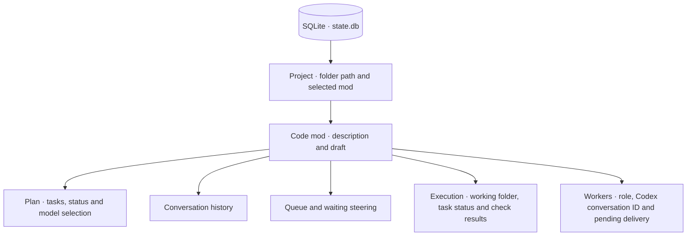

# Local state

One SQLite database stores harness state for all projects. Projects are identified by their canonical folder path; each mod’s data stays scoped to that project.



## On macOS

```text
~/Library/Application Support/sprowt-harness/
├── state.db          harness state
├── state.db-wal      SQLite write-ahead log, when present
├── state.db-shm      SQLite shared memory, when present
├── network.json      guest download allowlist
├── laya-runtime/     Python runtime installed by setup
├── laya-models/      downloaded model cache
└── workspaces/       private working folders per mod
    └── <mod>-<stamp>/
        ├── before/   starting files
        ├── work/     source exported from the VM
        ├── base.git/ private diff metadata
        ├── vm.json   VM identity and image digest
        ├── host-codex/ private host agent state; never shared with the guest
        ├── sandbox.log setup diagnostics
        └── review.patch
```

State is saved automatically as you create mods, type drafts, manage queues and receive worker messages. New agent replies also save their reported model and reasoning effort. Plans save model selection and routing. Execution saves the backend, task attempts, delivery and turn IDs, verification results and the fingerprint of verified source files.

Apple Container manages each VM’s disk separately. Code, installed runtimes and dependencies persist there across restarts. The host workspace holds starting files and source exports for review. Quitting stops active VMs; it keeps their disks. Setup may briefly create an image build context and source archive inside the private workspace.

The database file uses owner-only permissions; its directory is private to your macOS user. Conversation text, descriptions and queued instructions are stored as plain text.

## Reopen and delete

Run the harness from the same project root to restore mods, the selected mod, drafts, queues and conversations. Workers start when requested. A renamed or moved folder has a different project identity.

Deleting a mod removes its VM, plan, conversation, queue, draft, steering, execution records and working folder, including unapplied work. VM deletion must succeed before harness records are removed. Codex may keep earlier conversation records in its original directory. Credentials stay on the host.

Run one harness instance per project. Shared memory across projects, repository indexing and memory updates after merges are future layers.
