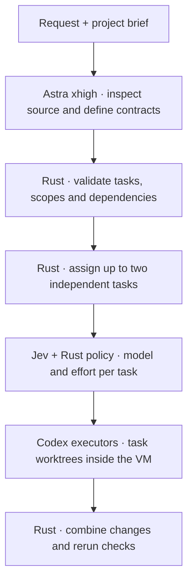

# Planning and routing

Creating a codemod starts a read-only Codex planner at **Astra xhigh**. Git setup and [starting-source synchronization](git-workflow.md#keep-the-starting-source-current) finish first. Edits plan against the latest source export.

## Planning

The planner inspects relevant source, manifests, tests, docs and project rules. Its starting brief includes up to 120 file paths across three levels, short root rules and manifest excerpts, and up to three documentation excerpts. Dependencies, hidden files and external symlinks are excluded from that brief. The brief guides inspection; the planner still reads the source.

Shared contracts define interfaces, data shapes and error behavior before work is split. Material assumptions and non-goals stay explicit. Separate file ownership allows concurrent work against those contracts; real prerequisites and shared files require dependencies.

## Jev task routing

[Jev](https://docs.typesafe.ai/introduction) is a hosted decision model. It evaluates four independent questions: difficulty, uncertainty, cross-component impact and security or data-integrity risk. Rust maps those answers to profiles:

| Task | Model | Effort |
| --- | --- | --- |
| Routine, clear, isolated | `gpt-6.1-sol` | medium |
| Involved or cross-component | `gpt-6.1-sol` | high |
| Hard, uncertain or high risk | `gpt-6.1-sol` | xhigh |
| Missing configuration, timeout or invalid response | `gpt-6.1-sol` | xhigh |

Each task routes before its turn starts, using the project brief, saved plan, contracts, assigned scope and checks. Steering stays in the current turn. Planning is pinned to `gpt-6-astra` xhigh, so it needs no routing call.

Requests time out after eight seconds. The initial confidence floor is **0.80 for every question**. Rust validates options, probabilities and confidence before lowering effort. These thresholds are experimental; confidence measures distribution concentration, not guaranteed correctness. Test them on real codemods before changing them. See [Jev confidence](https://docs.typesafe.ai/confidence).

Codex's model catalog validates the chosen model and effort. An unavailable model falls back to Sol 6.1 or the catalog default, preferring xhigh, then high, then medium. Actual account access is established by inference. A rejected turn remains retryable.

Each task stores its resolved model, effort and routing reason beside its checks. Jev calls also record the policy version, routing input and request duration, plus the revision and answers when available. **Ctrl+O** shows model choices and reasons; the full evidence stays in SQLite. Retries replace the current decision; this is diagnostic data, not a calibrated benchmark or automatic architecture repair.

## Configure Jev

Copy `.env.example` to `.env.local` in the harness repository and add `TYPESAFE_API_KEY`. Then run `sprowt-harness setup` from that folder. Setup copies only that key into `router.env` in the [private local data directory](local-state.md), with owner-only file permissions. Installed harnesses use this configuration from any project.

`.env.local` is ignored by Git. The key is never loaded into the process environment, model prompts or worker configuration. Codex commands cannot read the local key file or `router.env`; executor tools stay inside the VM. Host Rust calls only TypeSafe's fixed HTTPS endpoint, with redirects and environment proxies disabled. Routing sends relevant project context to TypeSafe and uses separate API billing.

## What a plan contains

A summary, shared contracts, material assumptions, non-goals and tasks with IDs, titles, outcomes, file scopes, dependencies, worker assignments and completion checks. Existing saved plans without the new context fields still load.

Rust checks that:

- Context notes are bounded and nonempty when supplied.
- There are 1–32 tasks with unique IDs and nonempty outcomes and checks.
- Dependencies exist and contain no cycles.
- File scopes use exact project-relative paths, with no globs or parent traversal.
- Tasks sharing file or directory scopes have a dependency between them.
- Every task uses the connected provider: Codex.

These checks validate structure and declared scopes. They do not prove the plan will solve the request.

## Review the plan

The conversation shows a numbered outline: task titles, outcomes and dependencies such as **after task 1**. The numbering matches the displayed order, even when the saved task IDs are words.

Press **Ctrl+O** for contracts, assumptions, file scopes, completion checks and model details. Press it again to collapse them. The full plan remains saved; changing its display does not change the plan or start a worker.

Once a valid plan is saved, execution begins automatically. **Ctrl+R** stops work or retries; **Ctrl+D** reviews source when workers are idle.

## Stop and retry

Ctrl+R stops unfinished planning or retries it after interruption or failure. An untouched worktree checks the remote again, refreshes its source and starts a fresh planner conversation. Confirmed starting snapshots and source already used for execution stay fixed. History, draft and queue are retained.

A valid plan is saved and displayed in the conversation. New plans proceed directly to execution. After an interruption, Ctrl+R explicitly resumes work.

Reopening restores progress; unfinished work waits for retry. Finished versions can update automatically from merged work, using an integration plan. Sending edits creates a new plan against the latest source, with checks for the change and regressions. The conversation stays; the current plan is replaced.
