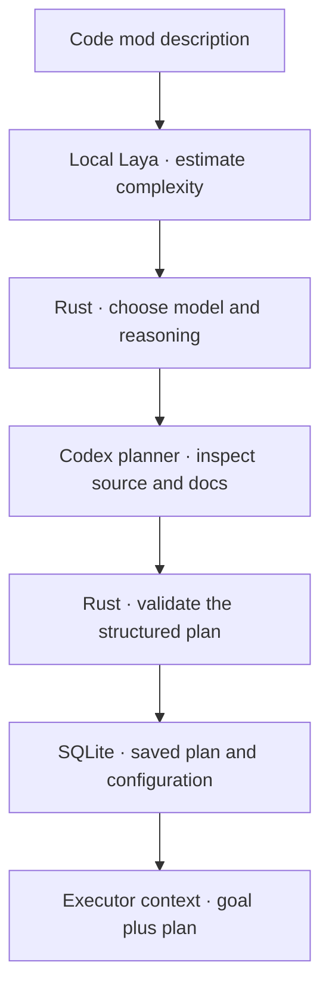

# Planning and Laya

Creating a code mod starts planning from its description. You can describe the whole change immediately.

## Two roles

| Role | Job today |
| --- | --- |
| Planner | Inspect the project and produce a task plan |
| Executor | Answer queued instructions using the goal and saved plan |

They have separate Codex conversations. Both are read-only. Plan tasks are saved for future execution; the harness does not dispatch them automatically yet.

## Local model routing

Install [uv](https://docs.astral.sh/uv/getting-started/installation/), then run `sprowt-harness setup`. Setup installs Python 3.13, `laya==0.3.20` and the multilingual checkpoint under the [local data directory](local-state.md).

Laya runs locally in a separate Python process. It receives the description, a top-level file listing and short excerpts from README.md and AGENTS.md. Codex then inspects the project itself to plan the work.

| Laya result | Planner model | Reasoning |
| --- | --- | --- |
| Simple | `gpt-6.1-sol` | medium |
| Complex | `gpt-6.1-sol` | high |
| Demanding | `gpt-6-astra` | high |
| Uncertain, unavailable or timed out | `gpt-6.1-sol` | high |

The score threshold is 0.70; routing times out after 30 seconds. This is an experimental heuristic. The stock checkpoint was uncertain or wrong in our small test. Laya recommends configuration; Codex generates the plan.

Rust checks the selected model and reasoning level against Codex’s catalog. Missing models fall back to Sol or the catalog default. Account access is checked only when inference runs. The header shows the chosen configuration and routing reason.

## What a plan contains

A summary and tasks with IDs, titles, outcomes, file scopes, dependencies, worker assignments and completion checks.

Rust checks that:

- There are 1–32 tasks with unique IDs and nonempty outcomes and checks.
- Dependencies exist and contain no cycles.
- File scopes use exact project-relative paths, with no globs or parent traversal.
- Tasks sharing file or directory scopes have a dependency between them.
- Every task uses the connected provider: Codex.

These checks validate structure and declared scopes. They do not prove the plan will solve the request.

## Stop and retry

Ctrl+R stops unfinished planning or retries it after interruption or failure. A valid plan is saved and displayed in the conversation. Once it is ready, Ctrl+R starts the executor with that plan as context.

Reopening restores the saved plan without starting workers. Mods created before planning was added retain their original queue workflow.
