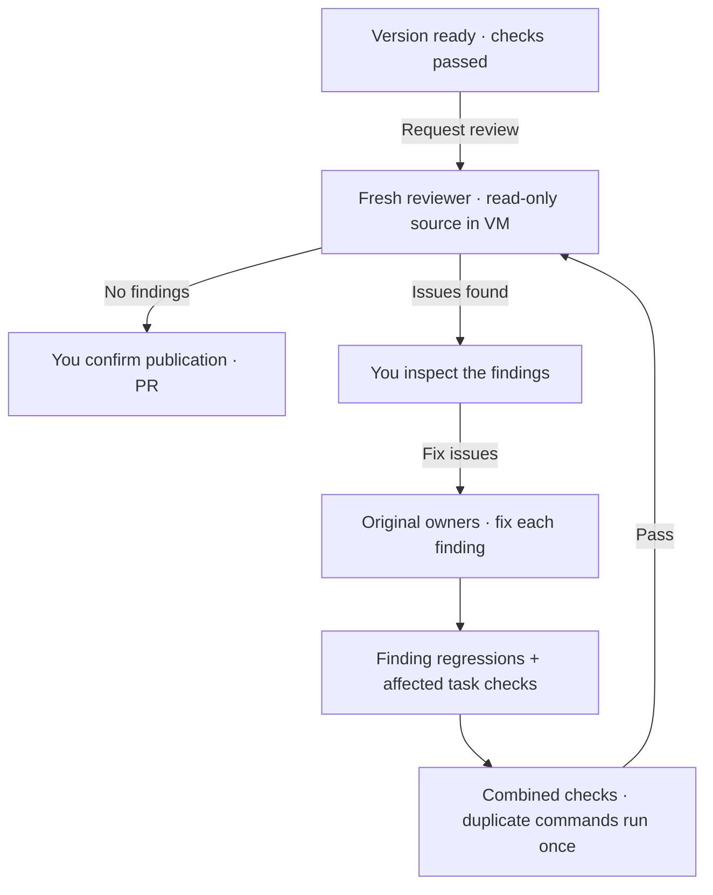

# Independent review

When a version is ready, **Ctrl+E · Ask agent to review** starts a fresh **Sol 6.1 xhigh** Codex conversation. In the diff, press **r**. Review is optional; **Ctrl+S** still publishes directly after checks pass.

The reviewer inspects the combined diff, source, original request, shared contracts and recorded check results. It looks for concrete defects, with a file, line, evidence and proposed fix.



## Fixes and limits

- **Fix issues** returns all current findings to the existing task owners. Their providers, file scopes and checks stay intact.
- Each finding adds a named **Review regression** check to its owner’s task. Owners reproduce and fix that case first; broad suite results alone cannot omit the finding’s check. Original checks remain required.
- Dependent tasks rerun after the fixes. Rust independently checks the combined result, then starts a fresh review. A passing regression is shown as checked; the fresh reviewer decides whether defects remain.
- Repair keeps the task folders, installed dependencies and worker download caches. Identical commands in one task verification pass run once, with results mapped to every covered check. New passes and changed source require fresh verification.
- Each plan gets at most **two user-triggered review fix rounds**. Retrying review keeps that budget. Unresolved findings stay visible; send edits to revise the plan.
- Invalid reports, unknown owners and paths outside the owner's scope pause review. They cannot start fixes.

The reviewer cannot write source, call harness tools, publish or grant network access. Its commands run in the existing codemod VM with only its own home and temporary directory writable. Planning remains **Astra xhigh**; Jev still routes executor effort.

Automatic target updates wait while the current plan has an unfinished review, open findings or repairs. A clean review releases the update. Local project sync continues. **Ctrl+U** can explicitly update a finished version; that changes the source and makes its previous review outdated.

## What you see

The dock shows the issue count and recommends **View review findings** when a review finds defects. During repair it shows checked issues, the current check and elapsed worker time. Target integration says **Verifying target update**; final verification has its own phase.

1. Press **Ctrl+G**, then **i**, to open the findings. Each issue shows its priority, file and line, owner, evidence and proposed fix.
2. Press **x · Fix issues** to start repairs. This action is also in All actions. Findings wait for your choice, including after restarting.
3. Watch issues move from queued to fixing, paused or awaiting a fresh review. Passing checks starts that review automatically. Further findings wait for your choice again.

The view supports mouse and keyboard scrolling. **Esc** returns to your draft; **h · All history** opens previous reports and reviewer messages. A clean review recommends publication. **Ctrl+O** still expands review details in the conversation.

Reviews are tied to a source fingerprint and plan. New instructions or changed source invalidate the result. Outdated findings remain readable but cannot start repairs. An old turn cannot replace a newer review or trigger repairs. Publishing still checks the current source against the verified fingerprint.

**Ctrl+R** stops an active reviewer. Interrupted reviews stay paused on reopening; **Ctrl+E** starts fresh. Closing removes the VM and keeps saved review history; deleting removes local review state with the codemod.

## Verify it

The live check seeds a defect missed by a smoke test, reviews it, chooses Fix issues, repairs the original task and reviews again in a disposable VM. It uses your Codex subscription and removes the VM afterward.

```sh
cargo test independent_review_repairs_a_seeded_bug_and_rechecks_in_vm -- --ignored
```
