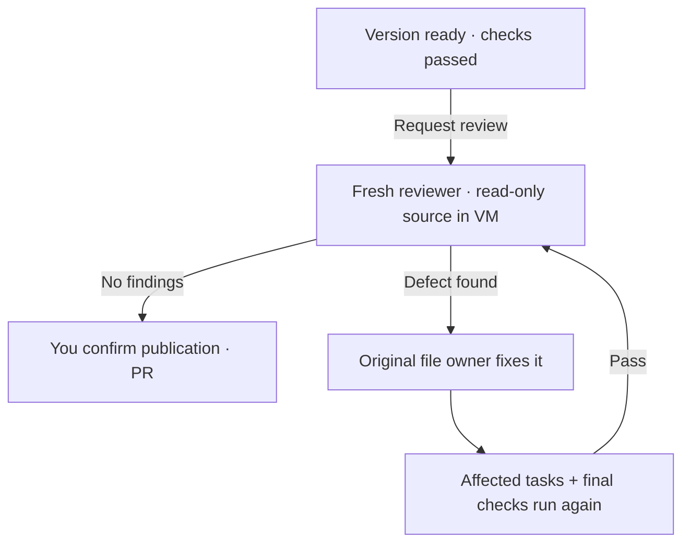

# Independent review

When a version is ready, **Ctrl+E · Ask agent to review** starts a fresh **Sol 6.1 xhigh** Codex conversation. In the diff, press **r**. Review is optional; **Ctrl+S** still publishes directly after checks pass.

The reviewer inspects the combined diff, source, original request, shared contracts and recorded check results. It looks for concrete defects, with a file, line, evidence and proposed fix.



## Fixes and limits

- Findings return to the existing task owners. Their providers, file scopes and checks stay intact.
- Owners include regression coverage in their check commands. Dependent tasks rerun after the fixes. Rust independently checks the combined result, then starts a fresh review.
- Each plan gets at most **two automatic review fix rounds**. Retrying review keeps that budget. Unresolved findings stay visible; send edits to revise the plan.
- Invalid reports, unknown owners and paths outside the owner's scope pause review. They cannot start fixes.

The reviewer cannot write source, call harness tools, publish or grant network access. Its commands run in the existing codemod VM with only its own home and temporary directory writable. Planning remains **Astra xhigh**; Jev still routes executor effort.

## What you see

The dock recommends review when changes are ready, then publication when the current review passes. **Ctrl+G** lists available actions. The conversation keeps the review result. **Ctrl+O** expands the summary, findings, file locations and proposed fixes. **Ctrl+T**, then **h · All history**, shows reviewer narration and previous reports alongside worker messages.

Reviews are tied to a source fingerprint and plan. New instructions or changed source invalidate the result. An old turn cannot replace a newer review or trigger repairs. Publishing still checks the current source against the verified fingerprint.

**Ctrl+R** stops an active reviewer. Interrupted reviews stay paused on reopening; **Ctrl+E** starts fresh. Closing removes the VM and keeps saved review history; deleting removes local review state with the codemod.

## Verify it

The live check seeds a defect missed by a smoke test, reviews it, repairs the original task and reviews again in a disposable VM. It uses your Codex subscription and removes the VM afterward.

```sh
cargo test independent_review_repairs_a_seeded_bug_and_rechecks_in_vm -- --ignored
```
