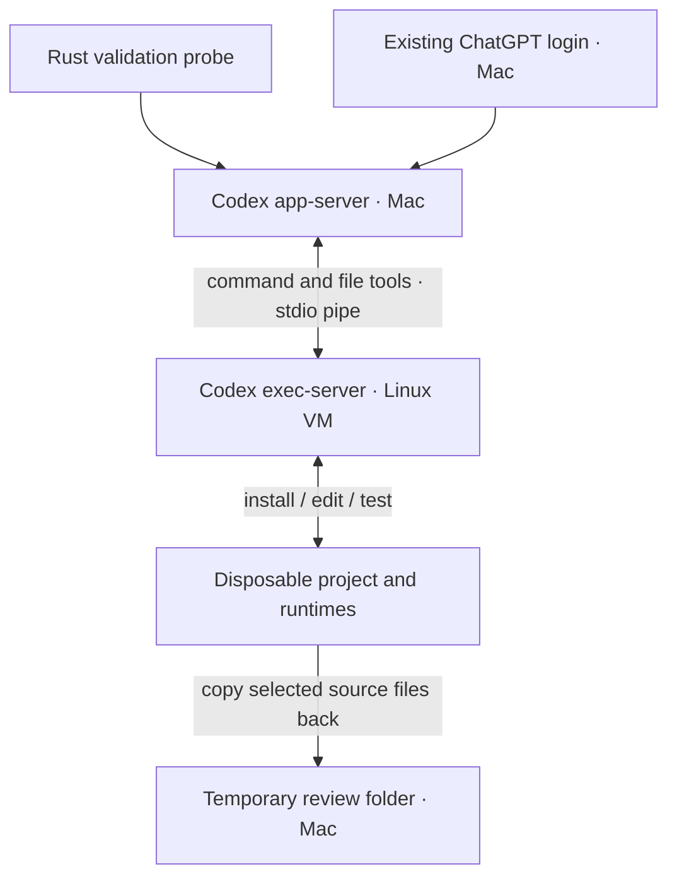

# Local VM validation

We want the model to prepare its own development environment. Runtime installs, edits and tests belong in a local VM. Your Codex login stays on the Mac.

This records our earlier standalone probe. Code mod execution now uses [persistent Linux VMs](sandbox.md) with enforced networking and guest-side verification.

## The connection



Apple Container creates the Linux VM. Codex already provides the execution server and tool transport, so this probe needs no custom shell bridge or MCP server.

The host agent registers only the VM environment. The guest receives no host mounts, login files, SSH agent, service sockets or inherited host secrets. The pipe needs no listening network port.

## Try it

Apple silicon, macOS 26, Rust and a file-backed Codex ChatGPT login are required. Tested versions: Apple Container **1.5.0**, Codex **0.159.2** and mise **2026.9.18**.

```sh
brew install container
container system start --enable-kernel-install
container build --progress plain -t sprowt-probe:0.159.2 examples/container
cargo run --example container_probe --locked
```

The first run downloads the kernel and base images. The development image contains general tools and mise, with no project language runtime preinstalled. Codex and mise release archives are pinned and checked against SHA-256 digests.

The probe copies a small manifest into `/workspace`. It asks Codex to choose a compatible Python version, install it and the dependencies, then implement and test a FastAPI health endpoint. Python is this fixture’s requirement; the harness’s environment design is language independent.

It independently checks the test and health endpoint inside Linux, exported source, the untouched original, absent guest credentials and an inaccessible host canary. It then stops the VM and checks that its executor is unavailable and no local executor is registered.

The live run passed: Codex selected Python **3.12.14**, installed the dependencies, edited both source files and passed the generated test and independent health check. It also recovered from a packaging error by installing the manifest’s dependencies directly.

Temporary files and the probe container are removed on normal success or failure. The built image and Apple Container service remain for reuse. The probe uses your Codex subscription.

## Integration

The harness now uses this route for code mods: one VM per executing mod, model-driven setup, guest checks and source-only diff review. Applying deletes the VM and keeps the mod’s history.

This older development probe allows guest internet access and runs as guest root. The integrated backend adds a domain proxy, Linux sandbox enforcement and lifecycle recovery. These checks are not a full security audit.

Standalone app-server `command/exec` has no environment selector in this version. The harness’s independent verification must use the guest executor directly. Otherwise checks would still run on the Mac.

The connection uses experimental Codex interfaces. Keep both Codex binaries at the tested version. Apple Container runs Linux; iOS and macOS projects need a later macOS VM backend.

## References

- [Apple Container](https://github.com/apple/container/tree/1.5.0)
- [Codex execution server](https://github.com/openai/codex/blob/rust-v0.159.2/codex-rs/exec-server/README.md)
- [Codex environment transport](https://github.com/openai/codex/blob/rust-v0.159.2/codex-rs/exec-server/src/environment_toml.rs)
- [Codex app-server](https://learn.chatgpt.com/docs/app-server)
- [mise runtime tools](https://mise.jdx.dev/dev-tools/)
