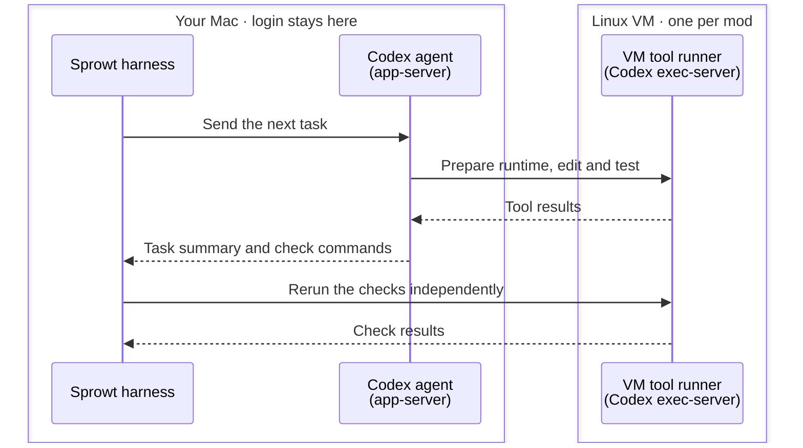
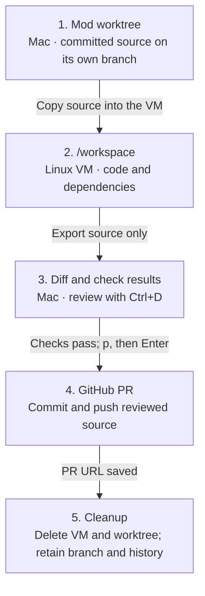
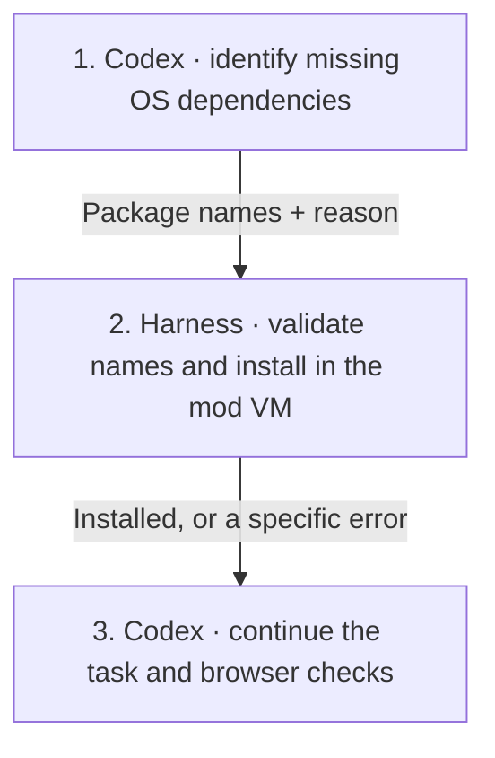
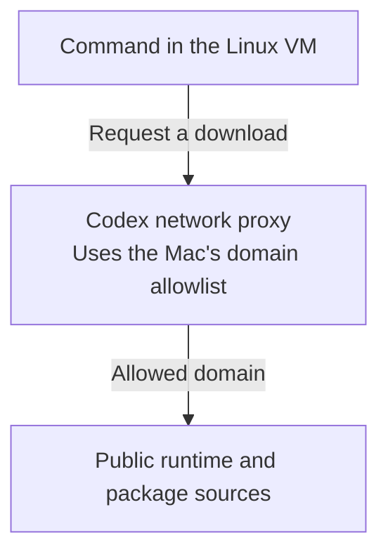

# Local Linux sandbox

Each executing code mod gets its own Apple Container VM. Codex chooses and installs the project’s runtime there. Your login stays on the Mac.

## Commands and checks

Read from top to bottom. Solid arrows send work; dashed arrows return results.



Both VM connections use standard input/output. The harness reruns checks in the same VM that Codex used.

## Source files

Files move in one direction: worktree, copy, review, PR. The VM gets source files; the original checkout and Git metadata stay on the Mac.



## Use it

You need Apple silicon, macOS 26+, Apple Container and Codex CLI **0.159.2**. Sign in with a file-backed ChatGPT login and start the container service:

```sh
brew install container
container system start --enable-kernel-install
codex -c 'cli_auth_credentials_store="file"' login
```

Create a mod, review its plan and press **Ctrl+R**. The first execution builds the shared development image; later runs reuse it. **Ctrl+D** opens the diff. New Git mods publish PRs; existing mods and non-Git folders keep local apply. See [Worktrees and PRs](git-workflow.md).

The image contains general build tools, Bubblewrap, Codex and mise. No project language is selected in advance. Codex reads your manifests, installs a compatible runtime under `/home/sprowt`, then installs project dependencies under `/workspace`.

## System packages

The executor chooses packages from project requirements and missing-library errors. For Playwright, it can inspect the installed browser dependency list. It calls `install_system_packages` with Debian package names and a short reason.



The harness accepts names only: no shell commands, URLs, repository changes or removal requests. It downloads signed packages from official Debian 12 repositories through the existing proxy and allowlist. It then runs the installer inside the VM with networking blocked by a small Linux syscall filter. Only setup can write system files; normal worker commands stay restricted. Trusted Debian install scripts run in the VM, with no host mounts or credentials. Packages that require network access during installation report a setup error.

Setup progress appears beside the active worker. Requests and results are saved in the mod’s `packages.jsonl`; Codex also saves the tool result in its conversation. **Ctrl+R** stops setup; a retry completes pending package configuration before continuing. A failed installation keeps the working files and reports its error.

Uses Codex’s experimental [dynamic tool interface](https://learn.chatgpt.com/docs/app-server#dynamic-tool-calls-experimental).

Existing mods keep their VM, runtime, source and transcript. Their first run after this upgrade opens a new executor conversation with the setup tool. The goal, saved plan, unfinished task and accepted user instructions supply its context; completed tasks stay complete.

## The boundary

- Commands, edits and independent checks use the same VM. A disconnected guest stops work; it never falls back to host execution.
- No host folders, login files, SSH agent, service sockets or ports are mounted or forwarded.
- Codex’s guest sandbox keeps system files read-only for normal worker commands and forces network traffic through its domain proxy. The harness’s package installer uses a separate writable setup command in the VM. Direct connections and private network destinations are blocked. Guest loopback is available for local app checks.
- Source exports preserve regular files, modes and deletions. Dependency folders and common credential files are excluded. Links and special files are rejected. Exports are limited to 512 MiB, with 64 MiB per source file.

The planner inspects the mod worktree through a read-only host OS sandbox. Legacy mods inspect the project. Host MCPs, apps, plugins and hooks stay disabled. VM execution needs a file-backed ChatGPT login; Keychain-only login is unsupported.

## Downloads



Other domains, direct connections and private network destinations are blocked.

The default allowlist covers common Python, Node, Rust, Go and other package sources, plus Playwright browser downloads. It allows `cdn.playwright.dev`, its Microsoft mirror and redirects to `storage.googleapis.com`. System package setup uses `deb.debian.org` for Debian packages and security updates. The worker requests missing browser libraries through the setup tool.

Edit the host-only file to add required domains:

```text
~/Library/Application Support/sprowt-harness/network.json
```

It is a JSON list of hostnames; `*.example.org` allows that domain’s subdomains. Existing local policies are kept when upgrading; new default domains must also be added to that file. Quit and reopen the harness, then press **Ctrl+R** to reconnect with the updated policy. A model cannot edit this host policy. Allowed services can receive data; domain filtering is not a guarantee against data leaving the VM.

## VM lifecycle

| Mod state | VM |
| --- | --- |
| Running | Running; reused across tasks |
| Paused or awaiting review | Retained with its runtime and dependencies |
| PR published or local apply complete | Deleted; history and source exports stay on the Mac |
| Git mod removed with changes | Draft PR saved, then VM and local workspace removed |
| Empty or legacy mod removed | Deleted with its local workspace and history |

Quitting stops VMs and retains unfinished mods’ disks. Reopening and **Ctrl+R** reconnect without losing dependencies. Reconnecting clears guest processes left by a crash. Shared images and the container service remain for reuse.

Git mods delete their VM and host worktree after saving the PR URL. Their published branch remains. Failed publication keeps the source and VM; failed cleanup keeps the PR and offers **Ctrl+R** to retry. Local apply saves its applied state before deleting the VM and offers the same cleanup recovery. Removing a Git mod exports current guest files before publishing unfinished work as a draft PR.

Unfinished mods created before VM support keep their working files. Their first explicit run starts a fresh executor conversation and reruns tasks in Linux; old host check results are cleared. Applied mods remain applied. A missing or altered VM blocks reconnection and preserves the last exported source for review.

This backend runs Linux. iOS and macOS builds need a later macOS VM backend. One executor per mod; different mods can run in parallel. Uses experimental [Codex executor interfaces](https://github.com/openai/codex/tree/rust-v0.159.2/codex-rs/exec-server) and [Codex managed networking](https://learn.chatgpt.com/docs/permissions).
