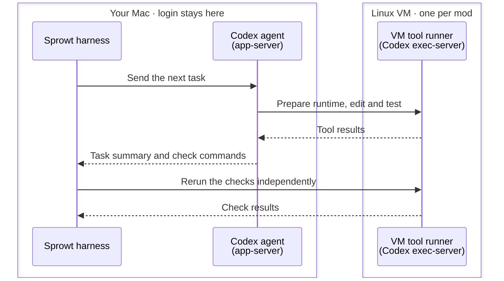
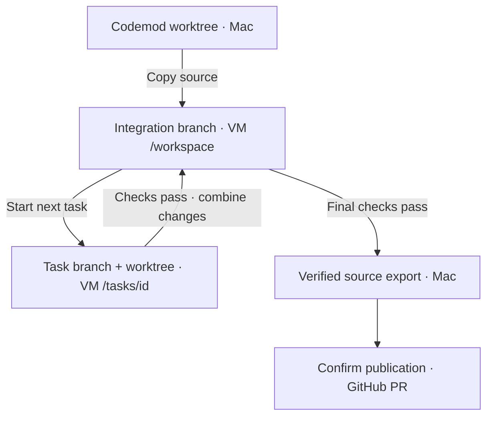
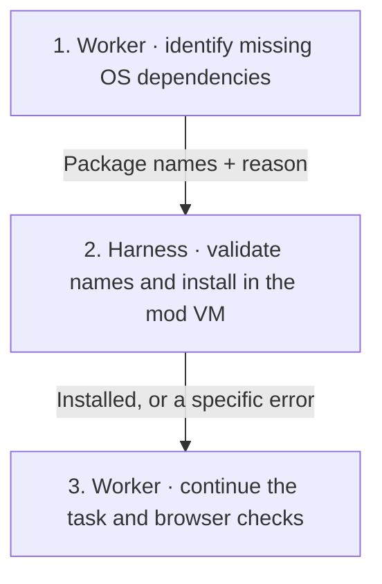
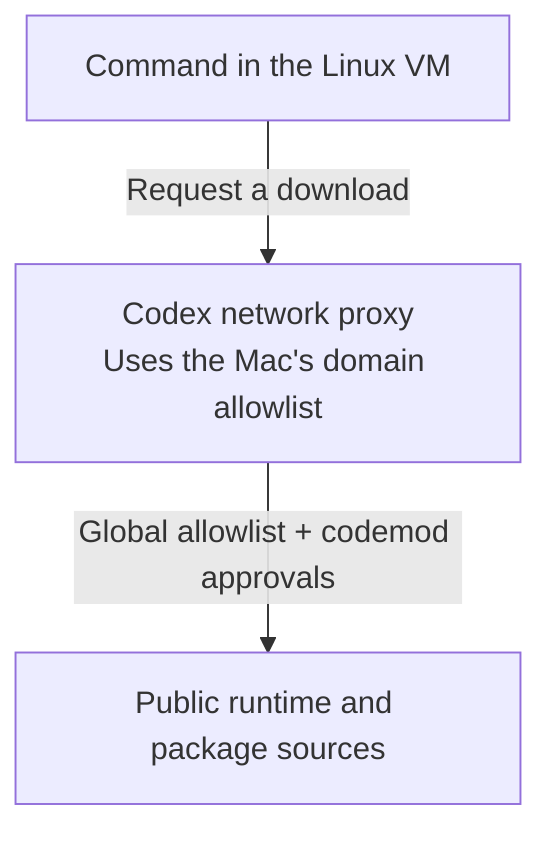
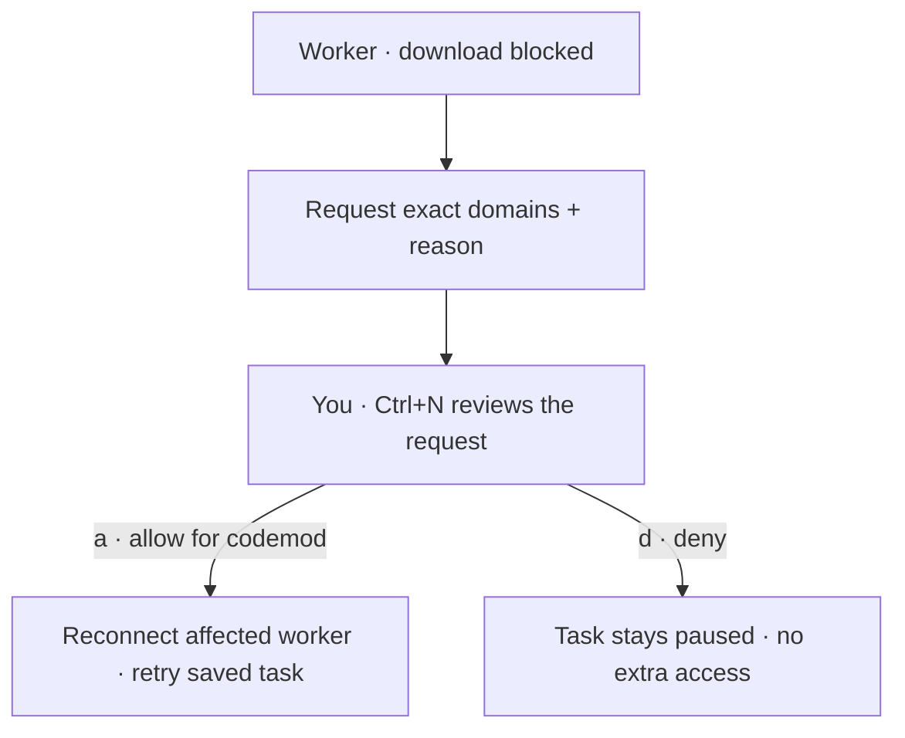

# Local Linux sandbox

Each executing codemod gets its own Apple Container VM. Workers choose and install the project’s runtime there. Your login stays on the Mac.

## Commands and checks

Read from top to bottom. Solid arrows send work; dashed arrows return results.



Each worker and the verification connection use standard input/output. The harness reruns checks in the same VM the workers used. When assigned a task, the full Muse CLI runs there too, inside an enforced process sandbox. Its model requests reach a host credential broker over stdio; runtime downloads still use the VM proxy. See [Workers](workers.md).

## Source files

The VM gets source files and creates its own local Git repository for tasks. Original project Git metadata, remote configuration and credentials stay on the Mac.



## Use it

You need Apple silicon, macOS 26+, Apple Container and Codex CLI **0.159.2**. Sign in with a file-backed ChatGPT login and start the container service:

```sh
brew install container
container system start --enable-kernel-install
codex -c 'cli_auth_credentials_store="file"' login
```

Create a mod; its valid plan starts execution automatically. The first execution builds the shared development image; later runs reuse it. **Ctrl+D** opens the diff. New codemods publish PRs. Existing snapshot mods can be adopted into Git. See [Worktrees and PRs](git-workflow.md).

The image contains general build tools, Bubblewrap, Codex and mise. No project language is selected in advance. Each executor reads your manifests, installs a compatible runtime under its own `/home/sprowt/workers/<worker-id>` (HOME), then installs project dependencies in its task worktree. Git objects are shared inside the VM; task dependencies remain available through final verification, review and repairs.

## System packages

One controller owns each VM and serializes system package installs, task checkpoints, checks and Git integration. Worker commands run concurrently in separate task worktrees and runtime homes.

The executor chooses packages from project requirements and missing-library errors. For Playwright, it can inspect the installed browser dependency list. It calls `install_system_packages` with Debian package names and a short reason.

The [tool dispatcher](tools.md) validates the request and verifies that the connected VM belongs to that worker’s mod before installation.



The harness accepts names only: no shell commands, URLs, repository changes or removal requests. It downloads signed packages from official Debian 12 repositories through the existing proxy and allowlist. It then runs the installer inside the VM with networking blocked by a small Linux syscall filter. Only setup can write system files; normal worker commands stay restricted. Trusted Debian install scripts run in the VM, with no host mounts or credentials. Packages that require network access during installation report a setup error.

The offline installer reports kernel auditing as unavailable, allowing package scripts to create system users without opening audit or network sockets. Setup output is retained in the mod's private `sandbox.log`.

Debian can create an empty `/root/.ssh` directory. Reconnection permits that empty directory and rejects any contents or links there, alongside the existing login-file checks.

Setup progress appears beside the active worker. Requests and results are saved in the mod’s `packages.jsonl`; Codex also saves the tool result in its conversation. **Ctrl+R** stops setup; a retry completes pending package configuration before continuing. A failed installation keeps the working files and reports its error.

Codex uses its experimental [dynamic tool interface](https://learn.chatgpt.com/docs/app-server#dynamic-tool-calls-experimental); Muse uses the guest MCP bridge.

If a saved Codex executor conversation lacks the current harness tools, reconnecting opens a new conversation. The goal, saved plan, unfinished task and accepted user instructions supply its context. The VM, runtime, source and transcript are retained; completed tasks stay complete.

## Browser checks

Chromium needs local Unix sockets to start. Worker commands and independent checks allow these sockets inside the codemod VM. Codex **0.159.2** requires `dangerously_allow_all_unix_sockets` for socket creation; an exact socket allowlist does not permit browser IPC. This grants access to guest sockets, including other guest processes, so it is not a separate communication boundary between workers. Host sockets are never mounted or forwarded. The domain proxy and task file restrictions still apply.

Start the app and browser in the same check command so they share the command's loopback network. Use a free port and stop both afterward. Missing browser libraries go through `install_system_packages`; runtimes and browser downloads remain the worker's choice.

Workers use `run_task_checks` to test in the controller's environment before reporting success. Standalone scripts are saved outside source at `/opt/sprowt-checks/<task-run-id>/`, read-only to workers. The harness restores them from private host copies before every check run. Temporary fixtures still belong in `/tmp` or HOME; `/static` is a browser URL, not a writable root folder. See [Saved check scripts](execution.md#saved-check-scripts).

Restart the harness after upgrading, then use **Ctrl+R** to retry a blocked task. Its saved source and completed tasks are retained.

## The boundary

- Commands, edits and independent checks use the same VM. A disconnected guest stops work; it never falls back to host execution.
- No host folders, login files, SSH agent, service sockets or ports are mounted or forwarded.
- Codex’s guest sandbox keeps system files read-only for normal worker commands and forces network traffic through its domain proxy. The harness’s package installer uses a separate writable setup command in the VM. Direct connections and private network destinations are blocked. Guest loopback is available for local app checks.
- Each task writes only its assigned worktree, its own runtime home and temporary files. The harness owns the combined source and guest Git metadata; task workers cannot commit or merge.
- The independent reviewer reads combined source in the same VM. Only its own home and `/tmp` are writable; source stays read-only and network access is disabled. It has no harness tools.
- Source exports preserve regular files, modes and deletions. Dependency folders and common credential files are excluded. Links and special files are rejected. Exports are limited to 512 MiB, with 64 MiB per source file.

The planner inspects the mod worktree through a read-only host OS sandbox. Legacy mods inspect the project. Host MCPs, apps, plugins and hooks stay disabled. VM execution needs a file-backed ChatGPT login; Keychain-only login is unsupported.

## Downloads



Other domains, direct connections and private network destinations are blocked.

The default allowlist covers common Python, Node, Rust, Go and other package sources, plus Playwright browser downloads. It allows `cdn.playwright.dev`, its Microsoft mirror and redirects to `storage.googleapis.com`. System package setup uses `deb.debian.org` for Debian packages and security updates. The worker requests missing browser libraries through the setup tool.

For a blocked download or documentation request, Codex and Muse call `request_network_access` with exact hostnames and a reason. The task shows **Network access needed · Ctrl+N**.



**Esc** defers the decision and keeps your draft. Approval waits for the requesting turn to stop, then reconnects that worker with the updated proxy policy. Its source, runtime and completed tasks stay. Other workers continue; their existing proxy connections receive the new policy on reconnect. Requests already covered by your approvals do not ask again.

Grants apply to downloads and independent checks in that codemod. Redirects to another blocked host need another request. Workers cannot approve requests, change the global policy or request wildcards, IPs, URLs or ports. Closing makes grants inactive; reopening restores them. Deleting the codemod removes them. Requests and decisions are saved on the Mac in SQLite.

For domains you want available to every codemod, edit the host-only file:

```text
~/Library/Application Support/sprowt-harness/network.json
```

It is a JSON list of hostnames; `*.example.org` allows that domain’s subdomains. Existing local policies are kept when upgrading; new default domains must also be added to that file. Quit and reopen the harness, then press **Ctrl+R** to reconnect with manual changes. Per-codemod approvals leave this file unchanged and reconnect automatically. Allowed services can receive data; domain filtering is not a guarantee against data leaving the VM.

## VM lifecycle

| Mod state | VM |
| --- | --- |
| Running | Running; reused across tasks |
| Paused | Retained with unfinished task folders and dependencies |
| Awaiting review | Retained with task folders and dependencies |
| PR published or edits requested | Retained for further work |
| Closed | Deleted after a local checkpoint; worktree and history stay |
| Deleted | Deleted with the local workspace and history |

Quitting stops VMs and retains unfinished mods’ disks. Reopening and **Ctrl+R** reconnect without losing dependencies. Reconnecting clears guest processes left by a crash. Shared images and the container service remain for reuse.

Publication saves the PR URL and retains the VM and worktree. Edit rounds reuse the same VM and per-worker runtime/download caches. Task folders, their local dependencies and saved check scripts are removed when a replacement plan starts. Review and repair reuse them. Failed operations keep source and offer **Ctrl+R** to retry.

Closing exports source and task branches, commits a local checkpoint and removes the VM; the worktree and history remain. Reopening creates a fresh VM when execution resumes, restoring task branches from a local Git bundle. Runtime installations are not part of that bundle. Deleting discards local source and history. Closed worktree retention removes only the host worktree, retaining the branch and exports. See [Worktrees and PRs](git-workflow.md).

Unfinished mods created before VM support keep their working files. Their first explicit run starts a fresh executor conversation and reruns tasks in Linux; old host check results are cleared. Previously completed snapshot work can be adopted into Git. A missing or altered VM blocks reconnection and preserves the last exported source for review.

This backend runs Linux. iOS and macOS builds need a later macOS VM backend. Up to two executors per mod; different mods can also run in parallel. Uses experimental [Codex executor interfaces](https://github.com/openai/codex/tree/rust-v0.159.2/codex-rs/exec-server) and [Codex managed networking](https://learn.chatgpt.com/docs/permissions).

## Verify the boundary

The regular test suite covers permissions, input validation and publication recovery. Run the VM integration checks with Apple Container running and Codex signed in:

```sh
cargo test tools::tests::package_calls -- --ignored --nocapture
cargo test git_mod::tests::publishing_keeps_the_vm -- --ignored --nocapture
cargo test sandbox::tests::persistent_vm_checks -- --ignored --nocapture
cargo test sandbox::tests::task_worktrees -- --ignored --nocapture
cargo test codex::tests::task_turn -- --ignored --nocapture
cargo test codex::tests::two_clients_share_a_vm -- --ignored --nocapture
cargo test codex::tests::browser_turn_and_verification -- --ignored --nocapture
cargo test app::tests::both_workers_resume_after_codemod_network_approval -- --ignored --nocapture
```

These use temporary repositories and VMs, checking worker restrictions, tool ownership, source transfer and cleanup. GitHub publication uses a local fixture. The Codex tests use short subscription-backed turns, including two simultaneous workers. The browser check verifies socket, network and file boundaries. The network test runs both providers through a blocked download, host approval and automatic retry, confirming saved files survive and an unapproved domain stays blocked. Native VM tests require the pinned CLI versions; shared images remain for reuse.
