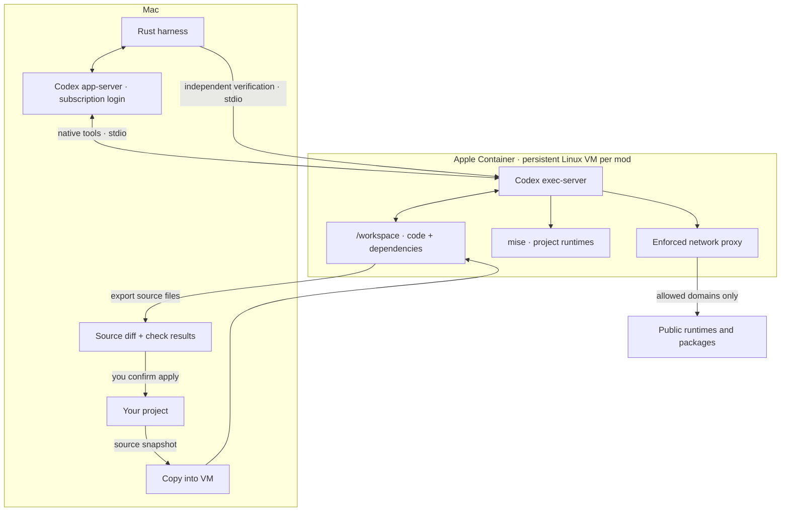

# Local Linux sandbox

Each executing code mod gets its own Apple Container VM. Codex chooses and installs the project’s runtime there. Your login stays on the Mac.



## Use it

You need Apple silicon, macOS 26+, Apple Container and Codex CLI **0.159.2**. Sign in with a file-backed ChatGPT login and start the container service:

```sh
brew install container
container system start --enable-kernel-install
codex -c 'cli_auth_credentials_store="file"' login
```

Create a mod, review its plan and press **Ctrl+R**. The first execution builds the shared development image; later runs reuse it. The terminal shows setup progress. **Ctrl+D** keeps the same diff and apply workflow.

The image contains general build tools, Bubblewrap, Codex and mise. No project language is selected in advance. Codex reads your manifests, installs a compatible runtime under `/home/sprowt`, then installs project dependencies under `/workspace`. System files stay read-only; extra OS packages require changing the image.

## The boundary

- Commands, edits and independent checks use the same VM. A disconnected guest stops work; it never falls back to host execution.
- No host folders, login files, SSH agent, service sockets or ports are mounted or forwarded.
- Codex’s guest sandbox keeps system tools read-only and forces network traffic through its domain proxy. Direct connections and private network destinations are blocked. Guest loopback is available for local app checks.
- Source exports preserve regular files, modes and deletions. Dependency folders and common credential files are excluded. Links and special files are rejected. Exports are limited to 512 MiB, with 64 MiB per source file.

The planner still inspects the project through a read-only host OS sandbox. Host MCPs, apps, plugins and hooks stay disabled. VM execution currently needs a file-backed ChatGPT login; Keychain-only login is not supported by this connection.

## Downloads

The default allowlist covers common Python, Node, Rust, Go and other package sources. Edit the host-only file to add required domains:

```text
~/Library/Application Support/sprowt-harness/network.json
```

It is a JSON list of hostnames; `*.example.org` allows that domain’s subdomains. Reconnect the worker after changing it. A model cannot edit this host policy. Allowed services can receive data; domain filtering is not a guarantee against data leaving the VM.

## Pause, reopen, delete

Pausing keeps the VM and its installed runtime. Quitting stops the VM; reopening and **Ctrl+R** start it again. Reconnecting also clears guest processes left by a crash. Source and dependencies persist. Deleting the mod deletes its VM and host workspace. Images and the container service remain for reuse.

Unfinished mods created before VM support keep their working files. Their first explicit run starts a fresh executor conversation and reruns tasks in Linux; old host check results are cleared. Applied mods remain applied. A missing or altered VM blocks reconnection and preserves the last exported source for review.

This backend runs Linux. iOS and macOS builds need a later macOS VM backend. One executor per mod; different mods can run in parallel. Uses experimental [Codex executor interfaces](https://github.com/openai/codex/tree/rust-v0.159.2/codex-rs/exec-server) and [Codex managed networking](https://learn.chatgpt.com/docs/permissions).
