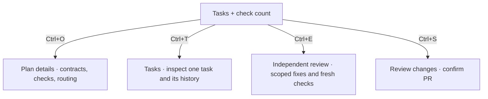

# Terminal and companion

The open outline keeps project context at the top and work in the middle. One dock groups progress, actions and your message. The conversation stays left aligned.

```text
[sprowt companion]  project
                    codex · worker + model + effort
                    muse · worker + model + effort

<codemod/>  ◇ selected mod    codex w1 · task 1 │ muse w2 · task 2

> your message

▤ Plan   ctrl+o ▸ show details

✓ 1. Build the API
     Tasks persist across restarts.

⠋ 2. Build the interface · w2
     Add and remove tasks from the page.

queue / waiting steering, when present

╭──────────────────────────────────────────────────────────────────────╮
│ ⠋ Working · 1/2 tasks done                       ctrl+r Stop workers │
├──────────────────────────────────────────────────────────────────────┤
│ Add an instruction…                                                  │
│                                                                      │
│                                                                      │
│                                                                      │
│ ↵ Queue message   ctrl+j Newline                      ctrl+g Actions │
╰──────────────────────────────────────────────────────────────────────╯
```

## Layout

- Messages and plans use the available terminal width, with two columns of margin on each side. The transcript and dock share the left edge; the dock has one column of inner padding. One blank row separates messages.
- Task markers and numbers have their own column. Titles, outcomes and wrapped text line up beneath each other.
- Menus and confirmations use up to 68 columns. The queue widens to fit its actions on one row when space allows. Task inspection, diffs, history and full errors use the terminal width.
- The composer starts with four text rows and grows to eight, then scrolls. Blank lines and wrapped text count toward its height; the cursor stays visible. Short terminals use fewer rows to keep the controls on screen. Opening All actions keeps the draft visible and moves focus to the menu.
- Active workers each get a header row with provider, role, model and effort. Long identities wrap. Progress belongs in the dock.

## Unified dock

The dock has three parts:

- **Top:** progress on the left, one useful action on the right.
- **Middle:** your message, growing from four to eight rows.
- **Bottom:** Enter and newline hints on the left, **Ctrl+G · Actions** on the right.

Narrow terminals stack controls with their labels intact. There is no separate “Next” row or footer. Background target checks keep active worker progress visible; publication and other foreground operations show their own status.

Rust chooses the next action from current state:

| State | Next step |
| --- | --- |
| New codemod | Describe your goal in the composer |
| Working | No action needed; queue instructions or stop workers |
| Worker question | Answer in the composer |
| Blocked download | Review the requested domains |
| Failed check | Inspect failed checks before retrying |
| Changes ready | Ask an agent to review; viewing the diff and publishing are also available |
| Review passed | Publish PR |
| Target branch changed | Update from the target and recheck |
| PR published | Send edits to update the same PR |
| Closed codemod | Reopen saved work |

While work runs, **Stop workers** appears when available. Other actions stay in **Ctrl+G · Actions**. The Enter hint describes what sending does: **Queue message**, **Request edits**, **Answer #ID** or **Create codemod**. Opening the menu keeps the draft visible and hides the composer shortcuts until you return.

**Ctrl+G · Actions** lists the available actions and shortcuts in aligned columns. Use ↑/↓ and Enter; Esc returns to the same draft. Its selection keeps its meaning as workers finish; unavailable actions cannot run.

Every menu item shows its shortcut. Inside All actions, **n** starts a new codemod, **c** closes the current one, **d** deletes it and **f** inspects a failure when available. Close and delete still require confirmation. These letters remain ordinary text in the composer; the dock shows **Ctrl+G** followed by the letter for menu actions.

**View diff**, **Ask agent to review** and **Publish PR** are separate actions. Review remains optional, and publication keeps its confirmations. Enter in the composer sends your message; it never triggers the dock's recommendation. Workers finishing do not move focus from your draft.

Errors use up to two wrapped rows inside the dock. **Inspect failure** opens the affected task directly. Errors without a task, such as Git failures, use **Show full error**. The codemod selector stays at the top; mouse and keyboard scrolling keep working independently of the dock.

## Inspect a task

**Ctrl+T · Tasks and history** lists the current tasks with their status, worker, model and effort. Select one with ↑/↓ and press Enter.

- The task view shows its latest update, checks and failure evidence. Working, waiting for prerequisites, waiting for an answer, failed checks and stopped workers have distinct labels.
- **h** opens that task's messages and handoffs. **a** opens All history from there. From the task list, **h** opens All history directly.
- **Esc** goes back one view; **Ctrl+T** returns to the conversation. Your draft, queue and plan toggle stay unchanged.
- Retry and network shortcuts appear when available and use the existing codemod actions. Inspecting a task does not restart it.

New worker messages save their task identity. Older unlinked messages remain in All history; they are not guessed from a reused worker ID. Without a task list, Ctrl+T opens All history directly.

```text
Ctrl+T → Tasks → Enter → Task details → h → Task history
             └─ h → All history              └─ a → All history
```

## Conversation

User messages have a `>` prefix and a subtle background. Agent messages show their provider, role, worker ID, model and configured reasoning effort when reported by Codex. One blank row separates messages.

The worker status uses a small dot spinner during connection, execution and verification. Each running task shows its worker ID and uses the same spinner in the plan, including while its checks run. Completed tasks and replies stay still. `--no-motion` uses a static activity glyph.

The codemod row lists each active provider, worker ID and numbered task. During combined checks the dock says **Final verification**; a failure says **Final verification blocked** with **Inspect failure** when its task is known. The task view shows the failed command and evidence; **Retry final checks** remains available. Missing-runtime recovery says **Restoring task environment**. Narrow terminals show the active worker count instead; task rows retain their worker IDs.

Codex’s configured effort is used when available. When unset, the harness reads the model’s default from Codex’s catalog and sends it explicitly with new turns. Replies save that effort for reopening. Older replies without recorded effort show **effort unknown**.

Plans show task titles, outcomes and dependencies first. **Ctrl+O · Show/Hide details** sits beside the plan heading and stays available in All actions. It expands file scopes, completion checks and planner model details. Check commands appear in indented blocks; multiline code keeps its source indentation, and wrapped lines stay inside the block. Expanding keeps the heading in view and leaves the draft and queue intact. Details start collapsed when you switch mods or reopen the project.

Check details count passed, failed and unrun commands. Several commands can belong to one planned check; all appear beneath it, and all must pass. Failed output starts at the assertion or error; summaries are labelled **worker report**. During automatic recovery, the previous failure stays in details. Controller results decide whether work is complete.

Task history includes saved narration, model and effort, and [worker messages](coordination.md). Questions for you stay visible in the conversation with the sender and message ID; the Enter hint says **Answer #ID** and saves your reply.

Finished versions show one row per task and the final check count. The dock recommends review; diff and publication remain in Actions. **Ctrl+E** starts an independent reviewer; its result stays compact and **Ctrl+O** expands findings. Outcomes, contracts, commands and routing stay behind **Ctrl+O**; routine worker chatter stays in history. **Ctrl+D** opens a full-width diff. Use **p** there, or **Ctrl+S** from the conversation, to review and confirm publication. Snapshot mods first offer Git adoption. See [Plan execution](execution.md).



Worktree creation, diff loading, publication and removal show progress in the dock. A saved PR link appears in the conversation. Failed Git operations show their cause and **Ctrl+R · Retry Git operation**. A published mod keeps its composer for requesting edits on the same PR.

Codemod, queue and project setup dialogs share spacing and keyboard hints. Empty codemod lists say **No active codemods** or **No closed codemods**, with a new-codemod action. Hints adapt to the available actions and terminal width. Plans and publish confirmations omit repeated VM guidance; the conversation keeps room for tasks and replies.

Blocked downloads mark the affected task. The dock highlights **Ctrl+N · Review domains**. The matching dialog lists exact domains and the worker's reason. **a** allows access for this codemod and retries its saved task; **d** denies and leaves the task paused. **Esc** returns without deciding. Opening or dismissing it preserves your draft; it never opens over your typing. Long requests scroll with ↑/↓. See [Downloads](sandbox.md#downloads).

Git setup shows the starting file list. GitHub setup uses Tab to choose connect existing or create private, then confirms `owner/repository` before contacting GitHub. Queue management appears only with queued instructions; run, stop and retry appear when relevant.

## Scrolling

Use the mouse wheel or trackpad over the conversation, plan, task details, diff, history or dialog to scroll it. Hover over the composer to scroll a long draft instead. Codemod, task, queue and All actions lists move the selection and keep it visible; Enter still opens or confirms it. Scrolling preserves drafts and queued instructions. Dialogs capture their own scrolling, and the view adjusts when the terminal resizes. Keyboard scrolling stays available.

## Commands

| Command | Action |
| --- | --- |
| `sprowt-harness` | Open the current project |
| `sprowt-harness setup` | Configure Jev from the harness’s `.env.local` |
| `sprowt-harness --closed-worktree-days 0` | Keep closed worktrees indefinitely |
| `sprowt-harness --no-motion` | Open with animations disabled |
| `sprowt-harness --help` | Show available options |
| `sprowt-harness --version` | Show the installed version |

## Controls

| Key | Action |
| --- | --- |
| Enter | Create a described mod, answer a highlighted question, queue a message or save an edit |
| Ctrl+J | Add a newline |
| Ctrl+G | All available actions; Esc returns |
| Ctrl+P | Switch, create, close, reopen or delete a codemod |
| Ctrl+Q | Manage queued instructions |
| Ctrl+R | Run, stop, retry or reopen a closed codemod |
| Ctrl+S | Publish verified changes as a PR |
| Ctrl+E | Ask an agent to review; r inside the diff |
| Ctrl+U | Sync the project branch and check the codemod's target |
| Ctrl+O | Show or hide plan details |
| Ctrl+T | Tasks and history; also returns to the conversation from those views |
| Ctrl+N | Review a pending network request |
| Ctrl+D | View diff |
| Mouse wheel / trackpad | Scroll the view under the pointer; move selection in lists |
| Fn + ↑ / ↓ on Mac | Scroll the conversation |
| Page Up / Page Down | Scroll on keyboards with those keys |
| Esc | Back from a dialog; quit from the conversation |
| Ctrl+C | Quit |

Pasted text keeps its line breaks. Dialog actions are covered in [Codemods and messages](codemods.md).

Target updates show an **integration plan** with the same task progress and details toggle. The status names target changes or a merged PR; publication stays unavailable until combined checks pass. See [Worktrees and PRs](git-workflow.md#when-another-codemod-merges).

Project sync runs independently on startup and every 30 seconds, including with no codemods and `--no-motion`. **Ctrl+U** also works in the new-mod screen and picker. An unsafe update leaves files intact and shows the cause in the dock.

## Sprowt companion

The companion uses terminal cells and glyphs, so it needs no image support. It sits beside the project heading in an 8-column, 4-row area.

Sprowt follows the selected codemod:

| State | Expression and movement |
| --- | --- |
| Idle | Double blink, sideways glances and a curious face |
| Planning | Thoughtful eyes and an occasional leaf twitch |
| Working or checking | Focused eyes and rhythmic leaf movement |
| Changes ready | One short bounce and wink, then a happy face |
| Blocked or failed | A concerned face, held still |

The body keeps its shape and footprint. Switching codemods resets the animation to that mod’s state. Queueing or editing an instruction can trigger a brief idle celebration; it never overrides active work or an error. Closing or stopping returns Sprowt to idle. Worker identity stays beside it; the dock shows workflow progress.

Run `sprowt-harness --no-motion` for a still companion and no entrance animation. On exit, the harness restores normal terminal input, mouse and paste handling, and the previous screen.
