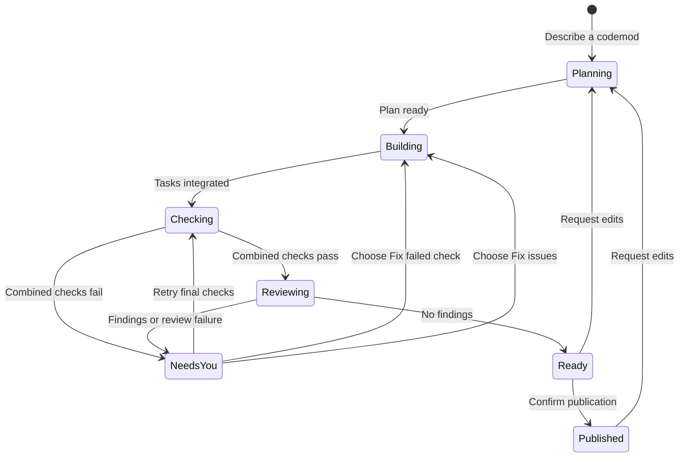
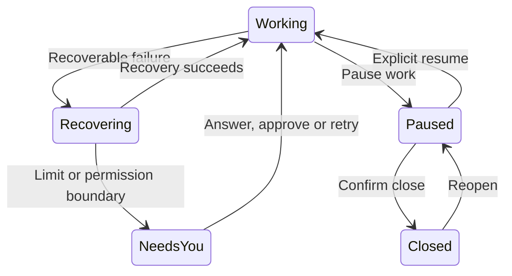

# Terminal and companion

The timeline shows the codemod from its request through publication. One dock tells you what is happening, whether anything needs you, and the next useful action. **Ctrl+T · Details** opens the evidence without interrupting work or losing your draft.

## State model

The interface derives one summary from saved work and active operations. The dock and Details use that same summary. Worker and Git controllers still own the transitions.

Keep these facts separate:

| Fact | What it answers |
| --- | --- |
| Lifecycle | Is the codemod open or closed? |
| Activity | Planning, building, checking, recovering, reviewing or a Git operation? |
| Attention | Does a task need an answer, permission or a retry? Was work paused by you? |
| Evidence | Which checks and review belong to this version? |
| Publication | Is there a PR, and does it include the current changes? |

A task finishing does not make the version ready. Combined checks and review have their own results. A PR can be open while new changes are still being prepared.



Recovery and lifecycle actions apply across that flow:



Close can also stop active work before saving its checkpoint. Delete requires confirmation and removes local work; the PR stays on GitHub. Reopening restores saved work, without starting workers. A review interrupted by exit or pause waits for an explicit retry.

## Timeline

```text
> Make tasks searchable

✓ Plan ready · 3 tasks
│
⠋ Implementation · 1/3 tasks finished
├─ ✓ 1. Add search storage · Done
├─ ⠋ 2. Build search controls · Working
│    muse · w12 · muse-spark-1.3 · high
│    Elapsed 2m 10s · last activity 8s ago
│    Latest update · Checking keyboard focus
├─ ○ 3. Verify integration · Waiting
│    Waiting for task 2.
│
○ Combined checks · after implementation / repair
│
○ Review · after combined checks
│
○ Publish PR · after checks and review
```

- Planning, implementation, combined checks, review and publication have separate rows. Task branches show independent work and dependencies; the parallel count comes from connected, active executors.
- Finished stages collapse. Active tasks show their owner, model, effort, elapsed time and latest update. Waiting tasks explain dependencies; active repairs follow a muted **previous failure** row. Expanding that row shows its saved evidence.
- Relevant actions sit beside their stage and remain available from the dock and More. Enter on a timeline row opens evidence; it never starts a repair or publishes.
- **Tab** focuses the timeline. **↑/↓** selects, **Space** expands, and **Enter** opens details. Clicking a row also selects it. **Esc** returns to the draft. **Ctrl+O** opens the full plan.
- New activity follows the current step until you scroll or navigate back. Your position then stays anchored to the same row, including the blank space between steps. Scrolling can move the selected task off screen; it does not pull you back to that task. **End** while exploring, or clicking **Jump to current**, resumes following. End in the composer still moves the text cursor.

### Timeline and side inspector

With at least 124 terminal columns and 12 rows available above the dock, the timeline and selected step appear side by side. The timeline uses 45% of the content width; the inspector gets the rest. The message dock stays full width.

```text
Timeline                          │ Details
✓ Plan ready                      │ Build search controls
⠋ Implementation                  │ Muse · Working
├─ ✓ Search storage               │ Elapsed 2m 10s · last activity 8s ago
├─ ⠋ Search controls              │
└─ ○ Verify integration           │ Latest update
○ Combined checks                 │ Checking keyboard focus
○ Review                          │
○ Publish PR                      │ Checks
                                  │ ✓ Keyboard navigation
                                  │ · Retry after failure
──────────────────────────────────┴─────────────────────────────────────
Working · 1/3 tasks finished
Add an instruction…
```

Selection updates the inspector immediately. It uses the same task evidence, check results and review findings as the full Details view. Task rows start collapsed in the split timeline; Space reveals the worker identity, while the inspector holds updates and evidence. Narrow terminals expand that evidence inline. Previous failures and outdated reviews stay labelled as saved evidence.

**Latest update** belongs to the current task attempt. Retrying or repairing a task clears earlier narration from this view; earlier results remain in task Activity. Older saved messages without an identifiable attempt appear only in history. A previous completion cannot appear as progress on a new repair. **Previous failure** rows appear only with saved check or review evidence, and selection shows that evidence separately from the current repair.

Task details use a compact state badge, distinct section headings and indented text. Checks have green passed markers, red failed markers and muted pending markers; wrapped text stays aligned beneath its label. Reports remain scrollable in full. Saved review findings show severity, location, evidence and proposed fix in separate blocks. The split timeline keeps a short findings summary; narrow terminals show the formatted evidence when expanded. This presentation uses the saved finding for that repair, so newer review results cannot replace its history.

- **Tab / Shift+Tab** cycle between message, timeline and inspector. A **▸** heading marks the focused pane; the dock border highlights when the composer is focused.
- **Enter** or **→** from the timeline focuses the inspector. **←** returns to the timeline. **Esc** returns directly to the draft. Enter in the inspector opens the full view when available; it never executes a workflow action.
- The inspector supports **↑/↓**, **Page Up/Down**, **Home/End**, and mouse scrolling. **e** toggles evidence for task and check rows. Each pane scrolls independently; exploring holds the selected step as new activity arrives.
- Thin scrollbars appear when timeline or evidence content overflows. The thumb shows your position; use the wheel or keyboard to move. Selecting another step resets the inspector to the top.
- Smaller or shorter terminals show the timeline across the available width, with Enter opening the existing full Details view. Resizing preserves the draft and selected step, clamps scroll positions, and returns inspector focus to the timeline when the side pane disappears.

The timeline reflects the current saved plan and operation states. Prior passes and full worker messages stay in **Details → Activity**. It does not invent historical timestamps or completion estimates. Elapsed time measures the connected worker's current turn; last activity measures observed worker events, not a guarantee of progress. Both restart with a new connection or turn. A completed task, passed combined checks and a clean current review remain distinct.

## Unified dock

```text
╭──────────────────────────────────────────────────────────────────────────╮
│ ⠋ Working · combined checks                                              │
│ 3/3 tasks finished · browser flows · 2m 10s                               │
│ Combined checks · 7/9 passed · running · Review not started               │
├──────────────────────────────────────────────────────────────────────────┤
│ Add an instruction…                                                      │
│                                                                          │
│                                                                          │
│                                                                          │
│ ↵ Queue for next pass   ctrl+j Newline   ctrl+r Pause   ctrl+t Details     │
│                                                              ctrl+g More │
╰──────────────────────────────────────────────────────────────────────────╯
```

- The first row names the state and, when you need to act, one recommended action.
- Supporting rows show progress, check/review currency and a concise error when relevant. A failed task remains visible while independent workers continue.
- The composer starts with four rows and grows to eight, then scrolls. Blank lines and wrapped text count; the cursor stays visible. Short terminals use fewer rows to retain controls.
- Pause, Details and More are secondary controls. Routine work has no highlighted recommendation. Enter sends your message, never the recommendation.

| State | Recommended action |
| --- | --- |
| New codemod | Describe the outcome |
| Working or recovering | None; progress continues automatically |
| Needs your answer | Answer in the composer |
| Needs network access | Review the requested domains |
| Task needs attention | Retry that task, or inspect its evidence in Details |
| Combined checks need attention | Fix failed check; rerun without edits remains in More |
| Review issues found | Fix review issues; Details opens Review |
| Review interrupted | Review changes |
| Paused by you | Resume the relevant work |
| Ready to publish | Publish PR |
| Target changed | Update and recheck |
| PR published | Request edits if needed |
| Closed | Reopen saved work |

**Ready to publish** means current checks and a clean current review. Publication remains an explicit choice; the existing ability to publish a checked version without a clean review remains available in More. Its confirmation includes the review state. Changed work on an existing PR says **PR open · update pending**.

**Ctrl+G · More** groups applicable actions under **Work**, **Inspect**, **Codemod** and a separate **Remove** section. Inspection uses one Details entry plus View diff. Existing Ctrl+O and Ctrl+G → i/f shortcuts still work. Every visible item shows its shortcut. Selection keeps its meaning while workers finish; Enter cannot activate a different action when the selected one disappears.

## Details

The inspector has four sections. Use **1–4**, **Tab** or **Shift+Tab** to switch. Mouse scrolling applies to the current section. **Ctrl+T** returns to the conversation; **Esc** goes back one level.

| Section | Contents |
| --- | --- |
| 1 · Tasks | Status, owner, model and effort; Enter opens one task |
| 2 · Checks | Combined results and task checks, including failures and commands not run |
| 3 · Review | Current or outdated findings, severity, file/line, evidence, owner and proposed fix |
| 4 · Activity | Saved worker updates, handoffs and previous results |

Details opens Review when findings exist, Checks after a combined failure, and otherwise Tasks. Before a task list exists it opens Activity. Opening any section is read-only. Checks puts failures first, summarizes skipped commands and keeps passing command output collapsed; **e** expands the evidence. In Checks, **x · Fix failed check** returns a combined failure to its original worker while preserving completed peers. The action appears only when the failure matches a saved task and command. Worker reports are labelled separately from controller check results.

### Inspect a task

Select a task and press Enter. Its details show the latest update, checks, failure evidence and recovery context. Dependencies, unanswered questions and network permissions have distinct states. Conflict details include paths, owners and automatic attempts used.

Fix failed check shows Connecting worker, Starting repair, Fixing failed check, then Checking as it progresses. Waiting for a worker means no worker has started connecting for that task. Previous failed checks remain visible as saved evidence until the new results arrive.

**r** retries the selected failed task from Tasks; **Ctrl+R** does so in its details. Independent peers continue; retries wait if both slots are occupied. **h** opens that task's activity and **a** opens all activity. Older messages without a saved task identity remain in all activity. Draft, queue and plan toggle are preserved.

## Messages and plans

Conversations remain left aligned with two columns of outer margin and one blank row between messages. User messages have a visible `>` and subtle background. Agent identities include provider, role, worker, model and effort. Active identities appear beside the companion and within expanded task rows. `--no-motion` uses a static glyph.

Plans show numbered tasks, outcomes and dependencies. **Ctrl+O** opens scopes, contracts, check commands and routing; pressing it again returns to the timeline. Multiline commands retain indentation. Switching codemods starts with collapsed completed stages. Routine worker narration stays in Activity; questions for you remain beside the composer.

The Enter hint says **Create codemod**, **Answer #ID**, **Request edits** or **Queue for next pass**. Queued messages remain separate from history. **Ctrl+Q** manages them; **s · Send to workers** uses saved steering and waits for an acknowledged delivery. With no running worker, the hint says **Send when workers connect**. Reordering does not send anything. Deliberately paused work keeps queued edits until you resume.

## Navigation and layout

Messages, plans, full Details, errors and diffs use the terminal width. Wide timelines reserve a side inspector for the selected step. Task numbers have their own column and wrapped outcomes align beneath the title. Menus and confirmations use up to 68 columns; queue menus widen for their controls. Empty lists say **No active codemods** or **No closed codemods**.

Use the wheel or trackpad over a view to scroll it, or over the composer to scroll the draft. Lists move their selection; Enter activates. Views clamp scrolling after resize. Opening More retains the visible draft. Narrow terminals stack controls without separating shortcuts from labels.

| Key | Action |
| --- | --- |
| Enter | Send from the composer; inspect a selected timeline row |
| Tab / Shift+Tab | Move between composer, timeline and side inspector |
| Space / ↑↓ | Expand / select while exploring the timeline |
| End | Jump to current in the timeline; scroll to the bottom in the inspector |
| Ctrl+J | Newline |
| Ctrl+T | Details / return to conversation |
| Ctrl+G | More actions; Esc returns |
| Ctrl+R | Pause, resume or retry relevant work |
| Ctrl+S | Review and confirm PR publication |
| Ctrl+E | Start or retry independent review |
| Ctrl+O | Expand/collapse plan details |
| Ctrl+D | View diff |
| Ctrl+Q | Manage pending instructions |
| Ctrl+N | Decide a pending domain request |
| Ctrl+P | Switch/create/close/reopen/delete codemods |
| Fn + ↑ / ↓, or Page Up / Down | Scroll |
| Esc | Return from timeline exploration or a view; quit from the composer |
| Ctrl+C | Quit |

More also supports **n** new, **c** close, **d** delete, **x** fix the failed check or review findings, and **r** retry a failed task. These letters type normally in the composer. Close, delete and publish retain their confirmations.

Blocked downloads show exact domains and a reason; **a** approves for this codemod and **d** denies. GitHub setup confirms the repository destination. Project sync runs on startup and every 30 seconds even without codemods; **Ctrl+U** checks immediately. Background target checks do not replace active work progress. See [Codemods](codemods.md), [Review](review.md) and [Git workflow](git-workflow.md).

## Commands

| Command | Action |
| --- | --- |
| `sprowt-harness` | Open the current project |
| `sprowt-harness setup` | Configure Jev |
| `sprowt-harness --no-motion` | Disable animation |
| `sprowt-harness --closed-worktree-days 0` | Keep closed worktrees indefinitely |

## Sprowt companion

The companion uses terminal cells and glyphs, so it needs no image support. It sits beside the project heading in an 8-column, 4-row area.

Sprowt follows the selected codemod:

| State | Expression and movement |
| --- | --- |
| Idle | Double blink, sideways glances and a curious face |
| Planning | Thoughtful eyes and an occasional leaf twitch |
| Working or checking | Focused eyes and rhythmic leaf movement |
| Changes ready | One short bounce and wink, then a happy face |
| Blocked or failed | A concerned face, held still |

The body keeps its shape and footprint. Switching codemods resets the animation to that mod’s state. Queueing or editing an instruction can trigger a brief idle celebration; it never overrides active work or an error. Closing or stopping returns Sprowt to idle. Worker identity stays beside it; the dock shows workflow progress.

Run `sprowt-harness --no-motion` for a still companion and no entrance animation. On exit, the harness restores normal terminal input, mouse and paste handling, and the previous screen.
