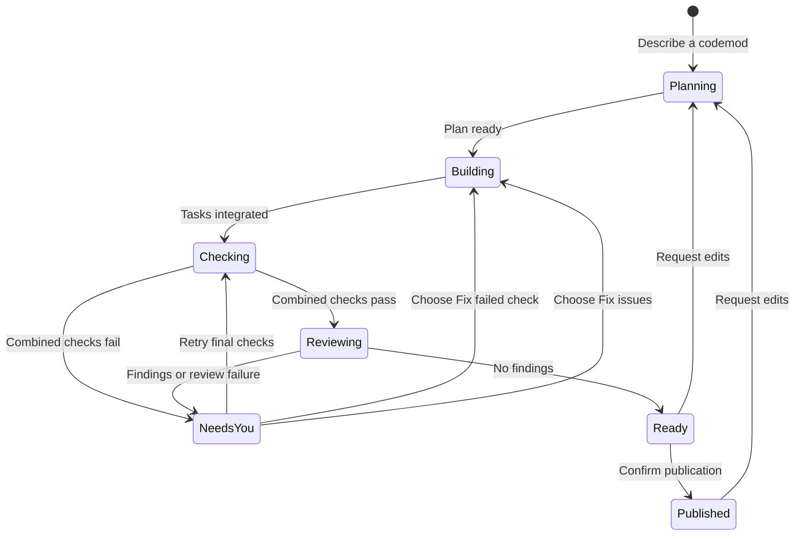
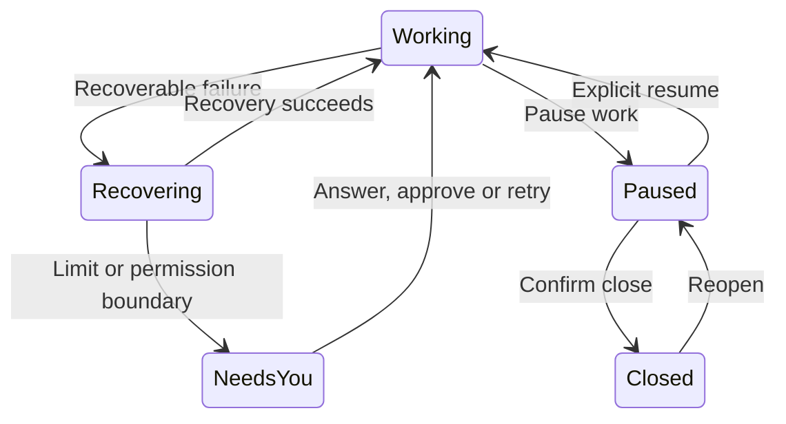

# Terminal and companion

The full-width outline shows the request and tasks. One dock tells you what is happening, whether anything needs you, and the next useful action. **Ctrl+T · Details** opens the evidence without interrupting work or losing your draft.

## State model

The interface derives one summary from saved work and active operations. The dock and Details use that same summary. Worker and Git controllers still own the transitions.

Keep these facts separate:

| Fact | What it answers |
| --- | --- |
| Lifecycle | Is the codemod open or closed? |
| Activity | Planning, building, checking, recovering, reviewing or a Git operation? |
| Attention | Does a task need an answer, permission or a retry? Was work paused by you? |
| Evidence | Which checks and review belong to this version? |
| Publication | Is there a PR, and does it include the current changes? |

A task finishing does not make the version ready. Combined checks and review have their own results. A PR can be open while new changes are still being prepared.



Recovery and lifecycle actions apply across that flow:



Close can also stop active work before saving its checkpoint. Delete requires confirmation and removes local work; the PR stays on GitHub. Reopening restores saved work, without starting workers. A review interrupted by exit or pause waits for an explicit retry.

## Unified dock

```text
╭──────────────────────────────────────────────────────────────────────────╮
│ ⠋ Working · combined checks                                              │
│ 3/3 tasks finished · browser flows · 2m 10s                               │
│ Combined checks · 7/9 passed · running · Review not started               │
├──────────────────────────────────────────────────────────────────────────┤
│ Add an instruction…                                                      │
│                                                                          │
│                                                                          │
│                                                                          │
│ ↵ Queue for next pass   ctrl+j Newline   ctrl+r Pause   ctrl+t Details     │
│                                                              ctrl+g More │
╰──────────────────────────────────────────────────────────────────────────╯
```

- The first row names the state and, when you need to act, one recommended action.
- Supporting rows show progress, check/review currency and a concise error when relevant. A failed task remains visible while independent workers continue.
- The composer starts with four rows and grows to eight, then scrolls. Blank lines and wrapped text count; the cursor stays visible. Short terminals use fewer rows to retain controls.
- Pause, Details and More are secondary controls. Routine work has no highlighted recommendation. Enter sends your message, never the recommendation.

| State | Recommended action |
| --- | --- |
| New codemod | Describe the outcome |
| Working or recovering | None; progress continues automatically |
| Needs your answer | Answer in the composer |
| Needs network access | Review the requested domains |
| Task needs attention | Retry that task, or inspect its evidence in Details |
| Combined checks need attention | Fix failed check; rerun without edits remains in More |
| Review issues found | Fix review issues; Details opens Review |
| Review interrupted | Review changes |
| Paused by you | Resume the relevant work |
| Ready to publish | Publish PR |
| Target changed | Update and recheck |
| PR published | Request edits if needed |
| Closed | Reopen saved work |

**Ready to publish** means current checks and a clean current review. Publication remains an explicit choice; the existing ability to publish a checked version without a clean review remains available in More. Its confirmation includes the review state. Changed work on an existing PR says **PR open · update pending**.

**Ctrl+G · More** groups applicable actions under **Work**, **Inspect**, **Codemod** and a separate **Remove** section. Inspection uses one Details entry plus View diff. Existing Ctrl+O and Ctrl+G → i/f shortcuts still work. Every visible item shows its shortcut. Selection keeps its meaning while workers finish; Enter cannot activate a different action when the selected one disappears.

## Details

The inspector has four sections. Use **1–4**, **Tab** or **Shift+Tab** to switch. Mouse scrolling applies to the current section. **Ctrl+T** returns to the conversation; **Esc** goes back one level.

| Section | Contents |
| --- | --- |
| 1 · Tasks | Status, owner, model and effort; Enter opens one task |
| 2 · Checks | Combined results and task checks, including failures and commands not run |
| 3 · Review | Current or outdated findings, severity, file/line, evidence, owner and proposed fix |
| 4 · Activity | Saved worker updates, handoffs and previous results |

Details opens Review when findings exist, Checks after a combined failure, and otherwise Tasks. Before a task list exists it opens Activity. Opening any section is read-only. Checks puts failures first, summarizes skipped commands and keeps passing command output collapsed; **e** expands the evidence. In Checks, **x · Fix failed check** returns a combined failure to its original worker while preserving completed peers. The action appears only when the failure matches a saved task and command. Worker reports are labelled separately from controller check results.

### Inspect a task

Select a task and press Enter. Its details show the latest update, checks, failure evidence and recovery context. Dependencies, unanswered questions and network permissions have distinct states. Conflict details include paths, owners and automatic attempts used.

**r** retries the selected failed task from Tasks; **Ctrl+R** does so in its details. Independent peers continue; retries wait if both slots are occupied. **h** opens that task's activity and **a** opens all activity. Older messages without a saved task identity remain in all activity. Draft, queue and plan toggle are preserved.

## Messages and plans

Conversations remain left aligned with two columns of outer margin and one blank row between messages. User messages have a visible `>` and subtle background. Agent identities include provider, role, worker, model and effort. Active identities appear beside the companion; task spinners and IDs stay in the outline through checks. `--no-motion` uses a static glyph.

Plans show numbered tasks, outcomes and dependencies. **Ctrl+O** beside the heading expands scopes, contracts, check commands and routing. Multiline commands retain indentation. Expanding keeps the heading in view; switching codemods starts collapsed. Completed plans collapse to task rows and check totals. Routine worker narration stays in Activity; questions for you remain beside the composer.

The Enter hint says **Create codemod**, **Answer #ID**, **Request edits** or **Queue for next pass**. Queued messages remain separate from history. **Ctrl+Q** manages them; **s · Send to workers** uses saved steering and waits for an acknowledged delivery. With no running worker, the hint says **Send when workers connect**. Reordering does not send anything. Deliberately paused work keeps queued edits until you resume.

## Navigation and layout

Messages, plans, Details, errors and diffs use the terminal width. Task numbers have their own column and wrapped outcomes align beneath the title. Menus and confirmations use up to 68 columns; queue menus widen for their controls. Empty lists say **No active codemods** or **No closed codemods**.

Use the wheel or trackpad over a view to scroll it, or over the composer to scroll the draft. Lists move their selection; Enter activates. Views clamp scrolling after resize. Opening More retains the visible draft. Narrow terminals stack controls without separating shortcuts from labels.

| Key | Action |
| --- | --- |
| Enter | Create, answer, request edits or queue the message |
| Ctrl+J | Newline |
| Ctrl+T | Details / return to conversation |
| Ctrl+G | More actions; Esc returns |
| Ctrl+R | Pause, resume or retry relevant work |
| Ctrl+S | Review and confirm PR publication |
| Ctrl+E | Start or retry independent review |
| Ctrl+O | Expand/collapse plan details |
| Ctrl+D | View diff |
| Ctrl+Q | Manage pending instructions |
| Ctrl+N | Decide a pending domain request |
| Ctrl+P | Switch/create/close/reopen/delete codemods |
| Fn + ↑ / ↓, or Page Up / Down | Scroll |
| Esc | Back from a view; quit from the conversation |
| Ctrl+C | Quit |

More also supports **n** new, **c** close, **d** delete, **x** fix the failed check or review findings, and **r** retry a failed task. These letters type normally in the composer. Close, delete and publish retain their confirmations.

Blocked downloads show exact domains and a reason; **a** approves for this codemod and **d** denies. GitHub setup confirms the repository destination. Project sync runs on startup and every 30 seconds even without codemods; **Ctrl+U** checks immediately. Background target checks do not replace active work progress. See [Codemods](codemods.md), [Review](review.md) and [Git workflow](git-workflow.md).

## Commands

| Command | Action |
| --- | --- |
| `sprowt-harness` | Open the current project |
| `sprowt-harness setup` | Configure Jev |
| `sprowt-harness --no-motion` | Disable animation |
| `sprowt-harness --closed-worktree-days 0` | Keep closed worktrees indefinitely |

## Sprowt companion

The companion uses terminal cells and glyphs, so it needs no image support. It sits beside the project heading in an 8-column, 4-row area.

Sprowt follows the selected codemod:

| State | Expression and movement |
| --- | --- |
| Idle | Double blink, sideways glances and a curious face |
| Planning | Thoughtful eyes and an occasional leaf twitch |
| Working or checking | Focused eyes and rhythmic leaf movement |
| Changes ready | One short bounce and wink, then a happy face |
| Blocked or failed | A concerned face, held still |

The body keeps its shape and footprint. Switching codemods resets the animation to that mod’s state. Queueing or editing an instruction can trigger a brief idle celebration; it never overrides active work or an error. Closing or stopping returns Sprowt to idle. Worker identity stays beside it; the dock shows workflow progress.

Run `sprowt-harness --no-motion` for a still companion and no entrance animation. On exit, the harness restores normal terminal input, mouse and paste handling, and the previous screen.
