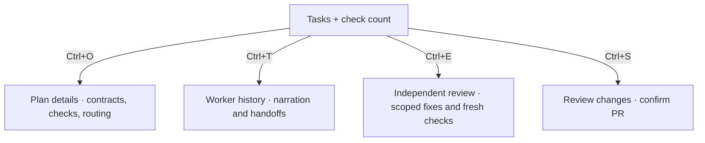

# Terminal and companion

The interface keeps the project and worker status at the top, the conversation left aligned and the composer at the bottom.

```text
[sprowt companion]  project + worker model + effort + activity

<codemod/>  ◇ selected mod    codex w1 · task 1 │ muse w2 · task 2

> your message

▤ codex · planner
ctrl+o ▸ show plan details
execution · numbered tasks

◆ codex · executor · w1 · model · effort
reply

queue / waiting steering, when present

[message composer]
keyboard hints
```

User messages have a `>` prefix and a subtle background. Agent messages show their provider, role, worker ID, model and configured reasoning effort when reported by Codex. One blank row separates messages.

The worker status uses a small dot spinner during connection, execution and verification. Each running task shows its worker ID and uses the same spinner in the plan, including while its checks run. Completed tasks and replies stay still. `--no-motion` uses a static activity glyph.

The codemod row lists each active provider, worker ID and numbered task. Final verification says **final checks**. Narrow terminals show the active worker count instead; task rows retain their worker IDs.

Codex’s configured effort is used when available. When unset, the harness reads the model’s default from Codex’s catalog and sends it explicitly with new turns. Replies save that effort for reopening. Older replies without recorded effort show **effort unknown**.

Plans show task titles, outcomes and dependencies first. **Ctrl+O · show/hide plan details** sits beside the heading. It expands file scopes, completion checks and planner model details. Check commands appear in indented blocks; multiline code keeps its source indentation, and wrapped lines stay inside the block. Expanding keeps the heading in view and leaves the draft and queue intact. Details start collapsed when you switch mods or reopen the project.

Check details count passed, failed and unrun checks. Failed output starts at the assertion or error; summaries are labelled **worker report**. During automatic recovery, the previous failure stays in details. Controller results decide whether work is complete.

**Ctrl+T** opens a separate worker history panel with saved narration, model and effort, and [worker messages](coordination.md). Scroll with ↑/↓ or Fn+↑/↓ on Mac; Esc returns to the same draft, queue and plan view. Questions for you stay visible in the conversation with the sender and message ID; the composer says **answer #ID** and Enter saves your reply.

Finished versions show one row per task, the final check count, request review and publish actions. **Ctrl+E** starts an independent reviewer; its result stays compact and **Ctrl+O** expands findings. Outcomes, contracts, commands and routing stay behind **Ctrl+O**; routine worker chatter stays in history. **Ctrl+D** opens a full-width diff. Use **p** there, or **Ctrl+S** from the conversation, to review and confirm publication. Snapshot mods first offer Git adoption. See [Plan execution](execution.md).



Worktree creation, diff loading, publication and removal show a spinner in the header. A saved PR link appears in the conversation. Failed operations put Git's error before progress output and show **Ctrl+R · retry Git operation**. A published mod keeps its composer for requesting edits on the same PR.

Codemod, queue and project setup dialogs share spacing and keyboard hints. Empty codemod lists say **No active codemods** or **No closed codemods**, with a new-codemod action. Hints adapt to the available actions and terminal width. Plans and publish confirmations omit repeated VM guidance; the conversation keeps room for tasks and replies.

Blocked downloads show **Network access needed · Ctrl+N** beside the affected task. The matching dialog lists exact domains and the worker's reason. **a** allows access for this codemod and retries its saved task; **d** denies and leaves the task paused. **Esc** returns without deciding. Opening or dismissing it preserves your draft; it never opens over your typing. Long requests scroll with ↑/↓. See [Downloads](sandbox.md#downloads).

Git setup shows the starting file list. GitHub setup uses Tab to choose connect existing or create private, then confirms `owner/repository` before contacting GitHub. Queue management appears only with queued instructions; run, stop and retry appear when relevant.

## Commands

| Command | Action |
| --- | --- |
| `sprowt-harness` | Open the current project |
| `sprowt-harness setup` | Configure Jev from the harness’s `.env.local` |
| `sprowt-harness --closed-worktree-days 0` | Keep closed worktrees indefinitely |
| `sprowt-harness --no-motion` | Open with animations disabled |
| `sprowt-harness --help` | Show available options |
| `sprowt-harness --version` | Show the installed version |

## Controls

| Key | Action |
| --- | --- |
| Enter | Create a described mod, answer a highlighted question, queue a message or save an edit |
| Ctrl+J | Add a newline |
| Ctrl+P | Switch, create, close, reopen or delete a codemod |
| Ctrl+Q | Manage queued instructions |
| Ctrl+R | Run, stop, retry or reopen a closed codemod |
| Ctrl+S | Publish verified changes as a PR |
| Ctrl+E | Request independent review; r inside the diff |
| Ctrl+U | Sync the project branch and check the codemod's target |
| Ctrl+O | Show or hide plan details |
| Ctrl+T | Open worker history; Esc returns |
| Ctrl+N | Review a pending network request |
| Ctrl+D | Review working-folder changes |
| Fn + ↑ / ↓ on Mac | Scroll the conversation |
| Page Up / Page Down | Scroll on keyboards with those keys |
| Esc | Back from a dialog; quit from the conversation |
| Ctrl+C | Quit |

Pasted text keeps its line breaks. Dialog actions are covered in [Codemods and messages](codemods.md).

Target updates show an **integration plan** with the same task progress and details toggle. The status names target changes or a merged PR; publication stays unavailable until combined checks pass. See [Worktrees and PRs](git-workflow.md#when-another-codemod-merges).

Project sync runs independently on startup and every 30 seconds, including with no codemods and `--no-motion`. **Ctrl+U** also works in the new-mod screen and picker. An unsafe update leaves files intact and shows the cause beside the project heading.

## Sprowt companion

The companion uses terminal cells and glyphs, so it needs no image support. It sits beside the project heading in an 8-column, 4-row area.

Sprowt follows the selected codemod:

| State | Expression and movement |
| --- | --- |
| Idle | Double blink, sideways glances and a curious face |
| Planning | Thoughtful eyes and an occasional leaf twitch |
| Working or checking | Focused eyes and rhythmic leaf movement |
| Changes ready | One short bounce and wink, then a happy face |
| Blocked or failed | A concerned face, held still |

The body keeps its shape and footprint. Switching codemods resets the animation to that mod’s state. Queueing or editing an instruction can trigger a brief idle celebration; it never overrides active work or an error. Closing or stopping returns Sprowt to idle. Worker progress remains in the status text beside it.

Run `sprowt-harness --no-motion` for a still companion and no entrance animation. On exit, the harness restores normal terminal input, paste handling and the previous screen.
