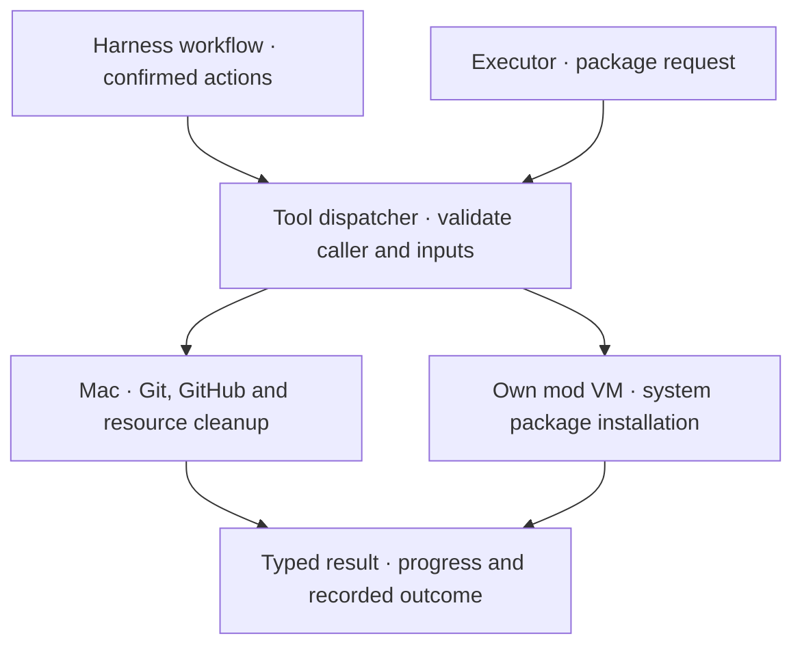

# Harness tools

A small Rust dispatcher handles harness-owned operations. It checks the caller, validates inputs and routes work to the existing adapter. Context comes from saved mod and worker state; model arguments cannot choose a host path, identity or VM.

## Available operations

| Operation | Caller | Execution |
| --- | --- | --- |
| `create_worktree` | Harness | Git on the Mac |
| `publish_pr` | Harness | Git and GitHub CLI on the Mac |
| `cleanup_mod` | Harness | VM deletion and Git worktree cleanup |
| `install_system_packages` | Executor | Package setup inside its own Linux VM |

Only package installation is advertised to Codex, using a JSON input schema. Unknown tools, host operations requested by workers and package requests from planners are rejected. Package names and reasons use the same validation for JSON and typed Rust calls. The connected VM must match the workspace bound to that worker.

PR publication follows the existing user confirmation and source verification. Draft publication preserves unfinished work during confirmed removal. Git checkpoints still own publication recovery; the dispatcher does not replace them. Credentials remain in host adapters.

## Progress and activity

Adapters report progress and return a typed result or an error. Existing cancellation and timeouts remain: Git/GitHub commands have a two-minute limit; managed package commands have a fifteen-minute limit.

Each workspace’s host-only `tools.jsonl` records call ID, tool, mod, worker when present, caller, status and duration. It omits arguments, outputs and credentials. Start records without an outcome can indicate an interrupted call. This log is diagnostic; it does not drive retries. Removing the mod removes its log.

## Extend it

Add a typed request, a registry entry with its caller policy, and an adapter. Worker-facing tools also need input validation and a JSON schema. Test permitted callers and workspace boundaries before exposing the operation.

The dispatcher is independent of Codex’s transport. A future Muse connection can use the same requests and policies. Codex’s native command and file tools continue through its VM connection; MCPs and runtime plugin loading are not connected yet.
