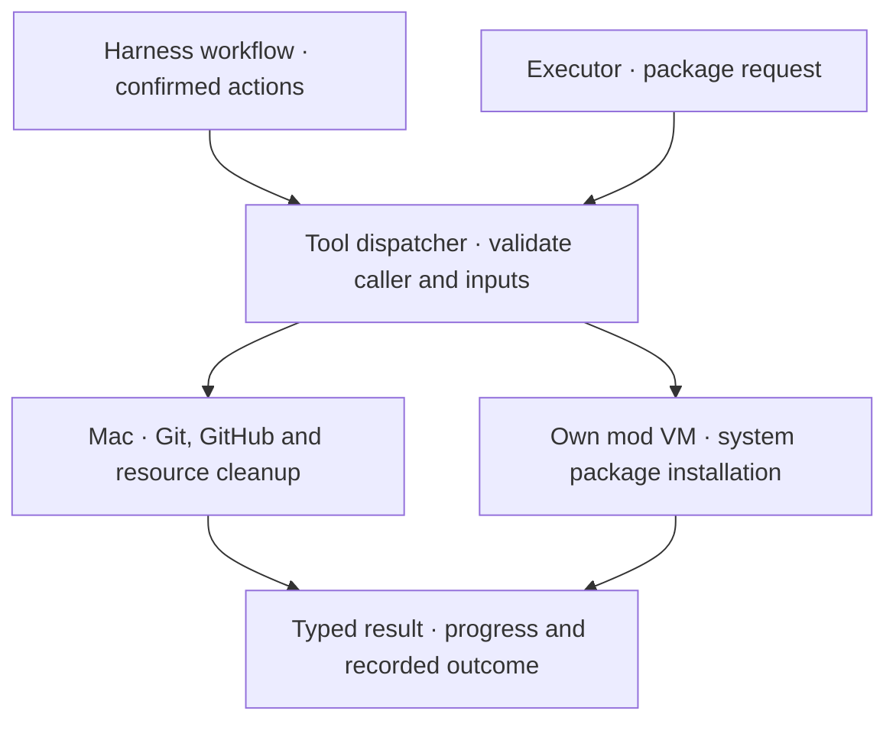

# Harness tools

A small Rust dispatcher handles harness-owned operations. It checks the caller, validates inputs and routes work to the existing adapter. Context comes from saved project, mod and worker state; model arguments cannot choose a host path, identity or VM.

## Available operations

| Operation | Caller | Execution |
| --- | --- | --- |
| `sync_project` | Harness | Safely fast-forward the project branch, independent of codemods |
| `initialize_project` | Harness | Create the confirmed initial commit and worktree |
| `adopt_snapshot` | Harness | Attach saved starting files and verified work to Git |
| `connect_repository` | Harness | Connect GitHub or create a confirmed private repository |
| `create_worktree` | Harness | Check and safely update the project branch, then create its worktree |
| `refresh_worktree` | Harness | Refresh an untouched worktree before retrying planning |
| `check_target` | Harness | Fetch the PR target and hold an outdated open PR as draft |
| `update_target` | Harness | Save a checkpoint and prepare combined source for VM verification |
| `finish_update` | Harness | Save the verified merge with both Git parents |
| `publish_pr` | Harness | Git and GitHub CLI on the Mac |
| `prepare_edits` | Harness | Check the saved PR when present; prepare the next edit round |
| `close_mod` | Harness | Commit a local checkpoint and remove the VM |
| `reopen_mod` | Harness | Restore the saved worktree and reopen |
| `prune_mod` | Harness | Remove an unchanged closed worktree; retain its branch |
| `cleanup_mod` | Harness | VM deletion and Git worktree cleanup |
| `install_system_packages` | Executor | Package setup inside its own Linux VM |

Only package installation is advertised to Codex, using a JSON input schema. Unknown tools, host operations requested by workers and package requests from planners are rejected. Package names and reasons use the same validation for JSON and typed Rust calls. The connected VM must match the workspace bound to that worker.

Initial Git setup and the GitHub destination require confirmation. Setup checks the reviewed file snapshot; adoption preserves the saved baseline. Repository setup validates owner/name, checks history and records progress for retries. Publication requires confirmation and verified source. Closing saves source locally before VM deletion. Pruning checks the saved commit and refuses outside edits. Edit rounds check PR status and its published commit when present. Git checkpoints own recovery. Credentials remain in host adapters.

A shared VM controller serializes package installation, task checkpoints, verification and Git integration. Each worker has a separate conversation and runtime home; ordinary worker commands run concurrently. The VM adapter manages task Git worktrees internally. These operations use saved task identities and are not exposed as model tools. See [Plan execution](execution.md).

Target updates wait for idle workers and a verified version. Publication fetches the target again and refuses pending or outdated integration. Workers cannot invoke these host operations; resolution and checks run through their existing VM tools. See [Worktrees and PRs](git-workflow.md#when-another-codemod-merges).

## Progress and activity

Adapters report progress and return a typed result or an error. Existing cancellation and timeouts remain: Git/GitHub commands have a two-minute limit; managed package commands have a fifteen-minute limit.

Each workspace’s host-only `tools.jsonl` records call ID, tool, mod, worker when present, caller, status and duration. Project sync uses its own project folder and has no mod ID. Logs omit arguments, outputs and credentials. Start records without an outcome can indicate an interrupted call. This log is diagnostic; it does not drive retries. Removing a mod removes its log; the project sync folder stays.

## Extend it

Add a typed request, a registry entry with its caller policy, and an adapter. Worker-facing tools also need input validation and a JSON schema. Test permitted callers and workspace boundaries before exposing the operation.

The dispatcher is independent of Codex’s transport. A future Muse connection can use the same requests and policies. Codex’s native command and file tools continue through its VM connection; MCPs and runtime plugin loading are not connected yet.
