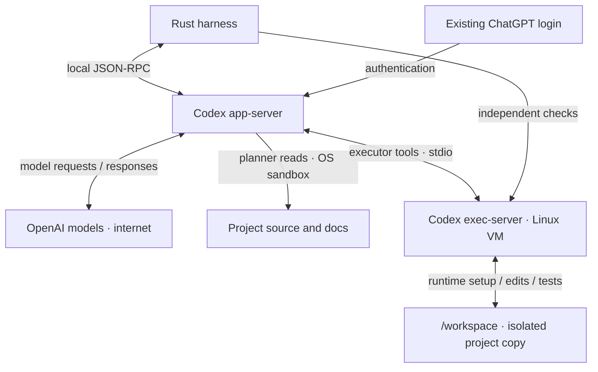

# Workers and isolation

The harness starts Codex through `codex app-server --listen stdio://`. Rust sends JSON-RPC requests over standard input and receives replies and events over standard output.

## Login

Install Codex CLI and run `codex -c 'cli_auth_credentials_store="file"' login`. Use your ChatGPT subscription. The harness checks that login type at startup; API-key login is not supported by this worker setup.

Codex handles authentication. The harness database stores conversation IDs and delivery state. Each VM worker has a private host Codex directory with a link to the existing login file; that directory is never copied into the guest. This route currently needs a file-backed ChatGPT login.

## Permissions today

Planner tools can read the project and required runtime files, with no tool networking. The host Codex credential directory and macOS Keychain directory are denied to these commands.

Executor tools use only the mod’s Linux VM. Commands can write `/workspace`, `/home/sprowt` and guest temporary files. System tools remain read-only. Project runtimes and dependencies can be installed through an enforced domain proxy. No host executor is registered for that agent. See [Local Linux sandbox](sandbox.md).

Host MCP servers, apps, plugins, hooks, browser tools and Codex delegation are disabled for these workers. Startup checks the permission boundary and that MCP tools are disabled before a worker can run. A failed check stops startup.

Codex’s trusted app-server uses the host login and network for inference. Executor commands and independent verification use the guest’s native sandbox and proxy. The connection uses standard input/output; no listening tool-server port is exposed.

## Run, pause, resume

- A new mod starts its planner automatically.
- After planning, **Ctrl+R** starts or pauses plan execution. Rust selects tasks; queued instructions run between tasks. See [Plan execution](execution.md) for verification and applying changes.
- Reopening restores saved state. **Ctrl+R** reconnects a worker to its saved Codex conversation.
- Quitting interrupts turns, stops agent processes and stops each active VM. Its disk persists. Deleting a mod also deletes its VM and workspace.

## Delivery and recovery

Each queued or steering instruction has a stable delivery ID. Before sending, the harness saves it as pending. Once Codex accepts it, a transaction moves the instruction into history and clears pending state.

On reconnect, Codex’s conversation records are checked for that ID. If delivery cannot be confirmed, the instruction is retained and automatic retry pauses. This reduces duplicate submissions; acceptance still does not mean the turn completed successfully. Tasks keep their delivery IDs, Codex turn IDs, status and checks. Only completed turns with passing verification can finish a task. If Codex has no saved file for an idle conversation, the harness starts a fresh one; uncertain task delivery never uses that fallback.

Currently verified on macOS with Codex CLI **0.159.2**. Muse, peer communication and multiple executors within a mod are future work.
