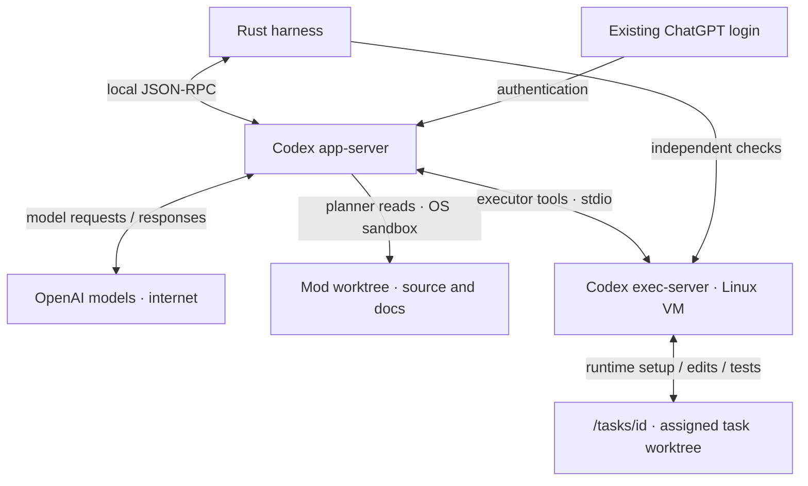
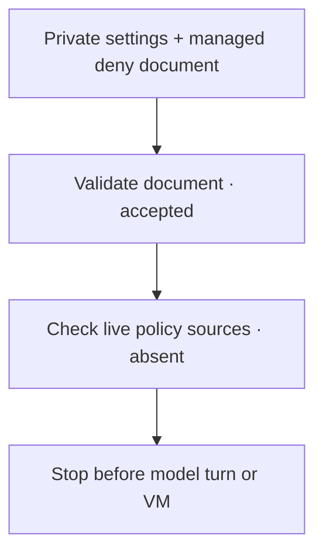

# Workers and isolation

The harness starts Codex through `codex app-server --listen stdio://`. Rust sends JSON-RPC requests over standard input and receives replies and events over standard output.



## Login

Install Codex CLI and run `codex -c 'cli_auth_credentials_store="file"' login`. Use your ChatGPT subscription. The harness checks that login type at startup; API-key login is not supported by this worker setup.

Codex handles authentication. The harness database stores conversation IDs and delivery state. Each VM worker has a private host Codex directory with a link to the existing login file; that directory is never copied into the guest. This route currently needs a file-backed ChatGPT login.

## Permissions today

Planner tools can read the project and required runtime files, with no tool networking. The host Codex credential directory, macOS Keychain directory, project `.env.local` and harness `router.env` are denied to these commands.

Executor tools use only the mod’s Linux VM. Normal commands can write their assigned `/tasks/<id>` folder, its own `/home/sprowt/workers/<worker-id>` and guest temporary files; system files remain read-only. Project runtimes and dependencies use an enforced domain proxy. The [tool dispatcher](tools.md) exposes package installation to executors and checks their VM ownership. Git, GitHub and cleanup remain harness-only operations. Guest Git combines task branches; publication uses host Git and GitHub CLI. Each task turn selects its folder and named permission profile through [Codex’s environment API](https://learn.chatgpt.com/docs/app-server). No host executor is registered for that agent. See [Local Linux sandbox](sandbox.md) for package setup.

Host MCP servers, apps, plugins, hooks, browser tools and Codex delegation are disabled for these workers. Startup checks the permission boundary and that MCP tools are disabled before a worker can run. A failed check stops startup.

Codex’s trusted app-server uses the host login and network for inference. Executor commands and independent verification use the guest’s native sandbox and proxy. The connection uses standard input/output; no listening tool-server port is exposed.

## Shared VM, separate workers

Each executor has its own app-server process, conversation and host Codex directory. Both connect to the same VM. One controller owns its lifecycle and serializes integration, checkpoints, verification and package setup. Stopping one worker never stops the other’s VM connection. The last connection stops the VM after checkpointing.

Workers install user runtimes in their own HOME. Other workers’ runtime folders are read-only, avoiding simultaneous writes to the same installation. OS packages are shared and installed through the controller.

## Run, pause, resume

Worker labels show their ID, model and reasoning effort. Each active task shows its worker ID and spinner; the codemod header shows how many workers are active. Task model and effort are selected explicitly before each turn and checked against Codex’s catalog. Saved replies keep their own labels; missing historical effort is shown as unknown.

- A new codemod confirms Git setup if needed, creates its branch and worktree, then starts its planner automatically. The Astra xhigh planner reads that committed source initially and the latest exported source for edits.
- A valid plan starts execution automatically. Rust assigns up to two independent tasks at once; ordinary queued messages wait for a verified version, then start the next edit plan. **Ctrl+R** stops or retries. See [Plan execution](execution.md) for verification and publication.
- Reopening restores saved state. **Ctrl+R** reconnects a worker to its saved Codex conversation.
- A finished version updates automatically when another PR changes its target branch. Current workers finish first; a fresh integration conversation resolves text conflicts and verifies combined behavior in the retained VM. Product decisions pause for your input. **Ctrl+U** checks immediately.
- Publishing retains the VM and worktree. Each edit plan starts fresh worker conversations and keeps the transcript. Closing stops workers, saves a checkpoint and removes the VM; deletion discards local data. Reopening a closed mod starts fresh conversations when work resumes. Quitting stops processes and active VMs but keeps their disks. Failed operations remain retryable with Ctrl+R.

The live status shows the model and configured reasoning effort reported by Codex and spins while work is in progress. Replies keep both labels when reopened. Jev routes each assigned task to Sol 6.1 medium, high or xhigh; model and effort overrides are sent with the task turn. Plan details show the current task’s saved routing reason. See [Planning and routing](planning.md) for setup and fallbacks.

## Delivery and recovery

Executors share [task mailboxes](coordination.md) through the host dispatcher. Mailbox calls run independently of the VM controller, so messaging does not hold the lock used for Git integration or package setup. User answers use the composer; waiting tasks resume after their questions are answered.

Each queued or steering instruction has a stable delivery ID. Before sending, the harness saves it as pending. Once Codex accepts it, a transaction records the instruction in history and clears that worker’s pending state. Broadcast steering tracks an acknowledgement per worker and disappears only when all targets have accepted.

On reconnect, Codex’s conversation records are checked for that ID. If delivery cannot be confirmed, the instruction is retained and automatic retry pauses. This reduces duplicate submissions; acceptance still does not mean the turn completed successfully. Tasks keep their assigned worker, delivery IDs, Codex turn IDs, status and checks. Only completed turns with passing verification can finish a task. If Codex has no saved file for an idle conversation, the harness starts a fresh one; uncertain task delivery never uses that fallback.

Worker messages use stable delivery IDs too, with separate receipt acknowledgements. Rejected injections remain in the saved inbox. Conversations created without the current worker tools start fresh when reconnected; saved source and history remain. Uncertain delivery still pauses for recovery.

Currently verified on macOS with Codex CLI **0.159.2**. Two Codex executors can share a mod VM and exchange messages.

## Muse compatibility probe

Muse **1.4.1** exposes `muse serve`, a JSON-RPC session protocol. Our [standalone probe](../examples/muse_probe.rs) checks account login, streamed completion, MCP calls, steering and host file isolation. It is not a scheduler worker.



### Try it

Check policy activation first. This runs offline and needs no login:

```sh
cargo run --example muse_probe --locked -- --managed-policy
```

It validates a deny document in a temporary configuration directory, then compares managed status before and after. Unknown or externally managed state stops the check. On Muse **1.4.1**, the policy sources stay absent and the configuration generation stays unchanged. **A `BLOCKED` exit is expected.**

For the subscription, MCP and hook-failure checks, sign in with `muse login`, then run:

```sh
cargo run --example muse_probe --locked
```

The probe runs a working guard, then deliberately fails its helper. Both must block native tools while keeping MCP and steering available to pass. **A `BLOCKED` exit is the current expected result.**

The probe creates private temporary settings, fixtures, guard audit and session data. It links the existing host login, strips inherited API keys, disables native shell and writes, and turns off delegation and background reminders. The only approved tool is MCP ping, once per call. The model is asked to read a synthetic file, never real credentials. Saved Muse settings stay untouched. Processes and temporary files are removed on normal completion or a returned error.

### Current result

| Check | Observed result |
| --- | --- |
| Subscription, streaming, MCP ping and steering | Passed with both guard configurations |
| Working `PreToolUse` guard | Native read blocked; MCP ping allowed |
| Failed guard helper | Native read returned the denied synthetic file; isolation failed |
| Native writes disabled | No file created |
| Empty `run.toolset` | Native tools absent, but MCP also unavailable |
| MCP name in `run.toolset` | Startup rejects it as an unknown tool, including with the MCP server configured |
| Managed deny document beside private settings | Validates; live policy sources remain absent |
| `execution` policy in user `settings.json` | Startup reports an unknown member and ignores it |

Muse's [permission guide](https://dev.meta.ai/docs/muse-code/permissions) says approval modes still admit file reads. Its [hook contract](https://meta-models.github.io/muse-code-sdk/next/guides/extend/hooks/) says failed hooks are ignored. A working hook therefore cannot be our isolation boundary. The probe rejects returned fixture contents, completed native tools, missing denial evidence or missing MCP/steering evidence.

To repeat the empty-toolset check:

```sh
cargo run --example muse_probe --locked -- --no-native-tools
```

The validator's `state=active` describes a supported document member; it does not prove the policy was loaded. Muse documents [managed policy validation](https://dev.meta.ai/docs/muse-code/configuration) and [per-tool denial](https://dev.meta.ai/docs/muse-code/changelog), but this binary exposes no policy-file option for `serve`. Its exported session configuration recognizes MCP servers, not native tool policy. The tested MCP tool identities are also rejected in `execution.tool_rules`. We have not found a supported per-worker activation route. No machine-wide configuration was changed.

A VM bridge needs an enforced native-tool denial with explicit MCP permission and observable startup evidence. Hook-free and failed-hook tests under that policy remain pending because it could not be activated.

The probe starts no VM. Muse scheduling, mixed Codex–Muse execution, combined verification and VM cleanup remain unverified until the tool boundary holds under failure too.

In this version, memory-only `serve` acknowledged turns but produced no completion during the probe timeout. The working test uses session files confined to its temporary data directory. The exported protocol has no Codex-style remote executor; a future Muse VM connection would use a harness-owned MCP bridge.
