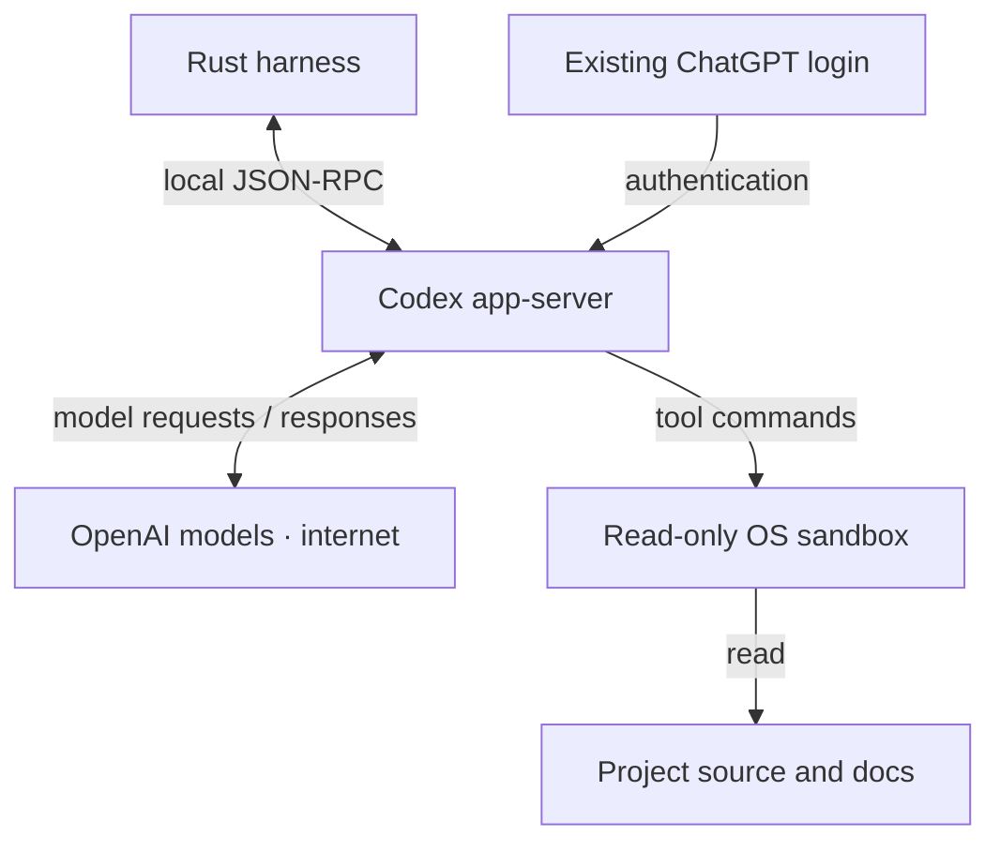

# Workers and isolation

The harness starts Codex through `codex app-server --listen stdio://`. Rust sends JSON-RPC requests over standard input and receives replies and events over standard output.

## Login

Install Codex CLI and run `codex login`. Use your ChatGPT subscription. The harness checks that login type at startup; API-key login is not supported by this worker setup.

Codex handles authentication. The harness database stores conversation IDs and delivery state, without copying login credentials.

## Permissions today

Tool commands can read the project and required runtime files. They cannot write files or access the network. The Codex credential directory and macOS Keychain directory are denied to these commands; their environment is restricted.

Host MCP servers, apps, plugins, hooks, browser tools and Codex delegation are disabled for these workers. Startup checks the permission boundary and that MCP tools are disabled before a worker can run. A failed check stops startup.

Codex’s trusted app-server uses the login and network for inference. Its tool commands run inside the restricted OS sandbox. This is the current isolation boundary; VM isolation comes later.

## Run, pause, resume

- A new mod starts its planner automatically.
- After planning, **Ctrl+R** starts or pauses the executor. Enabled executors consume ordinary queued instructions and stream replies.
- Reopening restores saved state. **Ctrl+R** reconnects a worker to its saved Codex conversation.
- Deleting a mod or quitting asks Codex to interrupt turns and terminate background commands, then stops the server and remaining child processes.

## Delivery and recovery

Each queued or steering instruction has a stable delivery ID. Before sending, the harness saves it as pending. Once Codex accepts it, a transaction moves the instruction into history and clears pending state.

On reconnect, Codex’s conversation records are checked for that ID. If delivery cannot be confirmed, the instruction is retained and automatic retry pauses. This reduces duplicate submissions; acceptance still does not mean the turn completed successfully.

Currently verified on macOS with Codex CLI **0.159.2**. Muse, peer communication and multiple executors within a mod are future work.
