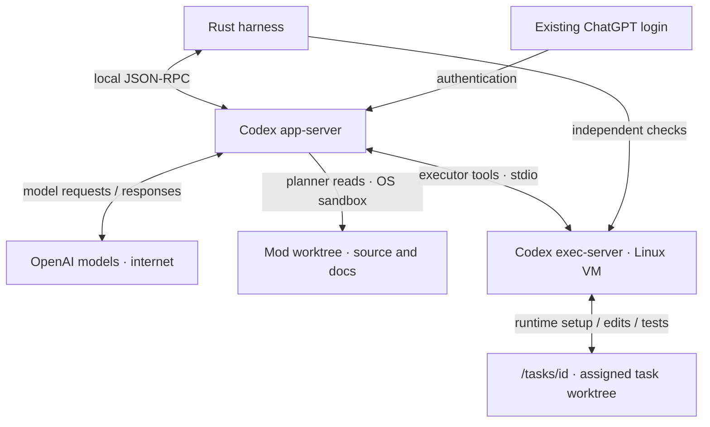

# Workers and isolation

The harness starts Codex through `codex app-server --listen stdio://`. Rust sends JSON-RPC requests over standard input and receives replies and events over standard output.

## Login

Install Codex CLI and run `codex -c 'cli_auth_credentials_store="file"' login`. Use your ChatGPT subscription. The harness checks that login type at startup; API-key login is not supported by this worker setup.

Codex handles authentication. The harness database stores conversation IDs and delivery state. Each VM worker has a private host Codex directory with a link to the existing login file; that directory is never copied into the guest. This route currently needs a file-backed ChatGPT login.

## Permissions today

Planner tools can read the project and required runtime files, with no tool networking. The host Codex credential directory and macOS Keychain directory are denied to these commands.

Executor tools use only the mod’s Linux VM. Normal commands can write their assigned `/tasks/<id>` folder, `/home/sprowt` and guest temporary files; system files remain read-only. Project runtimes and dependencies use an enforced domain proxy. The [tool dispatcher](tools.md) exposes package installation to executors and checks their VM ownership. Git, GitHub and cleanup remain harness-only operations. Guest Git combines task branches; publication uses host Git and GitHub CLI. Each task turn selects its folder and named permission profile through [Codex’s environment API](https://learn.chatgpt.com/docs/app-server). No host executor is registered for that agent. See [Local Linux sandbox](sandbox.md) for package setup.

Host MCP servers, apps, plugins, hooks, browser tools and Codex delegation are disabled for these workers. Startup checks the permission boundary and that MCP tools are disabled before a worker can run. A failed check stops startup.

Codex’s trusted app-server uses the host login and network for inference. Executor commands and independent verification use the guest’s native sandbox and proxy. The connection uses standard input/output; no listening tool-server port is exposed.

## Run, pause, resume

Worker labels show model and reasoning effort. An unset effort uses Codex’s model catalog default, sent explicitly with each new turn. Saved replies keep their own labels; missing historical effort is shown as unknown.

- A new codemod confirms Git setup if needed, creates its branch and worktree, then starts its planner automatically. The planner and Laya read that committed source initially and the latest exported source for edits.
- A valid plan starts execution automatically. Rust selects tasks; ordinary queued messages wait for a verified version, then start the next edit plan. **Ctrl+R** stops or retries. See [Plan execution](execution.md) for verification and publication.
- Reopening restores saved state. **Ctrl+R** reconnects a worker to its saved Codex conversation.
- Publishing retains the VM and worktree. Each edit plan starts fresh worker conversations and keeps the transcript. Closing stops workers, saves a checkpoint and removes the VM; deletion discards local data. Reopening a closed mod starts fresh conversations when work resumes. Quitting stops processes and active VMs but keeps their disks. Failed operations remain retryable with Ctrl+R.

The live status shows the model and configured reasoning effort reported by Codex and spins while work is in progress. Replies keep both labels when reopened. Laya still routes only the planner; the executor uses Codex’s resolved conversation settings. Unreported values stay omitted.

## Delivery and recovery

Each queued or steering instruction has a stable delivery ID. Before sending, the harness saves it as pending. Once Codex accepts it, a transaction moves the instruction into history and clears pending state.

On reconnect, Codex’s conversation records are checked for that ID. If delivery cannot be confirmed, the instruction is retained and automatic retry pauses. This reduces duplicate submissions; acceptance still does not mean the turn completed successfully. Tasks keep their delivery IDs, Codex turn IDs, status and checks. Only completed turns with passing verification can finish a task. If Codex has no saved file for an idle conversation, the harness starts a fresh one; uncertain task delivery never uses that fallback.

Currently verified on macOS with Codex CLI **0.159.2**. Muse, peer communication and multiple executors within a mod are future work.
