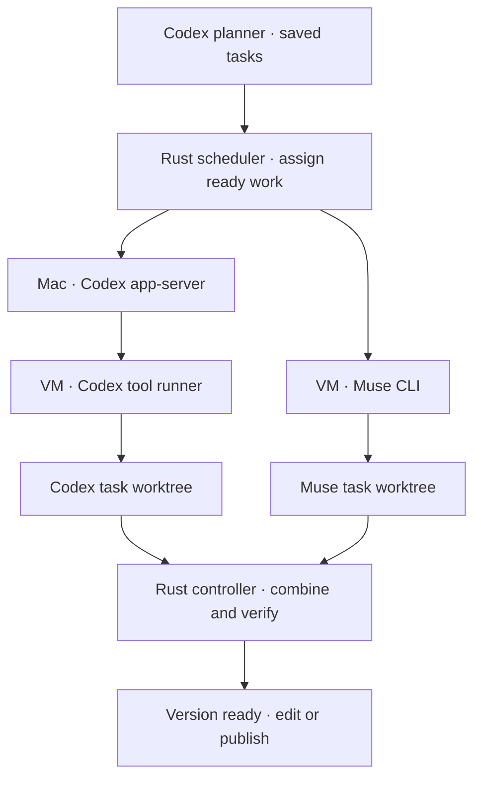
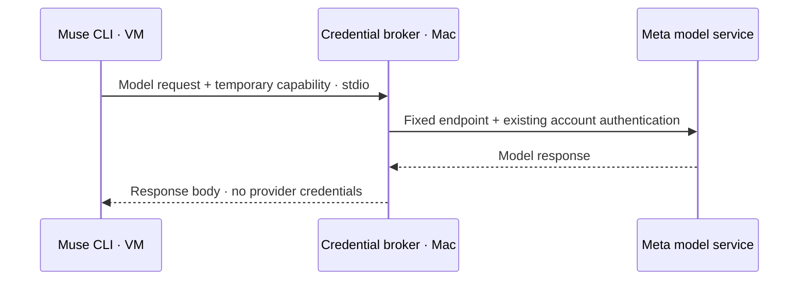

# Workers and isolation

Codex plans. Executors follow the saved plan in the codemod's Linux VM, with separate task worktrees and runtime homes. Up to two tasks can run at once.

## Choose workers

Codex is the default. To let the planner use Muse too:

```sh
sprowt-harness --muse
```

Describe the outcome normally. Astra xhigh assigns demanding implementation and integration checks to Codex, and can assign independent, well-scoped work to Muse. Small changes can stay with one provider. Saved tasks keep their provider and worker identity when retried.

| Role | Engine | Model and effort |
| --- | --- | --- |
| Planner | Host Codex app-server | Astra xhigh |
| Codex executor | Host app-server + guest exec-server | Sol 6.1 medium, high or xhigh, selected with Jev |
| Muse executor | Full Muse CLI inside the VM | Muse Spark 1.3 high |

The CLI flag enables a provider; it does not force parallel tasks. Plans using Muse require `--muse` when reopened. Jev currently routes Codex effort only.

## Login

Use a file-backed ChatGPT login for Codex:

```sh
codex -c 'cli_auth_credentials_store="file"' login
```

For Muse, install **1.4.1-R4503.1** and sign in on your Mac with `muse login`. A host CLI resolves that existing account login; the real provider header stays in host memory. No separate Meta API key is used. The Mac also needs Python 3 for the small stdio adapter.

On first use, the harness downloads the matching Linux Muse binary, checks its pinned SHA-256 and caches it privately. Python for the guest transport is installed through the existing VM package controller. No host folder is mounted into the VM.

## Two execution paths, one scheduler



Each worker has its own conversation, runtime HOME and cancellation signal. The shared controller serializes checkpoints, Git integration, independent checks and system package installation. Model turns and task commands overlap.

Codex's trusted host process handles inference and uses its guest environment for executor tools. Its apps, inherited MCP servers, plugins, hooks and delegation are disabled. The planner's host sandbox is read-only and denies credential directories and local environment files.

Muse and all its child commands run inside the guest exec-server's enforced Linux process sandbox. Its own internal sandbox is disabled inside that boundary. Muse can read required system files and write its assigned task folder, runtime home and temporary files. Other task folders are unavailable. Runtime downloads use the same harness allowlist as independent verification.

## Muse model broker



The guest gets a random capability, valid for one task turn: at most 128 model requests, one hour of access and 8,192 output tokens per request. The broker accepts only the model catalog and streamed Spark 1.3 responses at fixed Meta endpoints. Redirects and other model or account routes are denied. It revokes access when the turn ends or the worker stops.

Account authentication is verified. Subscription metering is not independently exposed by this CLI; confirm included usage in your account before treating it as measured subscription consumption.

## Messages and steering

Both providers use the same [task mailboxes](coordination.md) and [tool dispatcher](tools.md). Muse receives the advertised inbox and package tools through a guest MCP server. Calls carry the current worker's identity; workers cannot publish PRs or run host commands through this bridge.

Worker labels and saved replies show provider, worker ID, model and effort. **Ctrl+R** stops or retries work. Steering is acknowledged separately for each targeted worker; reordering the queue does not deliver instructions.

The harness saves a delivery as pending before sending it. Acceptance records its receipt atomically. Unknown delivery remains saved and pauses automatic retry. Codex checks its saved conversation for receipts on reconnect. Muse starts a fresh task session from the saved plan, source and accepted user instructions; an interrupted or uncertain delivery pauses for explicit retry. Native Muse conversation replay is not implemented.

## Lifecycle

Publishing keeps the VM and worktree for edits. Closing checkpoints source and removes the VM. Reopening creates a fresh VM when needed. Quitting stops workers and VMs but retains their disks. Deletion discards local codemod data. See [Local Linux sandbox](sandbox.md) for disk locations and cleanup.

## Standalone diagnostics

The compatibility probes are separate from scheduling. They use disposable fixtures and remove their VMs on completion or a returned error.

- [Muse host probe](../examples/muse_probe.rs): tests MCP and policy activation. Native hook failures do not provide an isolation boundary; a `BLOCKED` result is expected for those checks.
- [Muse VM probe](../examples/muse_vm_probe.py): native editing, execution, steering and sibling-read denial through a bounded broker.
- [Full Codex VM probe](../examples/codex_vm_probe.py): Linux CLI plus its matching tool helper, host-only ChatGPT credentials, native tools and cancellation. Production Codex still uses the host app-server.

Offline broker and transport checks:

```sh
python3 -m unittest discover -s examples -p 'test_*.py'
```
