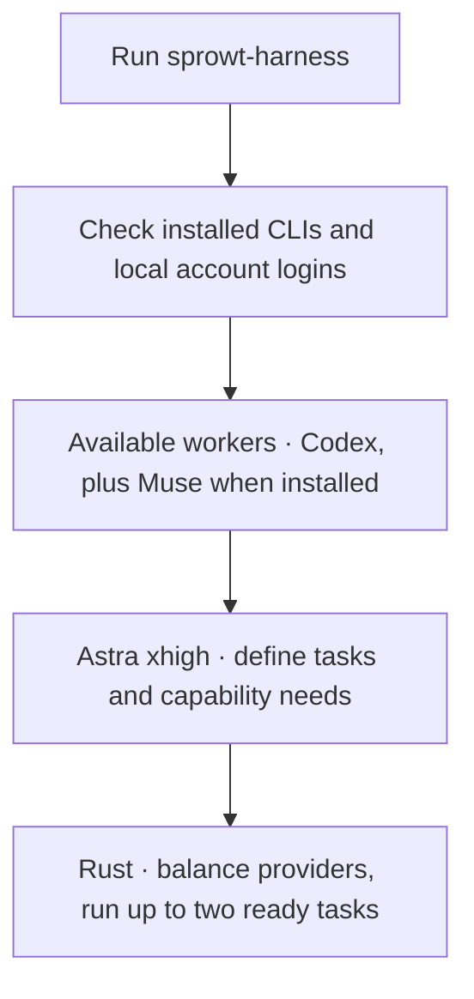
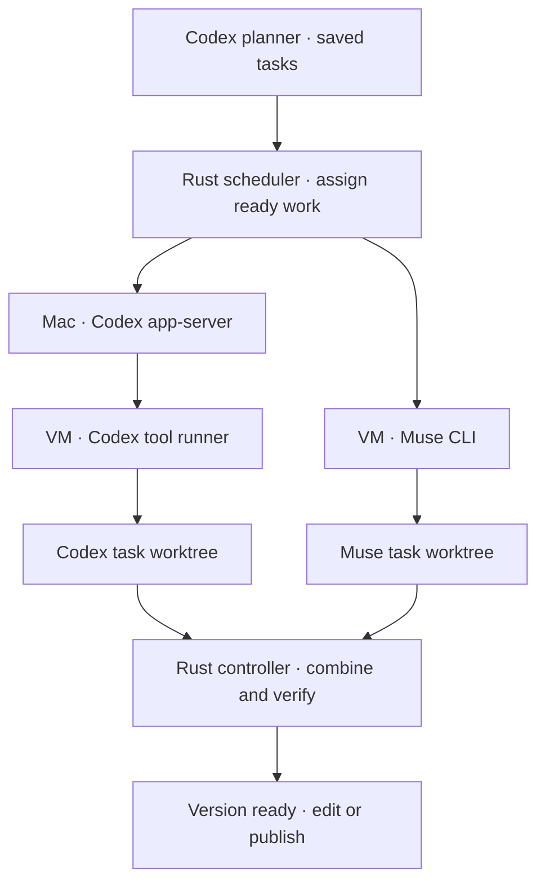
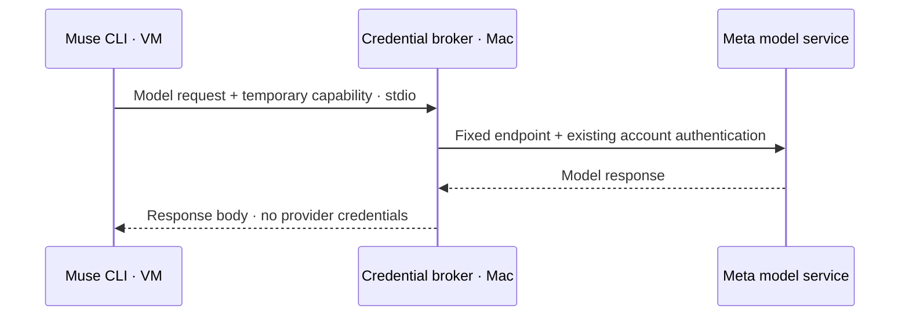
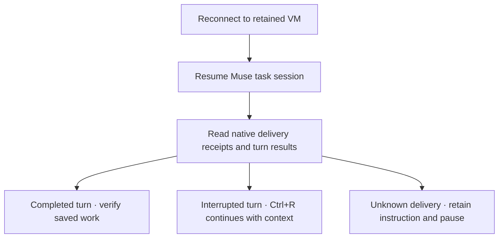

# Workers and isolation

Codex plans. Executors follow the saved plan in the codemod's Linux VM, with separate task worktrees and runtime homes. Up to two tasks can run at once.

## Automatic discovery

Start normally:

```sh
sprowt-harness
```

Startup checks CLI versions and local account status. Codex is required for planning. Installed, signed-in Muse joins automatically; if Muse is absent, work uses Codex alone. An installed CLI with an unsupported version or missing account login stops startup with a clear next action.



Describe the outcome normally. Astra xhigh defines useful tasks and contracts. Both providers can implement, test and integrate. Rust picks the least loaded suitable provider when a task is ready, alternating ties. A specific capability can restrict the choice. Small changes can stay with one worker; retries keep their assigned provider and identity. See [Provider assignment](planning.md#provider-assignment).

| Role | Engine | Model and effort |
| --- | --- | --- |
| Planner | Host Codex app-server | Astra xhigh |
| Codex executor | Host app-server + guest exec-server | Sol 6.1 medium, high or xhigh, selected with Jev |
| Muse executor | Full Muse CLI inside the VM | Muse Spark 1.3 high |

Discovery does not run inference, start a VM or copy credentials. It checks availability, not remote account access or usage limits. Saved Muse tasks require Muse on restart; their provider is retained. Jev currently routes Codex effort only.

## Login

Use a file-backed ChatGPT login for Codex:

```sh
codex -c 'cli_auth_credentials_store="file"' login
```

For Muse, install **1.4.3-R5018.1** and sign in on your Mac with `muse login`. A host CLI resolves that existing account login; the real provider header stays in host memory. No separate Meta API key is used. The Mac also needs Python 3 for the small stdio adapter.

CLI releases are pinned because protocol changes can affect isolation and recovery. If Muse updates itself, update and reinstall the harness for the matching supported release. The Linux binary is pinned and checksum-verified too.

On first use, the harness downloads the matching Linux Muse binary, checks its pinned SHA-256 and caches it privately. Python for the guest transport is installed through the existing VM package controller. No host folder is mounted into the VM.

## Two execution paths, one scheduler



Each worker has its own conversation, runtime HOME and cancellation signal. The shared controller serializes checkpoints, Git integration, independent checks and system package installation. Model turns and task commands overlap.

The two active slots follow ready work. They can run two Codex workers, two Muse workers or one of each. Rust balances automatic tasks using active load across codemods in this harness; saved assignments stay fixed. Dependencies gate readiness. Idle workers are parked and reused. Connecting, running and checking all occupy a slot. Saved task ownership, delivery recovery and repair handoffs keep the original worker.

Codex's trusted host process handles inference and uses its guest environment for executor tools. Its apps, inherited MCP servers, plugins, hooks and delegation are disabled. The planner's host sandbox is read-only and denies credential directories and local environment files.

Muse and all its child commands run inside the guest exec-server's enforced Linux process sandbox. Its own internal sandbox is disabled inside that boundary. Muse can read required system files and write its assigned task folder, runtime home and temporary files. Other task folders are unavailable. Runtime downloads use the same harness allowlist as independent verification.

## Muse model broker



The guest gets a random capability, valid for one task turn: at most 128 model requests, one hour of access and 8,192 output tokens per request. The broker accepts only the model catalog and streamed Spark 1.3 responses at fixed Meta endpoints. Redirects and other model or account routes are denied. It revokes access when the turn ends or the worker stops.

Account authentication is verified. Subscription metering is not independently exposed by this CLI; confirm included usage in your account before treating it as measured subscription consumption.

## Messages and steering

Both providers use the same [task mailboxes](coordination.md) and [tool dispatcher](tools.md). Muse receives the advertised inbox, package and network-request tools through a guest MCP server. Calls carry the current worker's identity; workers cannot publish PRs, approve network access or run host commands through this bridge.

Blocked downloads can request exact domains for your approval. Approval reconnects only the affected worker and retries its saved task; peers continue. Native conversation context is reused when compatible. An older Codex conversation without the current tool set starts fresh from the saved plan, source and accepted instructions. See [Downloads](sandbox.md#downloads).

The codemod row shows each active provider, worker ID and task number; narrow terminals show a count. Worker labels and saved replies show model and effort. **Ctrl+O** shows each task’s provider and assignment reason. **Ctrl+R** stops or retries work. Steering is acknowledged separately for each targeted worker; reordering the queue does not deliver instructions.

The harness saves a delivery as pending before sending it. Acceptance records its receipt atomically. Both providers check their saved conversation for receipts on reconnect. Unknown delivery remains saved and pauses automatic retry.

## Muse recovery

Muse keeps one native conversation per assigned task in its VM home. Stop and retry reuse it. Quitting retains the VM disk; reopening restores the same conversation, including tool results and accepted steering.



Session and command IDs save on the Mac before submission. Accepted turn IDs save before acknowledgment. Recovery reads native items and paged events, including when inline history is unavailable. A saved command ID alone is not proof of delivery. Repeated receipt processing keeps one transcript entry and does not resend steering or mailbox messages.

An interrupted turn waits for **Ctrl+R**. A completed turn reruns independent checks without asking Muse to implement it again. Missing or unreadable native history keeps uncertain delivery paused. Recovery is bounded to 64 pages and 8 MiB; oversized histories pause too.

Another task or edit round starts a new session with its own folder and permissions. Closing or deleting removes the VM and its native logs. After reopening a closed mod, explicit retry rebuilds context from the saved plan, source and accepted instructions; the old native tool history is unavailable.

## Independent reviewer

**Ctrl+E** starts a fresh Codex conversation using Sol 6.1 xhigh. It reads the combined source inside the existing VM with no source writes or harness tools. Findings return to existing owners; verified fixes receive another fresh review. See [Independent review](review.md).

## Lifecycle

Publishing keeps the VM and worktree for edits. Closing checkpoints source and removes the VM. Reopening creates a fresh VM when needed. Quitting stops workers and VMs but retains their disks. Deletion discards local codemod data. See [Local Linux sandbox](sandbox.md) for disk locations and cleanup.

## Standalone diagnostics

The compatibility probes are separate from scheduling. They use disposable fixtures and remove their VMs on completion or a returned error.

- [Muse host probe](../examples/muse_probe.rs): tests MCP and policy activation. Native hook failures do not provide an isolation boundary; a `BLOCKED` result is expected for those checks.
- [Muse VM probe](../examples/muse_vm_probe.py): native editing, execution, steering and sibling-read denial through a bounded broker.
- [Full Codex VM probe](../examples/codex_vm_probe.py): Linux CLI plus its matching tool helper, host-only ChatGPT credentials, native tools and cancellation. Production Codex still uses the host app-server.

Offline broker and transport checks:

```sh
python3 -m unittest discover -s examples -p 'test_*.py'
```
